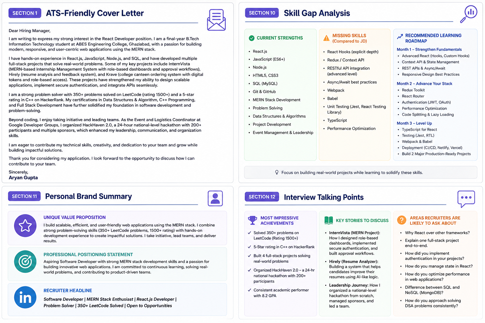

# Day 12 - Complete Job Search & Personal Branding Toolkit

## 📅 Date

June 12, 2026

---

# 🎯 Objective

Today's goal was to build a complete Job Search & Personal Branding Toolkit that goes beyond resume optimization and focuses on creating a professional career growth system.

The objective was to understand how recruiters evaluate candidates and prepare all essential resources needed for internship and job applications.

---

# 💼 Career Toolkit Components

## ATS-Friendly Cover Letter

Created a recruiter-focused cover letter tailored to software development roles, highlighting relevant technical skills, projects, and problem-solving abilities.

---

## Recruiter Outreach Strategy

Developed professional communication templates for:

- Recruiter Outreach
- Hiring Manager Emails
- Referral Requests
- Follow-Up Messages
- LinkedIn Networking

---

## Professional Introduction

Prepared a concise and impactful self-introduction suitable for:

- Interviews
- Networking Events
- Career Fairs
- Recruiter Calls

---

# 📊 Skill Gap Analysis

## Current Strengths

✅ MERN Stack Development

✅ React.js

✅ JavaScript

✅ Node.js

✅ MongoDB

✅ Git & GitHub

✅ Problem Solving

✅ Full-Stack Project Development

---

## Areas for Improvement

⚠️ Advanced React Concepts

⚠️ State Management (Redux / Context API)

⚠️ TypeScript

⚠️ Testing & Debugging

⚠️ Performance Optimization

⚠️ Production-Level Development Practices

---

# 📸 Toolkit Overview

The generated toolkit includes:

- ATS Recommendations
- Job Search Strategy
- Personal Branding Framework
- Professional Communication Templates
- Interview Preparation Guide
- Skill Gap Analysis
- Career Growth Roadmap

---

# 🎯 Top Job Roles Identified

1. Software Developer Intern
2. Frontend Developer Intern
3. React Developer Intern
4. MERN Stack Developer Intern
5. Full Stack Developer Intern
6. Associate Software Engineer
7. Web Developer
8. JavaScript Developer
9. Graduate Software Engineer
10. Junior Frontend Developer

---

# 🌟 Personal Brand Summary

### Unique Value Proposition

Final-year B.Tech IT student with strong MERN Stack development skills, hands-on project experience, and a passion for building scalable web applications.

### Professional Positioning

Aspiring Software Developer focused on creating impactful digital solutions through modern web technologies and continuous learning.

### Recruiter Headline

**Software Developer | MERN Stack Developer | React.js Enthusiast | Problem Solver**

---

# 🛠 Skills Practiced

- Resume Optimization
- Personal Branding
- Networking Strategy
- Career Planning
- Interview Preparation
- Prompt Engineering
- Professional Communication

---

# 💡 Key Learnings

### Career Growth Requires More Than Technical Skills

A strong professional profile consists of:

- Technical Expertise
- Communication Skills
- Networking
- Personal Branding
- Interview Readiness
- Continuous Learning

### Personal Branding Matters

Recruiters often evaluate:

- Resume Quality
- LinkedIn Presence
- Project Portfolio
- Communication Ability
- Professional Positioning

before scheduling interviews.

---

# 🚀 Biggest Takeaway

> A resume may help you get noticed, but a strong personal brand helps you get remembered.

Building a successful career requires not only technical skills but also the ability to communicate your value effectively.

---

# 📚 Outcome

Successfully created a complete Job Search & Personal Branding Toolkit, identified career growth opportunities, and developed a clearer strategy for internship and software development roles.

---

# ✅ Status

Day 12 Completed Successfully

### Challenge

ABTalks 60-Day Claude AI Mastery Challenge

### Topic

Job Search & Personal Branding Toolkit

### Outcome

Built a comprehensive career toolkit including ATS optimization, networking templates, interview preparation resources, personal branding assets, and career growth strategies.

#60DaysOfClaudeChallenge #ABTalks #PersonalBranding #CareerGrowth #SoftwareDeveloper #MERNStack #ReactJS #InterviewPreparation #JobSearch #StudentDeveloper
