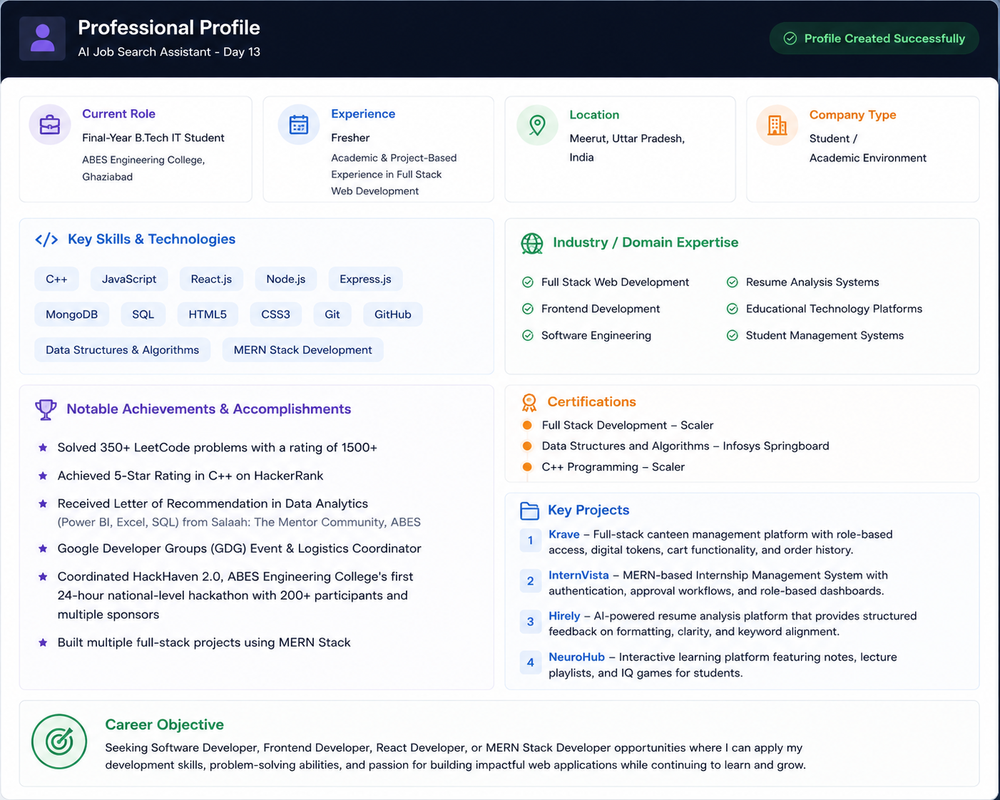
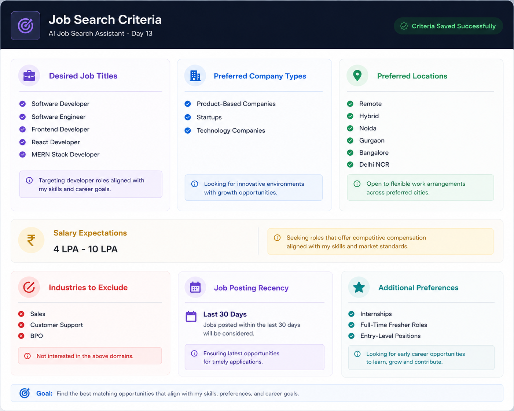
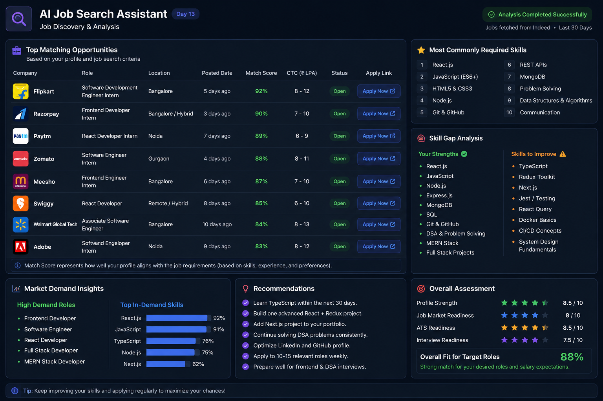

# Day 13 - AI Job Search Assistant

## 📅 Date

June 13, 2026

---

# 🎯 Objective

Today's goal was to build an AI-powered Job Search Assistant that could analyze my professional profile, identify suitable job opportunities, highlight skill gaps, and provide actionable career recommendations.

The challenge focused on using AI to make job searching more strategic, personalized, and data-driven.

---

# 💼 Professional Profile

I first created a detailed professional profile including:

- Education
- Technical Skills
- Projects
- Certifications
- Achievements
- Career Objectives

This information served as the foundation for AI-driven job matching and career analysis.

## 📸 Professional Profile

---

# 🔍 Job Search Criteria

To help the AI discover relevant opportunities, I defined my preferred:

### Target Roles

- Software Developer
- Software Engineer
- Frontend Developer
- React Developer
- MERN Stack Developer

### Preferred Locations

- Remote
- Hybrid
- Noida
- Gurgaon
- Bangalore
- Delhi NCR

### Salary Expectations

- ₹4 LPA – ₹10 LPA

### Additional Preferences

- Internships
- Full-Time Fresher Roles
- Entry-Level Opportunities
- Product-Based Companies
- Technology Startups

## 📸 Job Search Criteria

---

# 🤖 AI Job Discovery & Analysis

Using my professional profile and job search criteria, the AI assistant analyzed potential opportunities and generated:

- Job Match Scores
- Career Recommendations
- Market Demand Insights
- Skill Gap Analysis
- Overall Career Readiness Assessment

## 📸 AI Job Search Dashboard

---

# 📊 Key Findings

### Best-Matched Roles

✅ Software Developer

✅ Software Engineer

✅ Frontend Developer

✅ React Developer

✅ MERN Stack Developer

### Most In-Demand Skills

- React.js
- JavaScript
- TypeScript
- Node.js
- Next.js
- Git & GitHub
- REST APIs

### Skill Gaps Identified

- TypeScript
- Redux Toolkit
- Next.js
- Testing Frameworks
- Docker
- System Design Fundamentals

---

# 💡 Key Learnings

- AI can significantly simplify the job discovery process.
- Understanding market demand helps prioritize learning goals.
- Skill-gap analysis provides a clear roadmap for improvement.
- Career planning becomes more effective when guided by data and insights.

---

# 🚀 Biggest Takeaway

> AI can act as a personal career assistant by helping identify opportunities, assess skills, and create a focused roadmap for growth.

Instead of applying randomly, it's better to understand where your profile fits best and what skills employers are actively looking for.

---

# 🛠 Skills Practiced

- Career Planning
- Job Market Analysis
- Personal Branding
- Prompt Engineering
- Skill Gap Assessment
- AI-Assisted Career Development

---

# 📚 Outcome

Successfully built an AI-powered Job Search Assistant that analyzed my profile, identified suitable opportunities, highlighted improvement areas, and provided personalized career recommendations.

---

# ✅ Status

Day 13 Completed Successfully

### Challenge

ABTalks 60-Day Claude AI Mastery Challenge

### Topic

AI Job Search Assistant

### Outcome

Discovered relevant career opportunities, analyzed market demand, identified skill gaps, and built a personalized roadmap for improving job readiness.

#60DaysOfClaudeChallenge #ABTalks #ClaudeAI #JobSearch #SoftwareDeveloper #ReactJS #MERNStack #CareerGrowth #BuildInPublic
