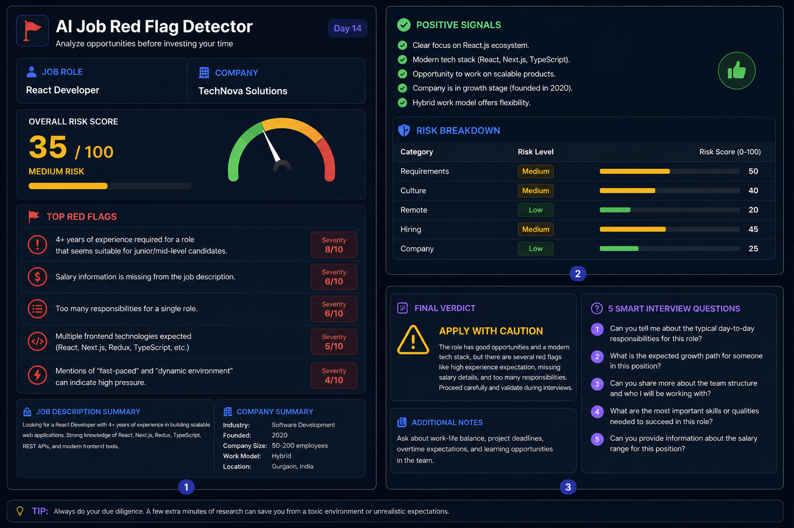

# Day 14 - AI Job Red Flag Detector

## 📅 Date

June 14, 2026

---

# 🎯 Objective

Today's goal was to analyze a job opportunity before applying and identify potential risks, hidden concerns, and positive signals using an AI-powered Job Red Flag Detector.

The focus was on understanding how to evaluate job descriptions more effectively rather than applying blindly.

---

# 💼 Job Analyzed

### Role

React Developer

### Company

TechNova Solutions

### Industry

Software Development

### Work Model

Hybrid

### Location

Gurgaon, India

---

# 🤖 AI Job Red Flag Analysis

The AI analyzed:

- Job Requirements
- Company Information
- Hiring Practices
- Workplace Culture Signals
- Salary Transparency
- Career Growth Potential

---

# 📸 Risk Analysis Dashboard

---

# 📊 Overall Risk Score

### Risk Score

**35 / 100**

⚠️ Medium Risk

The opportunity appears legitimate and technically strong, but there are a few areas that require additional validation during interviews.

---

# 🚩 Top Red Flags Identified

### 1. Experience Expectations

- 4+ years of experience required
- Role responsibilities appear suitable for junior-to-mid level candidates

### 2. Missing Salary Information

- No compensation range mentioned
- Limited transparency regarding benefits

### 3. Broad Responsibilities

- Large number of expectations under a single role
- Multiple technologies expected simultaneously

### 4. Fast-Paced Environment

- Mentions of dynamic and fast-paced work environment
- Could indicate increased workload pressure

---

# ✅ Positive Signals

- Strong React.js ecosystem focus
- Modern technology stack
- Opportunity to work on scalable products
- Company appears to be in growth phase
- Flexible hybrid work model
- Clear technical responsibilities

---

# 📈 Risk Breakdown

| Category | Risk Level |
|-----------|-----------|
| Requirements | Medium |
| Culture | Medium |
| Remote/Hybrid | Low |
| Hiring | Medium |
| Company | Low |

---

# 🎯 Final Verdict

## ⚠️ Apply With Caution

The role offers strong learning opportunities and exposure to modern technologies.

However, applicants should validate:

- Salary expectations
- Work-life balance
- Team structure
- Growth opportunities
- Actual experience expectations

during the interview process.

---

# 💡 Smart Interview Questions

1. What does success look like in the first 6 months?
2. What is the typical work-life balance for the team?
3. How is performance evaluated?
4. What growth opportunities are available within the company?
5. Can you share more details about compensation and benefits?

---

# 🛠 Skills Practiced

- Job Analysis
- Career Research
- Risk Assessment
- Interview Preparation
- Prompt Engineering
- Critical Thinking

---

# 💡 Key Learnings

- Not every job posting is worth pursuing.
- Salary transparency matters.
- Unrealistic requirements can be a warning sign.
- Company culture is just as important as compensation.
- Asking the right questions helps avoid poor career decisions.

---

# 🚀 Biggest Takeaway

> Applying for jobs is not just about getting selected.
>
> It is about identifying opportunities that align with your goals, values, and long-term growth.

AI can help job seekers make more informed decisions before investing time in lengthy application processes.

---

# 📚 Outcome

Successfully analyzed a job opportunity, identified potential risks, evaluated positive signals, and generated smart interview questions for validating concerns.

---

# ✅ Status

Day 14 Completed Successfully

### Challenge

ABTalks 60-Day Claude AI Mastery Challenge

### Topic

AI Job Red Flag Detector

### Outcome

Learned how to evaluate job opportunities critically, identify potential red flags, and make smarter career decisions using AI-powered analysis.

#60DaysOfClaudeChallenge #ABTalks #ClaudeAI #JobSearch #CareerGrowth #SoftwareDeveloper #InterviewPreparation #BuildInPublic
