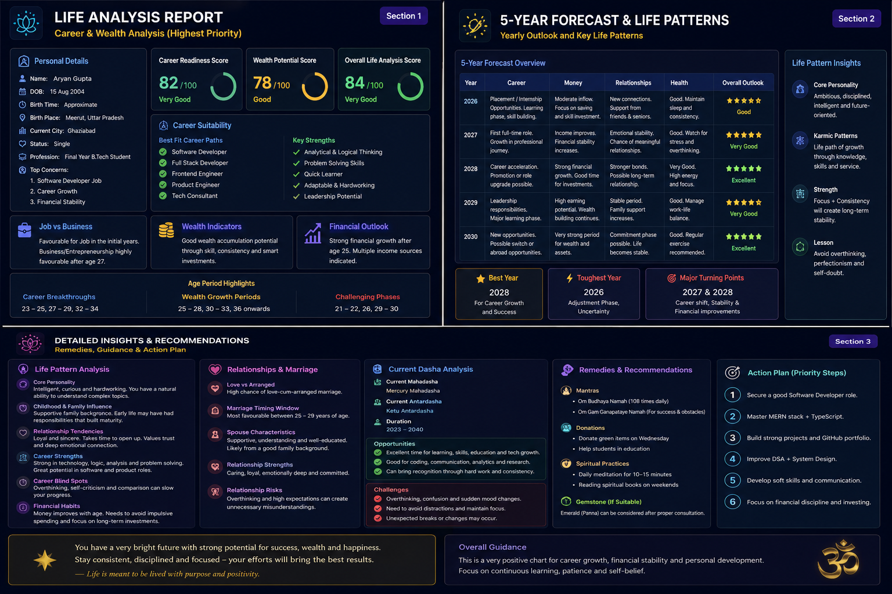

# Day 15 - Personal Life Analysis Consultant

## 📅 Date

June 15, 2026

---

# 🎯 Objective

Today's goal was to explore how structured prompting can be used to generate detailed, multi-section analytical reports from a single prompt.

The focus was on creating a Personal Life Analysis Consultant capable of organizing personal information into meaningful insights, forecasts, and recommendations.

---

# 🧠 Project Overview

## Personal Life Analysis Consultant

A structured AI-generated report that transforms personal inputs into a comprehensive analysis covering:

- Career & Wealth Analysis
- Life Pattern Insights
- Personal Growth Assessment
- 5-Year Forecast
- Recommendations & Action Plan

---

# 📸 Dashboard Report

The generated report included:

### 📊 Career & Wealth Analysis

- Career Readiness Score
- Wealth Potential Score
- Career Suitability Assessment
- Job vs Business Analysis
- Financial Outlook

### 📈 5-Year Forecast

- Career Progression
- Financial Growth Outlook
- Relationship Trends
- Health & Personal Development Indicators
- Major Turning Points

### 💡 Life Pattern Analysis

- Core Personality Traits
- Strengths & Weaknesses
- Growth Opportunities
- Long-Term Development Areas

### 🎯 Recommendations

- Career Action Plan
- Skill Development Priorities
- Personal Growth Suggestions
- Long-Term Success Strategies

---

# 🔍 Key Insights

### Career Strengths

✅ Problem Solving

✅ Analytical Thinking

✅ Technical Learning Ability

✅ Leadership Potential

### Growth Areas

- Advanced Technical Skills
- System Design Knowledge
- Communication Skills
- Long-Term Financial Planning

### Future Focus Areas

- Career Development
- Skill Enhancement
- Consistent Learning
- Personal Branding

---

# 💡 Key Learnings

- Structured prompts can generate highly organized reports.
- AI performs better when provided with clear context and detailed inputs.
- Complex information becomes easier to understand when presented through dashboards and visual summaries.
- Report generation is one of the most practical applications of Prompt Engineering.

---

# 🚀 Biggest Takeaway

> The quality of AI-generated insights depends heavily on the quality and structure of the input provided.

A well-designed prompt can transform raw information into a detailed report that is easier to analyze, understand, and act upon.

---

# 🛠 Skills Practiced

- Prompt Engineering
- Report Generation
- Structured Analysis
- Information Organization
- AI-Assisted Decision Making
- Dashboard Interpretation

---

# 📚 Outcome

Successfully generated a comprehensive Personal Life Analysis Report and explored how AI can be used to create structured insights, forecasts, and recommendations from a single prompt.

---

# ✅ Status

Day 15 Completed Successfully

### Challenge

ABTalks 60-Day Claude AI Mastery Challenge

### Topic

Personal Life Analysis Consultant

### Outcome

Learned how structured prompting can generate detailed reports, organize information effectively, and provide actionable insights through AI-powered analysis.

#60DaysOfClaudeChallenge #ABTalks #ClaudeAI #PromptEngineering #ArtificialIntelligence #CareerGrowth #PersonalDevelopment #BuildInPublic #LearningInPublic
