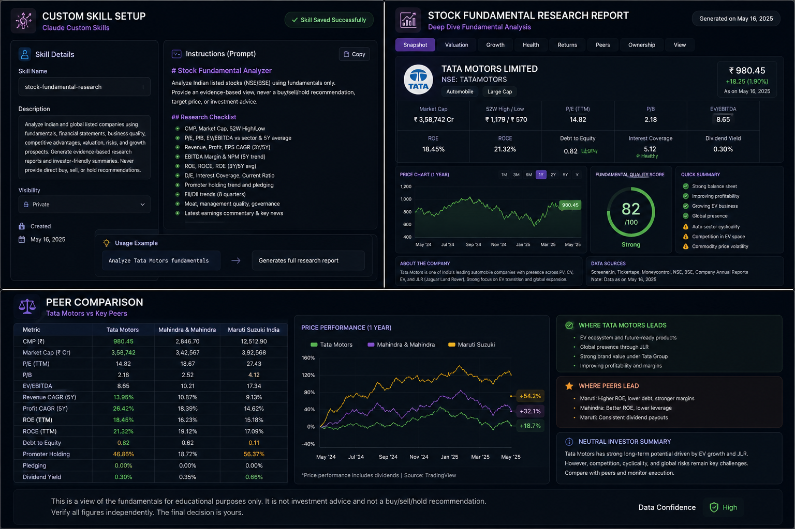

# Day 16 - Stock Fundamental Research Custom Skill

## 📅 Date

June 16, 2026

---

# 🎯 Objective

Today's goal was to learn how Custom Skills can eliminate repetitive prompting and create reusable AI workflows for complex tasks.

The focus was on building a Stock Fundamental Research Skill capable of generating structured research reports for listed companies using a consistent analysis framework.

---

# 🤖 Custom Skill Created

## Skill Name

**stock-fundamental-research**

### Purpose

Analyze listed companies using:

- Business Fundamentals
- Financial Statements
- Valuation Metrics
- Growth Trends
- Ownership Patterns
- Competitive Positioning
- Risk Factors

The skill generates evidence-based research reports and investor-friendly summaries while avoiding direct investment recommendations.

---

# 📸 Custom Skill & Research Dashboard

---

# 📊 Stock Analyzed

## Tata Motors Ltd.

The generated report included:

### Company Snapshot

- Market Capitalization
- 52 Week High / Low
- P/E Ratio
- P/B Ratio
- EV/EBITDA
- ROE
- ROCE
- Debt-to-Equity

### Fundamental Quality Assessment

Overall Quality Score:

**82 / 100**

Classification:

✅ Strong Fundamentals

---

# 📈 Analysis Areas Covered

### Valuation Analysis

- P/E Comparison
- P/B Analysis
- Relative Valuation

### Financial Health

- Debt Levels
- Profitability Metrics
- Cash Flow Indicators

### Growth Analysis

- Revenue Growth
- Profit Growth
- Earnings Trends

### Risk Assessment

- Industry Risks
- Competitive Risks
- Market Risks

---

# 🔄 Peer Comparison

The skill compared Tata Motors with:

- Mahindra & Mahindra
- Maruti Suzuki

Comparison Metrics:

- Market Cap
- ROE
- ROCE
- Debt-to-Equity
- Revenue Growth
- Profit Growth
- Promoter Holding

This helped create a balanced view without declaring a winner.

---

# 💡 Key Learnings

- Custom Skills eliminate the need to repeatedly write complex prompts.
- Structured workflows improve consistency and productivity.
- Financial analysis becomes easier when organized into reusable frameworks.
- AI can automate research processes while maintaining a standardized output format.

---

# 🚀 Biggest Takeaway

> The true power of Prompt Engineering is not creating one great prompt—it is building reusable systems that deliver consistent results every time.

Custom Skills help transform repetitive tasks into scalable workflows.

---

# 🛠 Skills Practiced

- Prompt Engineering
- Workflow Design
- Financial Analysis
- Research Automation
- Information Structuring
- AI Productivity

---

# 📚 Outcome

Successfully created a reusable Stock Fundamental Research Skill and generated a structured research report with valuation analysis, financial health assessment, risk evaluation, and peer comparison.

---

# ✅ Status

Day 16 Completed Successfully

### Challenge

ABTalks 60-Day Claude AI Mastery Challenge

### Topic

Claude Custom Skills

### Project

Stock Fundamental Research Skill

### Outcome

Learned how to build reusable AI workflows, automate research tasks, and generate consistent analytical reports using Custom Skills.

#60DaysOfClaudeChallenge #ABTalks #ClaudeAI #CustomSkills #PromptEngineering #StockAnalysis #ArtificialIntelligence #BuildInPublic #LearningInPublic
