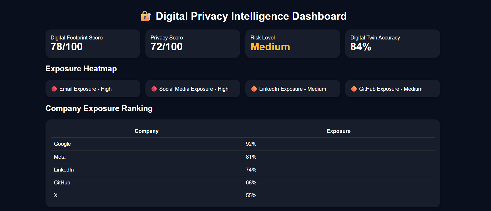
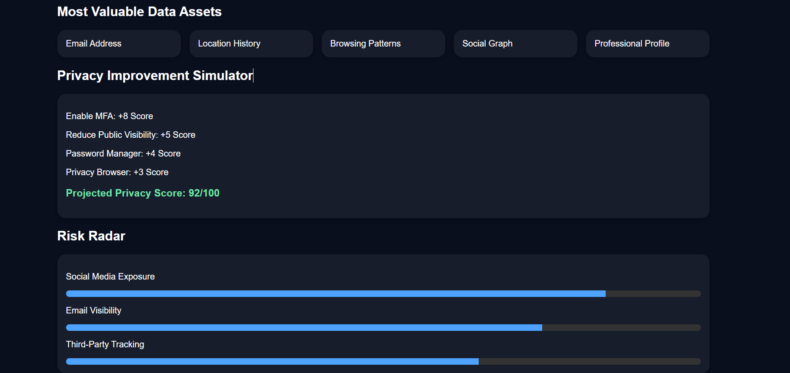
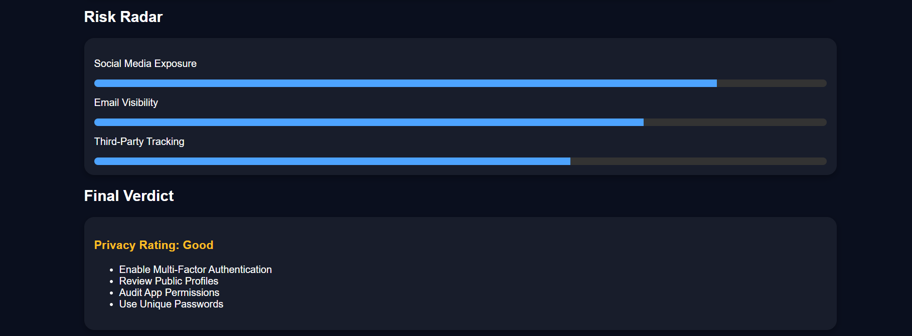

# Day 21 - Digital Privacy Intelligence Dashboard

## 📅 Date

June 21, 2026

---

# 🎯 Objective

Today's goal was to explore digital privacy, online exposure, and data awareness by building a Digital Privacy Intelligence Dashboard.

The focus was on understanding how personal data is distributed across platforms, identifying privacy risks, and exploring ways to improve online security.

---

# 🔐 Project Overview

## Digital Privacy Intelligence Dashboard

An interactive dashboard designed to visualize:

- Digital Footprint Score
- Privacy Score
- Exposure Heatmap
- Company Exposure Ranking
- Digital Twin Profile
- Risk Radar
- Privacy Improvement Simulator
- Security Recommendations

---

# 📸 Dashboard Preview

---

# 📊 Key Metrics

### Digital Footprint Score

**78 / 100**

### Privacy Score

**72 / 100**

### Risk Level

⚠️ Medium

### Digital Twin Accuracy

**84%**

---

# 🌐 Exposure Analysis

### High Exposure Areas

🔴 Email Accounts

🔴 Social Media Profiles

### Medium Exposure Areas

🟠 LinkedIn

🟠 GitHub

### Low Exposure Areas

🟢 Learning Platforms

🟢 Productivity Tools

---

# 🏢 Company Exposure Ranking

| Platform | Exposure Level |
|-----------|-----------|
| Google | 92% |
| Meta | 81% |
| LinkedIn | 74% |
| GitHub | 68% |
| X (Twitter) | 55% |

This section highlights how much personal information may be associated with different digital platforms.

---

# 👤 Digital Twin Profile

### Most Valuable Data Assets

- Email Address
- Location History
- Browsing Patterns
- Social Connections
- Professional Information

### Observation

These data points collectively contribute to a highly detailed digital profile that organizations can use for personalization, advertising, analytics, and recommendations.

---

# 📈 Privacy Improvement Simulator

### Potential Improvements

✅ Enable Multi-Factor Authentication (+8)

✅ Reduce Public Profile Visibility (+5)

✅ Use Password Manager (+4)

✅ Privacy-Focused Browser (+3)

### Projected Privacy Score

**92 / 100**

---

# ⚠️ Risk Radar

### Major Privacy Risks

- Social Media Exposure
- Email Visibility
- Third-Party Tracking
- Excessive Data Sharing
- Public Profile Information

---

# 💡 Key Learnings

- Every online account contributes to our digital footprint.
- Privacy risks often come from everyday platforms we use regularly.
- Small security improvements can significantly increase privacy scores.
- Data awareness is as important as cybersecurity.
- Dashboards help visualize privacy risks in a more understandable way.

---

# 🚀 Biggest Takeaway

> You cannot protect what you do not understand.

Understanding your digital footprint is the first step toward improving online privacy, reducing exposure, and making informed decisions about personal data.

---

# 🛠 Skills Practiced

- Data Analysis
- Privacy Awareness
- Dashboard Design
- Risk Assessment
- Data Visualization
- AI-Assisted Insights

---

# 📚 Outcome

Successfully built a Digital Privacy Intelligence Dashboard to analyze online exposure, identify privacy risks, evaluate digital assets, and explore practical ways to improve privacy and security.

---

# ✅ Status

Day 21 Completed Successfully

### Challenge

ABTalks 60-Day Claude AI Mastery Challenge

### Topic

Digital Privacy Intelligence Dashboard

### Outcome

Learned how digital footprints are created, how privacy exposure can be measured, and how data-driven insights can improve online security awareness.

#60DaysOfClaudeChallenge #ABTalks #ClaudeAI #PrivacyIntelligence #CyberSecurity #DataPrivacy #DigitalFootprint #DashboardDesign #ArtificialIntelligence #BuildInPublic #LearningInPublic
