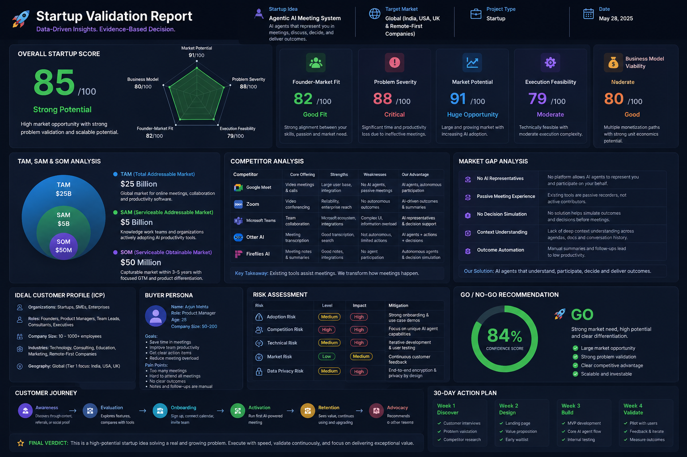

# Day 22 - Startup Validation Report

## 📅 Date

June 22, 2026

---

# 🎯 Objective

Today's goal was to learn how startup founders, investors, and venture capitalists evaluate startup ideas before investing significant time and resources.

The focus was on validating a startup idea through market analysis, competitor research, customer profiling, risk assessment, and business viability evaluation.

---

# 🚀 Startup Idea

## Agentic AI Meeting System

An AI-powered meeting platform where intelligent agents can represent users, participate in discussions, understand meeting context, generate insights, and assist in decision-making.

### Problem Being Solved

- Meeting fatigue and overload
- Scheduling conflicts
- Repetitive discussions
- Lack of actionable outcomes
- Poor meeting documentation

### Target Customers

- Startups
- Product Teams
- Software Companies
- Remote Teams
- Enterprises
- Consultants

---

# 📸 Startup Validation Dashboard

---

# 📊 Executive Summary

The startup idea addresses a growing productivity challenge faced by modern organizations. With the increasing adoption of AI and remote collaboration tools, there is a significant opportunity to improve meeting efficiency through intelligent automation.

### Overall Startup Score

**85 / 100**

### Recommendation

🚀 **GO**

### Confidence Level

**84%**

---

# 📈 Founder-Market Fit Analysis

| Category | Score |
|-----------|--------|
| Founder-Market Fit | 82/100 |
| Problem Severity | 88/100 |
| Market Potential | 91/100 |
| Execution Feasibility | 79/100 |
| Business Model Viability | 80/100 |

### Key Observation

Strong alignment between the founder's technical background and the problem being addressed.

---

# 🌎 TAM, SAM & SOM Analysis

### Total Addressable Market (TAM)

**$25 Billion**

Global market for online meetings, collaboration software, and workplace productivity solutions.

### Serviceable Addressable Market (SAM)

**$5 Billion**

Knowledge workers and organizations actively using productivity and communication tools.

### Serviceable Obtainable Market (SOM)

**$50 Million**

Potential capture within the first few years through focused customer acquisition and product positioning.

---

# 🏢 Competitor Analysis

### Existing Competitors

- Google Meet
- Zoom
- Microsoft Teams
- Otter AI
- Fireflies AI

### Market Gap Identified

✅ AI Representatives

✅ Autonomous Participation

✅ Context-Aware Discussions

✅ Decision Simulation

✅ Outcome Automation

### Competitive Advantage

Most existing tools assist meetings, while this platform aims to actively participate and contribute through AI agents.

---

# 🎯 Ideal Customer Profile (ICP)

### Organization Type

- Startups
- SMEs
- Enterprises

### Key Decision Makers

- Founders
- Product Managers
- Engineering Managers
- Team Leads

### Team Size

10 – 1000+ Employees

### Geography

India, USA, UK, and Remote-First Organizations

---

# 👤 Buyer Persona

### Name

Arjun Mehta

### Role

Product Manager

### Company Size

50–200 Employees

### Pain Points

- Excessive meetings
- Poor meeting outcomes
- Context switching
- Documentation overhead

### Goals

- Increase team productivity
- Improve decision quality
- Reduce meeting time
- Automate follow-ups

---

# ⚠️ Risk Assessment

| Risk | Impact |
|--------|--------|
| User Adoption Risk | High |
| Competitive Pressure | High |
| Technical Complexity | Medium |
| Privacy & Security Concerns | High |
| Market Education | Medium |

### Mitigation Strategies

- Early customer interviews
- MVP validation
- Privacy-first architecture
- Focused niche positioning
- Continuous user feedback

---

# 🔄 Pivot Opportunities

### Potential Expansions

- AI Meeting Assistant
- Enterprise Collaboration Suite
- AI Decision Support Platform
- AI Productivity Workspace
- Internal Knowledge Management System

---

# 🚀 30-Day Action Plan

## Week 1

- Conduct customer interviews
- Validate problem statements
- Analyze competitors

## Week 2

- Create landing page
- Build waitlist
- Define value proposition

## Week 3

- Develop MVP prototype
- Test AI agent workflows
- Gather early feedback

## Week 4

- Pilot testing
- Iterate based on feedback
- Measure engagement and adoption

---

# 💡 Key Learnings

- Startup ideas should be validated before development.
- Market size alone does not guarantee success.
- Customer pain points matter more than product features.
- Competitor analysis helps identify differentiation opportunities.
- Founder-market fit is critical for long-term execution.

---

# 🚀 Biggest Takeaway

> Great startups are built on validated problems, not just innovative ideas.

Successful founders focus on understanding customers, validating assumptions, and executing quickly based on evidence rather than intuition alone.

---

# 🛠 Skills Practiced

- Startup Validation
- Market Research
- Competitor Analysis
- Product Thinking
- Business Strategy
- Entrepreneurship

---

# 📚 Outcome

Successfully analyzed a startup concept using a VC-style framework and learned how to evaluate market opportunities, customer demand, competitive positioning, and execution risks before building a product.

---

# ✅ Status

Day 22 Completed Successfully

### Challenge

ABTalks 60-Day Claude AI Mastery Challenge

### Topic

Startup Validation & Market Analysis

### Project

Agentic AI Meeting System

### Outcome

Validated a startup idea through structured analysis, identified market opportunities, assessed risks, and created a practical execution roadmap.

#60DaysOfClaudeChallenge #ABTalks #ClaudeAI #StartupValidation #Entrepreneurship #ArtificialIntelligence #ProductManagement #BuildInPublic #LearningInPublic #Innovation
