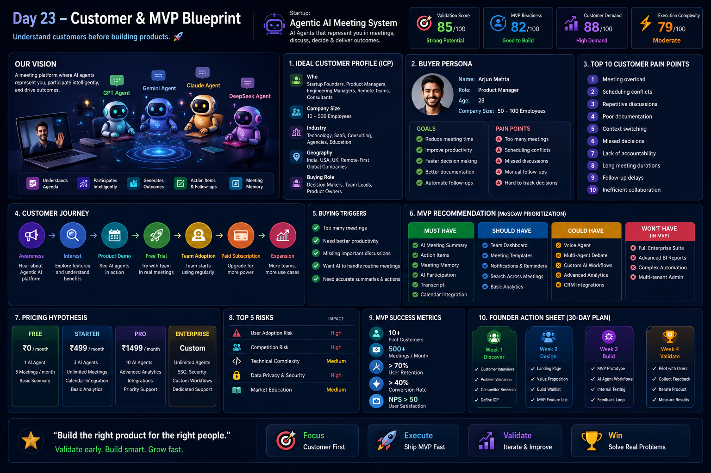

# Day 23 - Customer & MVP Blueprint

## 📅 Date

June 23, 2026

---

# 🎯 Objective

Today's goal was to understand customers before building products by creating a complete Customer & MVP Blueprint for a startup idea.

The focus was on identifying the right customers, understanding their pain points, mapping their journey, and defining the minimum viable product (MVP) required to solve their most important problems.

---

# 🚀 Startup Idea

## Agentic AI Meeting System

An AI-powered meeting platform where intelligent agents can represent users, participate in discussions, understand context, generate insights, and help teams make better decisions.

### Problem Being Solved

- Meeting overload
- Scheduling conflicts
- Repetitive discussions
- Poor documentation
- Missed decisions
- Manual follow-ups

---

# 📸 Customer & MVP Blueprint Dashboard

---

# 👥 Ideal Customer Profile (ICP)

### Primary Customers

- Startup Founders
- Product Managers
- Engineering Managers
- Team Leads
- Remote Teams
- Consultants

### Company Size

10 – 500 Employees

### Industries

- SaaS
- Technology
- Consulting
- Agencies
- Remote-First Organizations

### Geography

- India
- USA
- UK
- Global Remote Teams

---

# 👤 Buyer Persona

### Name

Arjun Mehta

### Role

Product Manager

### Age

28

### Goals

- Reduce meeting overload
- Improve team productivity
- Accelerate decision-making
- Improve collaboration

### Pain Points

- Too many meetings
- Scheduling conflicts
- Missed discussions
- Manual note-taking
- Lack of accountability

---

# 🔥 Top 10 Customer Pain Points

1. Meeting overload
2. Scheduling conflicts
3. Repetitive discussions
4. Poor documentation
5. Context switching
6. Missed decisions
7. Lack of accountability
8. Long meeting durations
9. Follow-up delays
10. Inefficient collaboration

---

# 🛣 Customer Journey

### Awareness

Customer discovers AI-powered meeting solutions.

### Interest

Explores features and benefits.

### Product Demo

Sees AI agents participate in meetings.

### Free Trial

Tests the platform with a team.

### Team Adoption

Uses the product regularly.

### Paid Subscription

Converts to a paid plan.

### Expansion

Rolls out across additional teams.

---

# 🛒 Buying Triggers

✅ Too many meetings

✅ Productivity loss

✅ Need better documentation

✅ Growing remote teams

✅ Faster decision-making requirements

---

# ⚠ Common Objections

❌ Will AI understand context?

❌ Can AI be trusted in meetings?

❌ Privacy and security concerns

❌ Team adoption challenges

❌ Cost justification

---

# 📋 MVP Recommendation (MoSCoW Prioritization)

## Must Have

- AI Meeting Summary
- Action Item Generation
- Meeting Memory
- AI Participation
- Calendar Integration

## Should Have

- Team Dashboard
- Search Across Meetings
- Notifications
- Basic Analytics

## Could Have

- Voice Agent
- Multi-Agent Debate
- CRM Integration
- Advanced Workflows

## Won't Have (MVP)

- Full Enterprise Suite
- Advanced Reporting
- Custom AI Training
- Complex Automation

---

# 💰 Pricing Hypothesis

| Plan | Price |
|--------|--------|
| Free | ₹0 |
| Starter | ₹499/month |
| Pro | ₹1499/month |
| Enterprise | Custom Pricing |

---

# ⚠ Top 5 Risks

| Risk | Impact |
|--------|--------|
| User Adoption | High |
| Competition | High |
| Technical Complexity | Medium |
| Privacy & Security | High |
| Market Education | Medium |

---

# 🚀 Founder Action Sheet (30-Day Plan)

## Week 1

- Conduct Customer Interviews
- Validate Pain Points
- Define ICP

## Week 2

- Create Landing Page
- Build Waitlist
- Validate Pricing

## Week 3

- Develop MVP Prototype
- Test Core Features
- Gather Feedback

## Week 4

- Pilot Testing
- Measure Engagement
- Iterate Product

---

# 💡 Key Learnings

- Customer understanding should come before product development.
- Building every feature is not the goal; solving the right problem is.
- MVPs should focus on validation rather than perfection.
- Customer pain points drive product adoption.
- Strong ICPs improve product positioning and marketing.

---

# 🚀 Biggest Takeaway

> Successful startups are built by deeply understanding customers before building solutions.

The best MVP is not the one with the most features—it is the one that solves the most important customer problem with the least complexity.

---

# 🛠 Skills Practiced

- Customer Discovery
- Product Management
- Startup Validation
- MVP Planning
- User Research
- Strategic Thinking

---

# 📚 Outcome

Successfully created a Customer & MVP Blueprint for an Agentic AI Meeting System, including customer profiles, pain points, customer journey mapping, feature prioritization, pricing strategy, and execution planning.

---

# ✅ Status

Day 23 Completed Successfully

### Challenge

ABTalks 60-Day Claude AI Mastery Challenge

### Topic

Customer & MVP Blueprint

### Project

Agentic AI Meeting System

### Outcome

Learned how to identify target customers, validate pain points, prioritize MVP features, and build a roadmap for launching a startup effectively.

#60DaysOfClaudeChallenge #ABTalks #ClaudeAI #ProductManagement #MVP #StartupValidation #Entrepreneurship #BuildInPublic #LearningInPublic #ArtificialIntelligence
