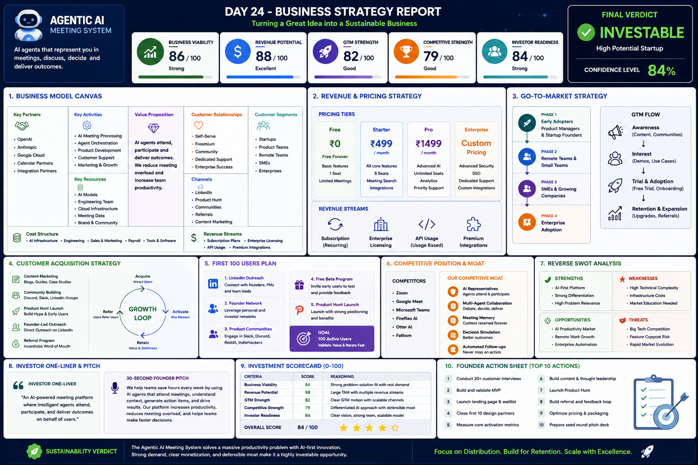

# Day 24 - Startup Business Strategy Report

## 📅 Date

June 24, 2026

---

# 🎯 Objective

Today's goal was to evaluate whether a startup idea can become a sustainable business by analyzing its revenue model, customer acquisition strategy, market positioning, competitive advantages, and long-term growth potential.

The focus was on moving beyond product development and understanding the business fundamentals required to build a scalable startup.

---

# 🚀 Startup Overview

## Agentic AI Meeting System

An AI-powered meeting platform where intelligent agents can represent users, participate in discussions, generate meeting outcomes, and automate follow-ups.

### Problem Being Solved

- Meeting overload
- Scheduling conflicts
- Poor documentation
- Lost context across discussions
- Manual action-item tracking
- Reduced team productivity

---

# 📸 Business Strategy Dashboard

---

# 📊 Executive Summary

The Agentic AI Meeting System addresses a growing productivity challenge faced by startups, remote teams, and enterprises. By leveraging AI agents to participate in meetings and automate outcomes, the platform aims to reduce meeting fatigue while improving decision-making and collaboration.

### Overall Business Score

**84 / 100**

### Final Verdict

🟢 **INVESTABLE**

---

# 💼 Business Reality Check

### Who Pays?

- Startup Founders
- Product Teams
- SMEs
- Enterprises
- Consulting Firms

### Why Do They Pay?

- Save employee time
- Improve productivity
- Automate meeting documentation
- Reduce operational inefficiencies

### Discovery Channels

- LinkedIn
- Product Hunt
- Founder Communities
- Startup Networks
- AI Communities

### Biggest Risks

- User adoption challenges
- Competition from established platforms
- AI trust and reliability concerns

---

# 🧩 Business Model Canvas

## Customer Segments

- Startups
- Product Managers
- Engineering Teams
- Remote Organizations
- Enterprises

## Value Proposition

- AI Meeting Participation
- Automated Summaries
- Action Item Generation
- Meeting Memory
- Decision Tracking

## Revenue Streams

- Monthly Subscriptions
- Enterprise Licensing
- API Usage
- Premium Integrations

## Channels

- Content Marketing
- Product Hunt
- Referrals
- Communities
- LinkedIn Outreach

---

# 💰 Revenue & Pricing Strategy

| Plan | Pricing |
|--------|---------|
| Free | ₹0 |
| Starter | ₹499/month |
| Pro | ₹1499/month |
| Enterprise | Custom Pricing |

### Revenue Sources

1. SaaS Subscription Revenue
2. Enterprise Contracts
3. API Consumption
4. Integration Marketplace

---

# 📢 Go-To-Market Strategy

### Phase 1

Target startup founders and product managers.

### Phase 2

Expand into remote teams and growing startups.

### Phase 3

Focus on SMEs and consulting firms.

### Phase 4

Scale into enterprise organizations.

---

# 🎯 Customer Acquisition Strategy

### Acquisition Channels

✅ LinkedIn Content & Outreach

✅ Founder Communities

✅ Product Hunt Launch

✅ Referral Programs

✅ AI & Startup Communities

### Growth Loop

Acquire → Activate → Retain → Refer → Scale

---

# 🚀 First 100 Users Plan

### Week 1

- Conduct customer interviews
- Validate core pain points

### Week 2

- Launch landing page
- Build waitlist

### Week 3

- Release MVP
- Collect feedback

### Week 4

- Pilot with early adopters
- Measure engagement

### Goal

🎯 100 Active Users

---

# 🏆 Competitive Position & Moat

## Competitors

- Zoom
- Google Meet
- Microsoft Teams
- Fireflies AI
- Otter AI

## Competitive Advantages

✅ AI Representatives

✅ Multi-Agent Collaboration

✅ Meeting Memory

✅ Decision Simulation

✅ Automated Follow-Ups

---

# 🔄 Reverse SWOT Analysis

## Strengths

- Strong AI Differentiation
- Large Productivity Market
- High Problem Relevance

## Weaknesses

- Technical Complexity
- Infrastructure Costs
- Market Education Needed

## Opportunities

- Growth of AI Adoption
- Remote Work Expansion
- Enterprise Automation

## Threats

- Big Tech Competition
- Rapid Market Changes
- Feature Replication

---

# 💡 Investor One-Liner

> An AI-powered meeting platform where intelligent agents attend, participate, and generate outcomes on behalf of users.

---

# 🎤 30-Second Founder Pitch

Meetings consume a significant portion of workplace productivity. Our platform uses intelligent AI agents to attend meetings, capture context, generate action items, and improve decision-making. By reducing meeting overload and automating follow-ups, we help teams work faster and more effectively.

---

# 📈 Investment Scorecard

| Category | Score |
|----------|--------|
| Business Viability | 86 |
| Revenue Potential | 88 |
| GTM Strength | 82 |
| Competitive Strength | 79 |
| Investor Readiness | 84 |

### Overall Score

⭐ **84 / 100**

---

# 📝 Founder Action Sheet

### Top 10 Priorities

1. Conduct customer interviews
2. Validate MVP assumptions
3. Build landing page
4. Launch waitlist
5. Acquire first 10 users
6. Collect product feedback
7. Refine pricing strategy
8. Improve onboarding flow
9. Build referral loop
10. Prepare investor pitch deck

---

# 💡 Key Learnings

- Great products need strong distribution strategies.
- Revenue generation matters more than vanity metrics.
- Customer acquisition is as important as product development.
- Competitive moats create long-term business advantages.
- Sustainable businesses require continuous validation and iteration.

---

# 🚀 Biggest Takeaway

> Building a startup is not only about creating a product—it's about creating a business that customers are willing to pay for repeatedly.

A sustainable business combines customer value, revenue generation, market demand, and strong execution.

---

# 🛠 Skills Practiced

- Startup Strategy
- Business Modeling
- Revenue Planning
- Go-To-Market Strategy
- Customer Acquisition
- Entrepreneurship

---

# 📚 Outcome

Successfully developed a complete Business Strategy Report for an Agentic AI Meeting System, including revenue strategy, GTM planning, customer acquisition roadmap, competitive positioning, and investment readiness analysis.

---

# ✅ Status

Day 24 Completed Successfully

### Challenge

ABTalks 60-Day Claude AI Mastery Challenge

### Topic

Startup Business Strategy Report

### Project

Agentic AI Meeting System

### Outcome

Validated the business potential of a startup idea and created a practical roadmap for growth, monetization, customer acquisition, and long-term sustainability.

#60DaysOfClaudeChallenge #ABTalks #ClaudeAI #StartupStrategy #Entrepreneurship #BusinessModel #ProductManagement #BuildInPublic #LearningInPublic #ArtificialIntelligence
