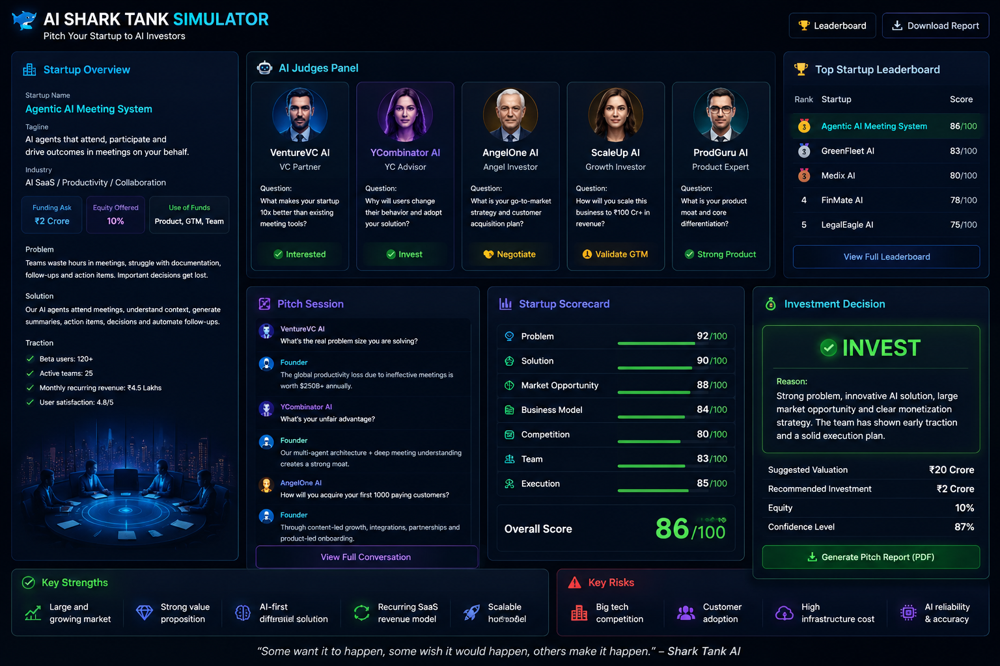
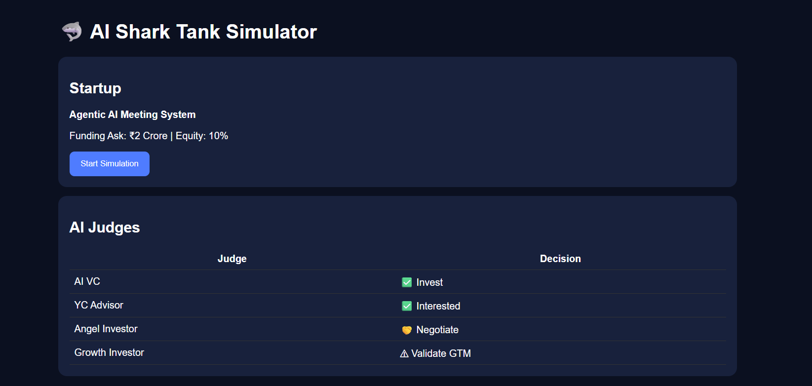
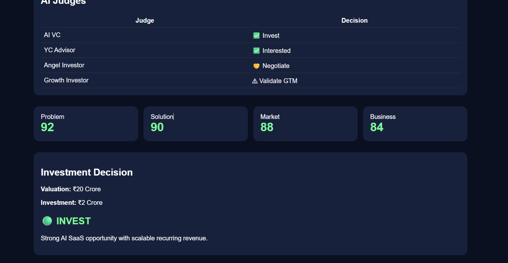

# Day 25 - AI Shark Tank Simulator

## 📅 Date

June 25, 2026

---

# 🎯 Objective

Today's challenge was to simulate a real startup investment pitch using AI. The goal was to evaluate a startup idea from an investor's perspective by analyzing its business model, market potential, execution strategy, valuation, and funding requirements.

---

# 🚀 Startup Idea

## Agentic AI Meeting System

An AI-powered collaboration platform where intelligent AI agents can attend meetings, understand discussions, generate summaries, assign action items, and help teams make faster, smarter decisions.

### Problem Statement

Modern teams spend countless hours in meetings that often result in:

* Meeting overload
* Poor documentation
* Missed action items
* Scheduling conflicts
* Reduced productivity

Our solution automates meeting participation and follow-ups using AI agents.

---

# 📸 Simulation Preview

---

# 🦈 AI Investor Panel

The startup pitch was evaluated by a panel of AI investors representing different perspectives:

* Venture Capital Partner
* Y Combinator Advisor
* Angel Investor
* Product Expert
* Growth Investor

Each judge analyzed the startup's business model, scalability, market opportunity, product differentiation, and go-to-market strategy.

---

# 📊 Startup Scorecard

| Category             |  Score |
| -------------------- | :----: |
| Problem Validation   | 92/100 |
| Solution Innovation  | 90/100 |
| Market Opportunity   | 88/100 |
| Business Model       | 84/100 |
| Competition          | 80/100 |
| Team Readiness       | 83/100 |
| Execution Capability | 85/100 |

## ⭐ Overall Score

**86 / 100**

---

# 💰 Investment Recommendation

**Suggested Investment:** ₹2 Crore

**Suggested Equity:** 10%

**Estimated Valuation:** ₹20 Crore

**Investor Confidence:** 87%

### Final Decision

🟢 **INVEST**

The startup demonstrates a strong problem-solution fit, a scalable SaaS business model, and promising market potential. Success will depend on execution quality, customer adoption, and continuous innovation.

---

# 💡 Key Strengths

* Solves a real business productivity problem
* AI-first approach with clear differentiation
* Recurring SaaS revenue model
* Large and growing target market
* Strong scalability potential

---

# ⚠️ Risks Identified

* Competition from established collaboration platforms
* Customer adoption challenges
* Infrastructure and AI operating costs
* Data privacy and security requirements

---

# 📚 Key Learnings

* Investors evaluate businesses, not just ideas.
* A compelling pitch combines market opportunity, business model, and execution strategy.
* Product differentiation and recurring revenue significantly improve investment attractiveness.
* Clear communication is as important as building the product itself.

---

# 🚀 Biggest Takeaway

> A successful startup pitch is built on a clear problem, a compelling solution, a sustainable business model, and the ability to execute consistently.

---

# 🛠 Skills Practiced

* Startup Pitching
* Business Strategy
* Investor Thinking
* Product Positioning
* Entrepreneurship
* AI-Assisted Analysis

---

# 📂 Project Files

* `Day25_AI_Shark_Tank_Simulator.html`
* `startup-pitch-report.md`
* `ai-shark-tank-simulation.png`

---

# ✅ Status

**Day 25 Completed Successfully**

### Challenge

**ABTalks 60-Day Claude AI Mastery Challenge**

### Topic

**AI Shark Tank Simulator**

### Outcome

Built an AI-powered startup pitching experience, evaluated a business idea through simulated investor feedback, analyzed funding recommendations, and gained practical insights into startup validation and investment readiness.

---

#60DaysOfClaudeChallenge #ABTalks #ClaudeAI #SharkTank #StartupPitch #Entrepreneurship #ArtificialIntelligence #ProductManagement #BuildInPublic #LearningInPublic
