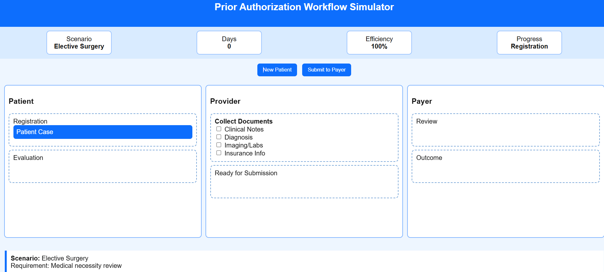
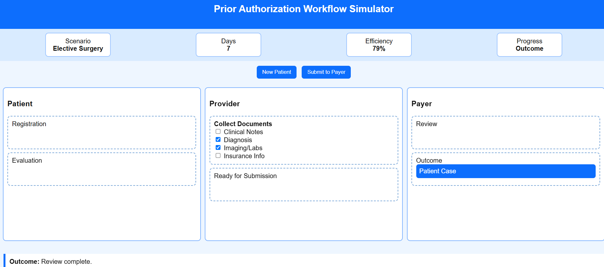

# 🏥 Day 26 – Prior Authorization Workflow Simulator

## 📌 Overview

Today’s challenge focused on understanding one of the most important workflows in the healthcare industry—**Prior Authorization (PA)**.

I built a **Prior Authorization Workflow Simulator** that demonstrates how healthcare providers, insurance companies, and patients interact throughout the authorization lifecycle. The simulator visualizes each stage of the process while explaining how documentation, verification, and clinical review affect the final outcome.

---

# 🎯 Objective

- Understand the Prior Authorization process
- Simulate real-world healthcare workflows
- Learn insurance verification and approval lifecycle
- Track workflow progress using an interactive dashboard
- Explore approval, pending, denial, and appeal scenarios

---

# 🏥 Patient Scenario

**Patient Name:** John Anderson

**Age:** 48 Years

**Diagnosis:** Chronic Lower Back Pain

**Requested Procedure:** MRI Lumbar Spine

**Insurance Provider:** BlueCross PPO

---

# 📸 Screenshots

## Workflow Dashboard



---

# 🔄 Prior Authorization Workflow

```
Patient Registration
        │
        ▼
Insurance Verification
        │
        ▼
Prior Authorization Request
        │
        ▼
Clinical Review
        │
        ▼
Insurance Decision
   ┌────┼────┐
   │    │    │
Approve Pend Deny
             │
             ▼
          Appeal
             │
             ▼
      Final Decision
```

---

# 📄 Required Documents

- ✅ Physician Notes
- ✅ Diagnosis Report
- ✅ Insurance Card
- ✅ MRI Request Form
- ✅ Clinical History
- ✅ Supporting Medical Records

---

# 📊 Workflow Analytics

| Metric | Result |
|---------|---------|
| Workflow Completion | 100% |
| Documentation Accuracy | 100% |
| Processing Time | 4 Days |
| Approval Probability | 95% |
| Final Status | 🟢 Approved |

---

# 🎓 Educational Insights

The simulator demonstrates how healthcare organizations process prior authorization requests before approving medical procedures.

### Key Concepts Covered

- Patient Registration
- Insurance Eligibility Verification
- Medical Necessity Review
- Prior Authorization Submission
- Clinical Documentation
- Approval Workflow
- Denial & Appeal Process

---

# 💡 Key Learnings

- Learned the complete Prior Authorization workflow.
- Understood how insurance verification impacts healthcare decisions.
- Explored documentation required for medical approvals.
- Learned the difference between approval, pending, denial, and appeal scenarios.
- Gained insight into healthcare workflow automation.

---

# 🚀 Technologies & Concepts

- HTML5
- CSS3
- JavaScript
- Interactive Dashboard Design
- Workflow Simulation
- Business Process Visualization
- Healthcare Operations

---

# 📂 Project Structure

```
Day26/
│── Prior_Authorization_Workflow_Simulator.html
│── workflow-dashboard.png
│── workflow-summary-report.md
│── day26.md
```

---

# 📈 Outcome

Successfully created an interactive **Prior Authorization Workflow Simulator** that visualizes the complete healthcare authorization lifecycle, improving understanding of insurance verification, document validation, clinical review, and approval workflows.

---

## 🌟 Key Takeaway

> Prior Authorization is more than paperwork—it ensures that medical treatments meet clinical guidelines while balancing patient care, insurance policies, and operational efficiency.

---

### #60DaysOfClaudeChallenge #ABTalks #ClaudeAI #Healthcare #HealthTech #WorkflowAutomation #BusinessProcesses #InteractiveLearning #ArtificialIntelligence #BuildInPublic
