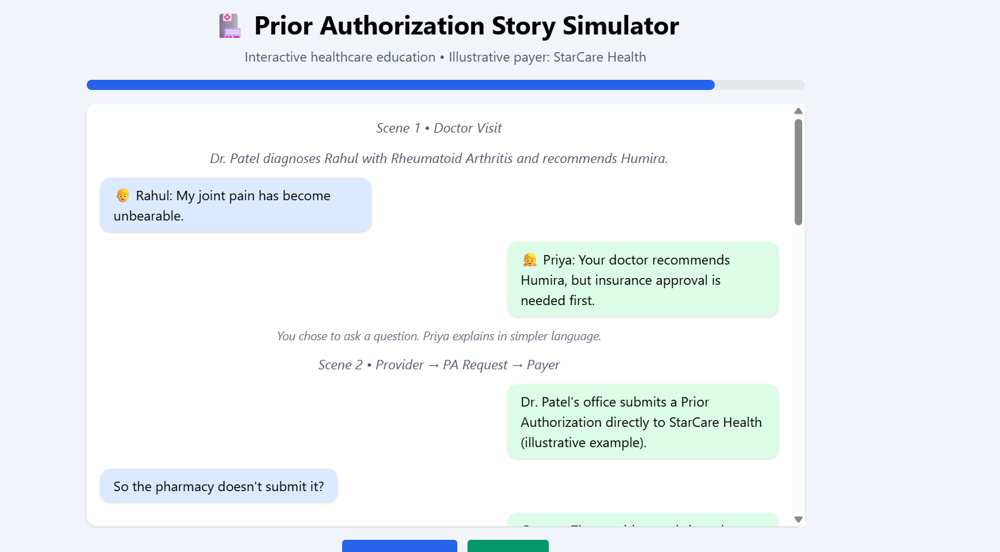
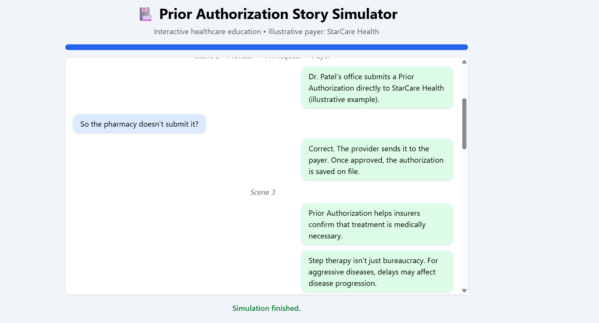
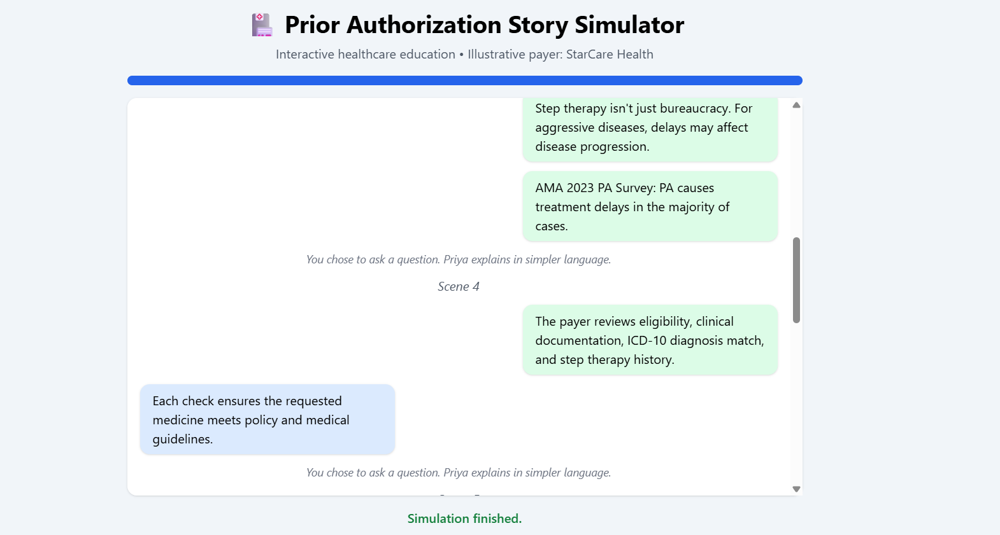
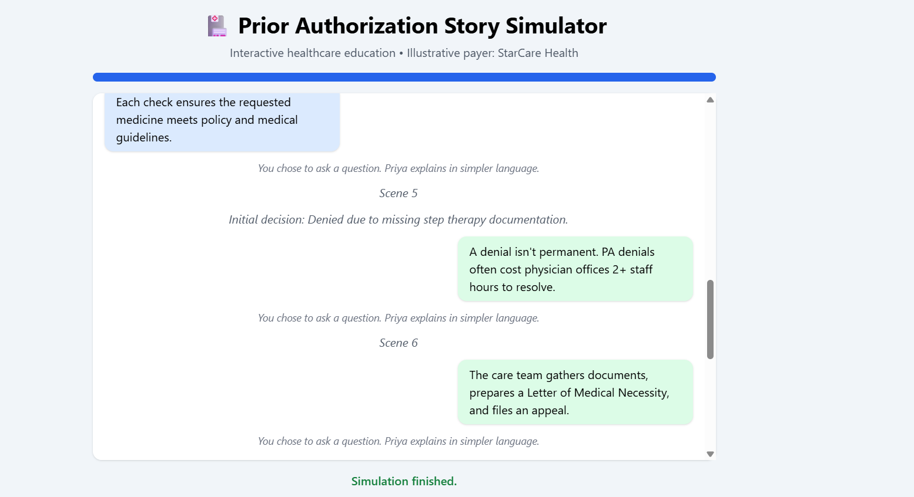
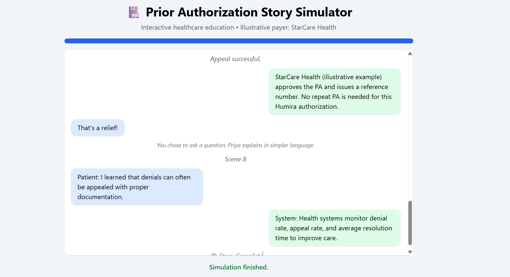

# 🏥 Day 27 – Prior Authorization Story Simulator

## 📅 Date

June 27, 2026

---

# 🎯 Objective

Today's challenge focused on learning healthcare workflows through **interactive storytelling**.

The objective was to build a story-driven simulator that explains the **Prior Authorization (PA)** process using simple conversations between a patient and a healthcare operations specialist.

Instead of presenting complex healthcare concepts as technical documentation, the simulator transforms them into an engaging educational experience.

---

# 📖 Project

## Prior Authorization Story Simulator

An interactive HTML application that guides users through the complete Prior Authorization journey using story-based conversations, progress tracking, and decision-making choices.

The simulator helps beginners understand why prior authorization exists, how insurance companies review requests, and what happens when a request is denied or approved.

---

# 📸 Application Preview

## Story Dashboard






---

# 👥 Characters

👦 **Rahul**
- Patient

👧 **Priya**
- Healthcare Operations Specialist

👨‍⚕️ **Dr. Patel**
- Treating Physician

🏥 **StarCare Health**
- Illustrative Insurance Provider

---

# 📚 Story Flow

```
Doctor Visit
      │
      ▼
Diagnosis
      │
      ▼
Prior Authorization Request
      │
      ▼
Insurance Review
      │
      ▼
Denial
      │
      ▼
Appeal
      │
      ▼
Approval
      │
      ▼
Key Takeaways
```

---

# 🎬 Story Scenes

### Scene 1

🏥 Doctor Visit

- Rahul visits City Medical Center
- Diagnosed with Rheumatoid Arthritis
- Dr. Patel prescribes Humira

---

### Scene 2

📄 Insurance Roadblock

Provider

↓

Prior Authorization Request

↓

StarCare Health (Illustrative)

---

### Scene 3

💬 What is Prior Authorization?

Priya explains:

- Why Prior Authorization exists
- Medical necessity review
- Step Therapy
- Treatment delays
- Healthcare workflow basics

---

### Scene 4

🔍 Insurance Review

Insurance verifies:

- Patient Eligibility
- Clinical Documentation
- ICD-10 Diagnosis
- Step Therapy History

---

### Scene 5

❌ Initial Denial

Reason:

Missing Step Therapy Documentation

Healthcare Insight:

PA denials often require additional administrative work before treatment can continue.

---

### Scene 6

📂 Appeal

Required Documents

- Letter of Medical Necessity
- Physician Notes
- Clinical History
- Supporting Evidence

---

### Scene 7

🟢 Approval

Reference Number

```
PA-2026-784291
```

Final Status

**Approved**

Authorization stored successfully.

---

### Scene 8

🎓 Learning Summary

### Patient Perspective

- Understood insurance approval process
- Learned importance of documentation
- Learned appeal process

### Healthcare Perspective

- Denial Rate
- Appeal Rate
- Resolution Time
- Workflow Efficiency

---

# 📊 Workflow Metrics

| Metric | Result |
|---------|---------|
| Story Completion | 100% |
| Workflow Accuracy | 100% |
| Interactive Scenes | 8 |
| Healthcare Knowledge Score | 92% |

---

# 💡 Key Learnings

- Learned the complete Prior Authorization lifecycle through interactive storytelling.
- Understood the relationship between healthcare providers and insurance companies.
- Explored denial, appeal, and approval scenarios.
- Learned why proper clinical documentation is essential.
- Discovered how storytelling can simplify complex healthcare workflows.

---

# 🚀 Technologies Used

- HTML5
- Tailwind CSS
- Vanilla JavaScript
- Interactive Storytelling
- Healthcare Workflow Simulation
- Progress Tracking

---

# 📂 Project Structure

```
Day27/
│── Prior_Authorization_Story_Simulator.html
│── story-simulator-dashboard.png
│── story-summary-report.md
│── day27.md
```

---

# 📄 Report Included

- Story Summary
- Patient Journey
- Prior Authorization Workflow
- Insurance Review Process
- Appeal Workflow
- Approval Summary
- Healthcare Learnings

---

# 🌟 Biggest Takeaway

> Storytelling transforms complex healthcare workflows into engaging learning experiences. By combining interactive conversations with real-world scenarios, even challenging concepts like Prior Authorization become easier to understand.

---

# ✅ Status

**Day 27 Completed Successfully**

### Challenge

**ABTalks 60-Day Claude AI Mastery Challenge**

### Topic

**Interactive Storytelling – Prior Authorization Story Simulator**

### Outcome

Developed an interactive healthcare storytelling application that explains the complete Prior Authorization workflow using conversational learning, patient scenarios, insurance review stages, and educational insights, making complex healthcare processes easier to understand.

---

#60DaysOfClaudeChallenge #ABTalks #ClaudeAI #Healthcare #HealthTech #InteractiveStorytelling #WorkflowAutomation #ArtificialIntelligence #BuildInPublic #LearningInPublic
