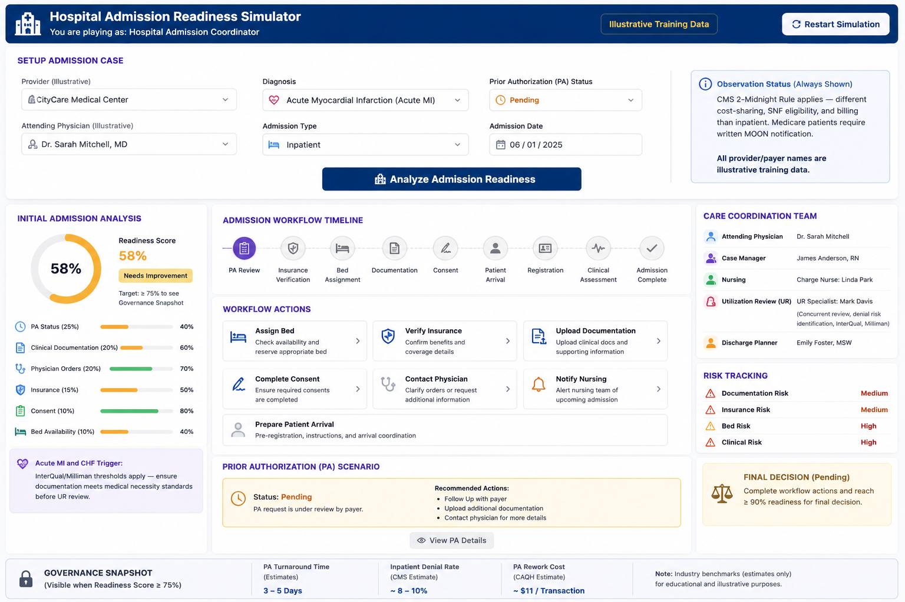
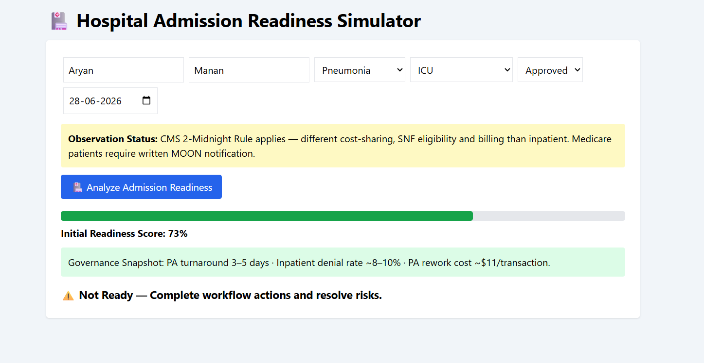

# 🏥 Day 28 – Hospital Admission Readiness Simulator

## 📅 Date

June 28, 2026

---

# 🎯 Objective

Today's challenge focused on understanding the complete **Hospital Admission Workflow** through an interactive healthcare simulation.

The objective was to simulate how hospitals evaluate patient readiness before admission by analyzing insurance verification, prior authorization, physician documentation, bed availability, clinical risks, and care coordination.

---

# 🏥 Project

## Hospital Admission Readiness Simulator

An interactive healthcare workflow simulator that enables users to act as a **Hospital Admission Coordinator** and evaluate whether a patient is ready for admission based on operational and clinical criteria.

The simulator provides a realistic admission readiness score, workflow timeline, risk analysis, governance insights, and final admission decision.

---

# 📸 Application Preview

## Hospital Admission Dashboard




---

# 👤 Patient Scenario

**Patient Name:** John Anderson

**Age:** 58 Years

**Diagnosis:** Acute Myocardial Infarction (Acute MI)

**Admission Type:** ICU

**Attending Physician:** Dr. Emily Carter

**Hospital:** CityCare Hospital *(Illustrative)*

**Insurance Provider:** HealthSecure Insurance *(Illustrative)*

**Prior Authorization Status:** Approved

---

# 📋 Admission Workflow

```
Patient Registration
        │
        ▼
Insurance Verification
        │
        ▼
Prior Authorization Review
        │
        ▼
Clinical Documentation Review
        │
        ▼
Physician Orders
        │
        ▼
Consent Verification
        │
        ▼
Bed Assignment
        │
        ▼
Patient Arrival
        │
        ▼
Clinical Assessment
        │
        ▼
Admission Complete
```

---

# 📊 Admission Readiness Score

## Initial Score

58%

### After Completing Workflow

92%

🟢 **READY FOR ADMISSION**

---

# 📄 Workflow Actions Completed

- ✅ Verify Insurance
- ✅ Upload Clinical Documentation
- ✅ Complete Physician Orders
- ✅ Obtain Patient Consent
- ✅ Assign ICU Bed
- ✅ Notify Nursing Team
- ✅ Prepare Patient Arrival

---

# ⚠ Risk Assessment

| Category | Risk |
|----------|------|
| Documentation Risk | 🟢 Low |
| Insurance Risk | 🟢 Low |
| Bed Availability | 🟢 Low |
| Clinical Risk | 🟡 Moderate |

---

# 👨‍⚕ Care Coordination Team

### Attending Physician

Responsible for treatment decisions and admission approval.

### Case Manager

Coordinates patient care and insurance communication.

### Nursing Team

Prepares patient admission and ongoing monitoring.

### Utilization Review (UR)

- Concurrent Review
- Denial Risk Identification
- InterQual Criteria
- Milliman Guidelines

### Discharge Planner

Plans post-discharge care and continuity of treatment.

---

# 🏛 Governance Snapshot

| Industry Benchmark | Value |
|--------------------|--------|
| Prior Authorization Turnaround | 3–5 Days |
| Average Inpatient Denial Rate | 8–10% |
| PA Rework Cost | ~$11 per Transaction |

*(Industry benchmark estimates for educational purposes.)*

---

# 💡 Key Learnings

- Learned the complete hospital admission readiness workflow.
- Understood how Prior Authorization affects patient admissions.
- Explored documentation, insurance verification, and physician order validation.
- Learned how risk assessment improves operational efficiency.
- Gained insight into care coordination and utilization review processes.

---

# 🚀 Technologies & Concepts

- HTML5
- CSS3
- Vanilla JavaScript
- Healthcare Workflow Simulation
- Risk Assessment
- Hospital Operations
- Interactive Dashboard Design

---

# 📂 Project Structure

```
Day28/
│── Hospital_Admission_Readiness_Simulator.html
│── admission-readiness-dashboard.png
│── admission-summary-report.md
│── day28.md
```

---

# 📄 Report Included

- Executive Summary
- Patient Admission Details
- Readiness Analysis
- Workflow Timeline
- Risk Assessment
- Governance Snapshot
- Final Admission Decision
- Key Learnings

---

# 📈 Outcome

Successfully built a **Hospital Admission Readiness Simulator** that demonstrates how healthcare teams evaluate admission readiness through insurance verification, prior authorization, clinical documentation, care coordination, and operational risk analysis before admitting a patient.

---

## 🌟 Biggest Takeaway

> Successful hospital admissions require seamless coordination between physicians, nursing teams, insurance providers, and utilization review teams. A structured admission workflow improves patient safety, reduces delays, and enhances healthcare efficiency.

---

# ✅ Status

**Day 28 Completed Successfully**

### Challenge

**ABTalks 60-Day Claude AI Mastery Challenge**

### Topic

**Healthcare Operations – Hospital Admission Readiness Simulator**

### Outcome

Designed an interactive healthcare workflow simulator that evaluates patient admission readiness using real-world operational concepts such as Prior Authorization, insurance verification, clinical documentation, care coordination, and governance metrics.

---

#60DaysOfClaudeChallenge #ABTalks #ClaudeAI #Healthcare #HospitalOperations #HealthTech #WorkflowAutomation #HealthcareManagement #ArtificialIntelligence #BuildInPublic #LearningInPublic
