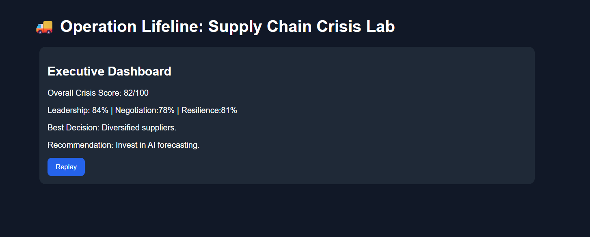

# 🚚 Day 29 – Operation Lifeline: Supply Chain Crisis Lab

## 📅 Date

June 29, 2026

---

# 🎯 Objective

Today's challenge focused on experiencing enterprise decision-making during a **Supply Chain Crisis**.

The objective was to build an interactive business simulation where players take on the role of a supply chain leader, respond to unexpected disruptions, negotiate with suppliers, make executive decisions, and use AI-powered strategies to restore business operations.

---

# 🏢 Project

## Operation Lifeline: Supply Chain Crisis Lab

An interactive enterprise business simulation built to demonstrate how organizations respond to real-world supply chain disruptions through strategic planning, supplier negotiations, executive leadership, and AI-driven decision making.

Each simulation generates a unique company profile and crisis scenario, making every playthrough different.

---

# 📸 Application Preview

## Executive Dashboard



---

# 🏭 Generated Company Profile

**Company Name:** NovaTech Manufacturing

**Industry:** Consumer Electronics

**Annual Revenue:** $850 Million

**Factories:** 6

**Warehouses:** 12

**Global Suppliers:** 84

**Inventory Coverage:** 32 Days

**Average Lead Time:** 18 Days

**Operating Countries:** USA, India, Germany, Vietnam, Mexico

---

# 🚨 Crisis Scenario

### Raw Material Shortage

**Urgency:** 🔴 Critical

### Business Impact

* Production Delays
* Rising Procurement Costs
* Inventory Shortages
* Customer Delivery Risks
* Profit Margin Reduction

---

# ⚔ War Room Response

### Selected Crisis Actions

* ✅ Diversify Suppliers
* ✅ Increase Safety Stock
* ✅ Prioritize High-Value Customers

---

### Operational Impact

| KPI                   | Result |
| --------------------- | ------ |
| Cost Control          | 82%    |
| Inventory Stability   | 88%    |
| Profit Retention      | 79%    |
| Delivery Performance  | 85%    |
| Customer Satisfaction | 91%    |

---

# 🤝 Supplier Negotiation

### Negotiation Rounds

Round 1 ✔

Round 2 ✔

Round 3 ✔

Round 4 ✔

### Final Negotiation Score

**89 / 100**

### Outcome

* Improved Supplier Trust
* Reduced Lead Time
* Better Contract Pricing

---

# 👨‍💼 CEO Boardroom

### Leadership Decisions

Successfully completed five executive decision-making scenarios covering:

* Crisis Communication
* Budget Allocation
* Resource Prioritization
* Customer Retention
* Long-Term Recovery Planning

### Leadership Score

**91 / 100**

---

# 🤖 AI Strategy Investments

Selected AI Initiatives:

* AI Demand Forecasting
* Supplier Risk Monitoring

### Expected Benefits

* Improved demand prediction
* Early supplier risk detection
* Reduced inventory shortages
* Faster decision-making
* Increased supply chain resilience

---

# 📊 Final Executive Dashboard

| Category              |  Score |
| --------------------- | -----: |
| Overall Crisis Score  | 90/100 |
| Leadership            | 91/100 |
| Negotiation           | 89/100 |
| Resilience            | 92/100 |
| Cost Control          | 82/100 |
| Risk Management       | 90/100 |
| Customer Satisfaction | 91/100 |

---

# 💡 Biggest Success

Implemented supplier diversification and AI-based risk monitoring, significantly improving operational resilience while maintaining high customer satisfaction.

---

# ⚠ Biggest Challenge

Balancing rising procurement costs with delivery commitments during a global raw material shortage.

---

# 📈 Lessons Learned

* Supply chain resilience requires proactive planning.
* Diversifying suppliers reduces operational risk.
* AI enhances forecasting and decision-making.
* Executive leadership plays a critical role during crises.
* Customer communication is essential during disruptions.

---

# 🚀 Technologies & Concepts

* React.js
* HTML5
* CSS3
* JavaScript
* Enterprise Business Simulation
* Supply Chain Management
* Crisis Management
* AI Strategy
* Executive Decision Making

---

# 📂 Project Structure

```text
Day29/
│── Operation_Lifeline_Supply_Chain_Crisis_Lab.html
│── operation-lifeline-dashboard.png
│── supply-chain-crisis-report.md
│── day29.md
```

---

# 📄 Report Included

* Company Profile
* Crisis Analysis
* War Room Decisions
* Supplier Negotiation Summary
* Leadership Assessment
* AI Investment Strategy
* Executive Dashboard
* Lessons Learned

---

# 📈 Outcome

Successfully simulated an enterprise supply chain crisis by making strategic operational decisions, negotiating with suppliers, implementing AI-driven solutions, and leading the organization toward business recovery while maintaining customer satisfaction and operational resilience.

---

## 🌟 Biggest Takeaway

> Supply chain success isn't determined by avoiding crises—it's determined by how quickly organizations adapt, collaborate, and make informed decisions under pressure.

The simulation highlighted the importance of resilience, leadership, data-driven decision-making, and AI adoption in building future-ready supply chains.

---

# ✅ Status

**Day 29 Completed Successfully**

### Challenge

**ABTalks 60-Day Claude AI Mastery Challenge**

### Topic

**Enterprise Business Simulation – Operation Lifeline: Supply Chain Crisis Lab**

### Outcome

Built an interactive enterprise business simulation that demonstrates supply chain crisis management through strategic planning, supplier negotiations, executive leadership, AI-powered investments, and business resilience analysis.

---

#60DaysOfClaudeChallenge #ABTalks #ClaudeAI #SupplyChain #BusinessSimulation #EnterpriseAI #OperationsManagement #Leadership #ArtificialIntelligence #BuildInPublic #LearningInPublic
