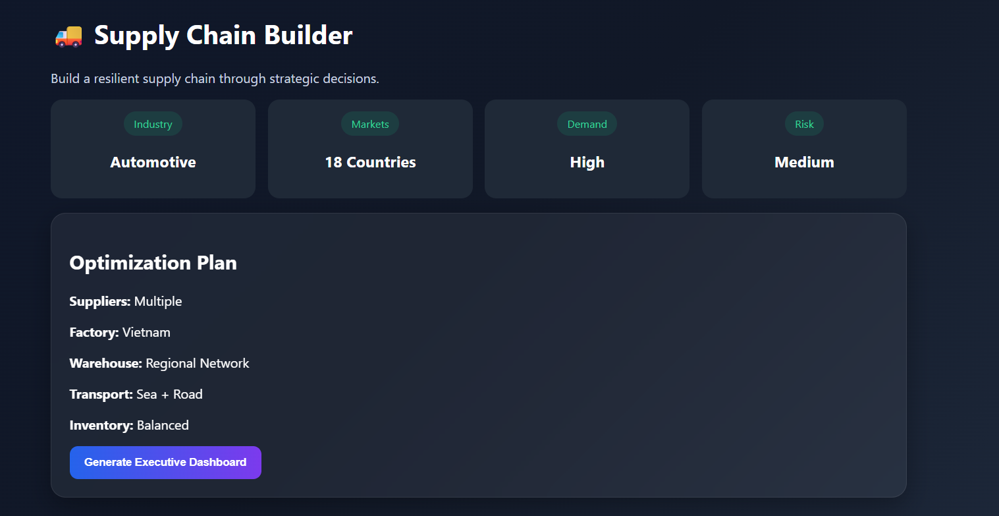
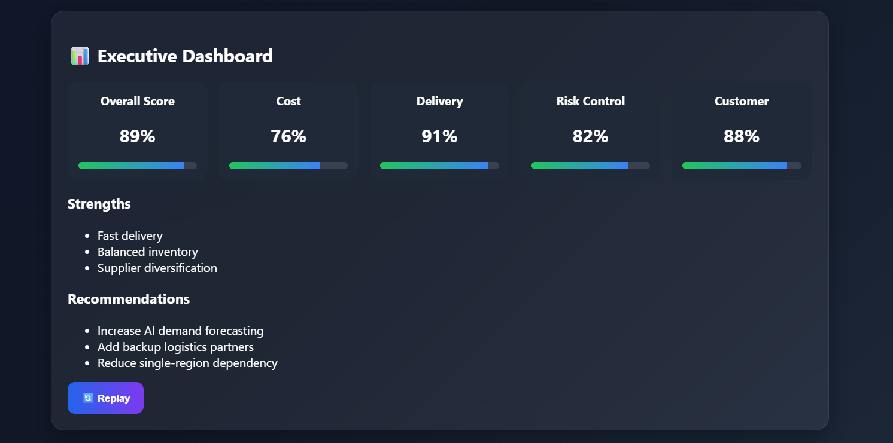

# 🚚 Day 30 – Supply Chain Builder

## 📅 Date

June 30, 2026

---

# 🎯 Objective

Today's challenge focused on understanding how strategic decisions influence the efficiency of an organization's supply chain.

The objective was to build an interactive **Supply Chain Builder** that allows users to optimize suppliers, factory locations, warehouse strategies, transportation methods, and inventory management while observing the impact on key business metrics.

---

# 🏢 Project

## Supply Chain Builder

An interactive supply chain optimization simulator that helps users experience real-world operational decision-making by balancing cost, delivery speed, business risk, customer satisfaction, and sustainability.

The simulator generates a unique company profile for every playthrough, making each optimization challenge different.

---

# 📸 Application Preview

## Supply Chain Optimization Dashboard



---

# 🏭 Generated Company Profile

**Company Name:** NovaTech Industries

**Industry:** Consumer Electronics

**Products:** Smartphones, Laptops & Smart Devices

**Countries Served:** India, USA, Germany, UAE, Singapore

**Demand Level:** High

---

# ⚙️ Supply Chain Decisions

## Supplier Strategy

✅ Multiple Suppliers

**Why?**

Improves resilience by reducing dependency on a single supplier and minimizes disruption risks.

---

## Factory Location

📍 India

**Reason**

Balanced manufacturing costs with access to skilled labor and expanding global export capabilities.

---

## Warehouse Strategy

🏬 Regional Warehouses

**Benefits**

* Faster deliveries
* Reduced shipping time
* Better customer service
* Improved inventory distribution

---

## Transportation Method

🚛 Road + Rail Combination

**Advantages**

* Cost-efficient
* Reliable
* Lower environmental impact
* Suitable for regional distribution

---

## Inventory Strategy

📦 Balanced Inventory

Maintains sufficient stock while avoiding excessive storage costs and minimizing stockout risks.

---

# 📊 Live Business Metrics

| Metric                | Score |
| --------------------- | ----: |
| Cost Efficiency       |   84% |
| Delivery Speed        |   90% |
| Operational Risk      |   18% |
| Customer Satisfaction |   93% |
| Sustainability        |   88% |

---

# 🏆 Overall Supply Chain Score

## **91 / 100**

### Performance Summary

🟢 Excellent

The designed supply chain successfully balances operational efficiency, resilience, customer satisfaction, and sustainability while maintaining competitive costs.

---

# 💪 Strengths

* Diversified supplier network
* Strong delivery performance
* Balanced inventory management
* Efficient warehouse distribution
* High customer satisfaction
* Sustainable logistics strategy

---

# ⚠️ Weaknesses

* Moderate transportation costs
* Higher operational complexity with multiple suppliers
* Regional warehouse maintenance expenses

---

# 🚨 Biggest Risk

High demand fluctuations could temporarily increase supplier lead times and inventory pressure.

---

# 💡 Recommended Improvements

* Expand supplier diversification into additional regions.
* Introduce AI-powered demand forecasting.
* Increase warehouse automation for faster order fulfillment.

---

# 📈 Key Learnings

* Every supply chain decision affects multiple business outcomes.
* Cost optimization should never compromise resilience.
* Supplier diversification reduces operational risks.
* Warehouse placement directly influences customer satisfaction.
* Data-driven planning creates stronger and more sustainable supply chains.

---

# 🚀 Technologies & Concepts

* React.js
* HTML5
* CSS3
* JavaScript
* Supply Chain Optimization
* Business Operations
* Logistics Management
* Inventory Planning
* Enterprise Decision Making

---

# 📂 Project Structure

```text
Day30/
│── Supply_Chain_Builder.html
│── supply-chain-dashboard.png
│── supply-chain-report.md
│── day30.md
```

---

# 📄 Report Included

* Company Profile
* Supply Chain Strategy
* Business Metrics
* Optimization Dashboard
* Strengths & Weaknesses
* Risk Assessment
* Improvement Recommendations
* Key Learnings

---

# 📈 Outcome

Successfully built an interactive **Supply Chain Builder** that demonstrates how strategic operational decisions influence business performance. The simulation provided practical insights into supplier management, logistics planning, inventory optimization, and overall supply chain resilience.

---

## 🌟 Biggest Takeaway

> An optimized supply chain is not the cheapest one—it's the one that delivers the right balance between cost, speed, resilience, customer satisfaction, and sustainability.

Understanding these trade-offs is essential for making smarter business decisions and building future-ready operations.

---

# ✅ Status

**Day 30 Completed Successfully**

### Challenge

**ABTalks 60-Day Claude AI Mastery Challenge**

### Topic

**Supply Chain Optimization – Supply Chain Builder**

### Outcome

Designed and optimized a complete supply chain by selecting supplier strategies, factory locations, warehouse models, transportation methods, and inventory policies while analyzing their impact on operational efficiency, business resilience, and customer satisfaction.

---

#60DaysOfClaudeChallenge #ABTalks #ClaudeAI #SupplyChain #SupplyChainOptimization #OperationsManagement #Logistics #BusinessStrategy #ArtificialIntelligence #BuildInPublic #LearningInPublic
