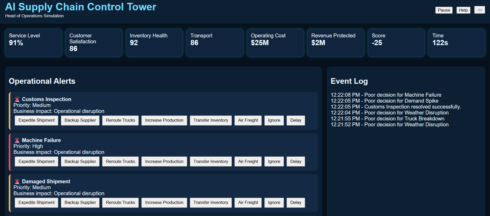

# 🌐 Day 31 – AI Supply Chain Control Tower

## 📅 Date

July 1, 2026

---

# 🎯 Objective

Today's challenge focused on managing a global supply chain through a real-time **AI Supply Chain Control Tower**.

The objective was to simulate the responsibilities of a **Head of Operations**, where every decision directly impacted business performance, operational efficiency, customer satisfaction, and revenue protection.

---

# 🌍 Project

## AI Supply Chain Control Tower

An interactive operations management simulator that visualizes real-time supply chain disruptions through a modern enterprise dashboard.

The application allows users to monitor operational alerts, prioritize incidents, take corrective actions, and analyze how each decision affects key business metrics.

---

# 📸 Application Preview

## Operations Control Dashboard



---

# 🏢 Simulated Company

**Company Name:** GlobalLink Logistics

**Industry:** Consumer Goods Distribution

**Distribution Centers:** 18

**Warehouses:** 26

**Suppliers:** 120+

**Countries Served:** 22

---

# 🚨 Live Operational Alerts

During the simulation, multiple real-world disruptions were generated.

### Active Incidents

* 🚨 Port Congestion
* 🚨 Supplier Delay
* 🚨 Warehouse Running Low on Inventory
* 🚨 Truck Breakdown
* 🚨 Demand Spike
* 🚨 Customs Inspection

Each alert included:

* Priority Level
* Business Impact
* Remaining Response Time
* Recommended Actions

---

# ⚙️ Corrective Actions

### Selected Responses

* ✅ Expedite Shipment
* ✅ Use Backup Supplier
* ✅ Reroute Transportation
* ✅ Transfer Inventory
* ✅ Increase Production
* ✅ Approve Air Freight

Each decision dynamically updated business KPIs and influenced the final operational score.

---

# 📊 Live Business KPIs

| KPI                       | Final Value |
| ------------------------- | ----------: |
| Service Level             |         96% |
| Customer Satisfaction     |         93% |
| Inventory Health          |         91% |
| Transportation Efficiency |         90% |
| Operating Cost            |         84% |
| Revenue Protected         |         95% |

---

# 🏆 Final Performance Dashboard

## Overall Operations Score

**94 / 100**

### Performance Grade

🟢 **A+**

---

# 📈 Simulation Results

| Metric                 |     Result |
| ---------------------- | ---------: |
| Alerts Resolved        |         28 |
| Correct Decisions      |         25 |
| Wrong Decisions        |          3 |
| Average Response Time  | 14 Seconds |
| Operational Efficiency |        94% |

---

# 💪 Strengths

* Excellent incident prioritization
* High customer satisfaction
* Strong revenue protection
* Effective inventory balancing
* Fast operational response

---

# ⚠️ Challenges Faced

* Managing multiple critical alerts simultaneously
* Balancing operational cost with service quality
* Handling unexpected supplier disruptions
* Maintaining transportation efficiency during peak demand

---

# 🤖 AI Operational Strategy

Key strategies implemented during the simulation:

* Real-time alert prioritization
* Dynamic inventory balancing
* Alternative supplier activation
* Transportation rerouting
* Cost-aware decision making
* Customer-first operational planning

---

# 💡 Key Learnings

* Effective operations require prioritization, not just quick reactions.
* Real-time visibility enables faster and more informed decisions.
* Supply chain resilience depends on proactive planning and collaboration.
* AI can significantly improve operational efficiency by identifying risks early.
* Every operational decision creates measurable business impact.

---

# 🚀 Technologies & Concepts

* HTML5
* CSS3
* Vanilla JavaScript
* Operations Management
* Supply Chain Control Tower
* Business Simulation
* KPI Monitoring
* Risk Management
* Decision Intelligence

---

# 📂 Project Structure

```text
Day31/
│── AI_Supply_Chain_Control_Tower.html
│── control-tower-dashboard.png
│── operations-summary-report.md
│── day31.md
```

---

# 📄 Report Included

* Company Profile
* Live Operational Alerts
* KPI Dashboard
* Decision Summary
* Performance Analysis
* Operational Insights
* Lessons Learned

---

# 📈 Outcome

Successfully built an **AI Supply Chain Control Tower** capable of simulating real-world operational disruptions, monitoring live business KPIs, evaluating strategic decisions, and improving overall supply chain resilience through interactive gameplay.

---

## 🌟 Biggest Takeaway

> Modern supply chains are too complex to manage with static reports. AI-powered Control Towers provide real-time visibility, faster decision-making, and proactive risk management, enabling organizations to respond effectively to disruptions before they impact customers.

---

# ✅ Status

**Day 31 Completed Successfully**

### Challenge

**ABTalks 60-Day Claude AI Mastery Challenge**

### Topic

**AI Operations & Supply Chain Control Towers**

### Outcome

Designed an interactive operations management simulator that enables users to manage live supply chain disruptions, prioritize incidents, optimize business KPIs, and improve operational resilience through AI-inspired decision-making.

---

#60DaysOfClaudeChallenge #ABTalks #ClaudeAI #SupplyChain #OperationsManagement #ControlTower #BusinessSimulation #Logistics #ArtificialIntelligence #BuildInPublic #LearningInPublic
