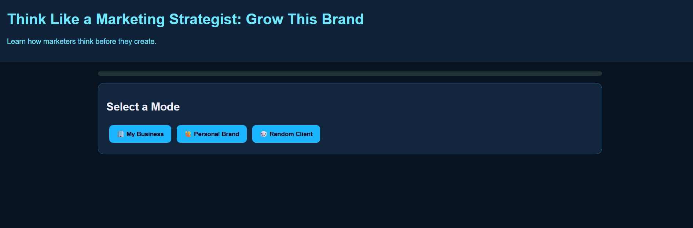
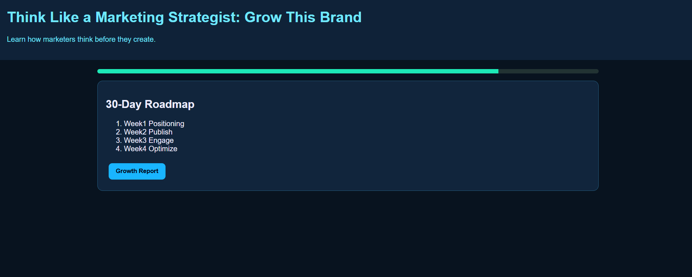

# 📈 Day 32 – Think Like a Marketing Strategist

## 📅 Date

July 2, 2026

---

# 🎯 Objective

Today's challenge focused on learning **how marketers think before they create content**.

The objective was to build an interactive **Marketing Strategy Simulator** that teaches users how to identify their target audience, select the right marketing channels, define content pillars, and create a long-term growth strategy.

---

# 📊 Project

## Think Like a Marketing Strategist

An interactive marketing strategy simulator that helps users make strategic branding decisions rather than simply generating content.

The application guides users through audience research, platform selection, content planning, growth roadmap creation, and handling unexpected marketing events.

---

# 📸 Application Preview

## Marketing Strategy Dashboard




---

# 👤 Selected Mode

### 🙋 Personal Brand

**Brand:** Aryan Gupta

**Niche:** Software Development • AI • Full-Stack Development

**Goal:** Build a strong personal brand while sharing projects, technical knowledge, and career insights.

---

# 🎯 Target Audience

* Computer Science Students
* Aspiring Software Developers
* AI Enthusiasts
* Recruiters
* Tech Professionals
* Startup Founders

---

# 🌐 Platform Strategy

### Selected Platforms

* 💼 LinkedIn
* 💻 GitHub
* 🎥 YouTube

### Why These Platforms?

* **LinkedIn:** Professional networking and personal branding.
* **GitHub:** Showcase technical projects and coding skills.
* **YouTube:** Share tutorials, project walkthroughs, and educational content.

---

# 📚 Content Pillars

### Selected Content Themes

* 🚀 AI & GenAI Projects
* 💻 Full-Stack Development
* 📈 Career Growth & Learning Journey

These pillars provide a balanced mix of technical expertise, educational value, and authentic personal branding.

---

# 🗓 30-Day Marketing Roadmap

### Week 1

* Optimize LinkedIn profile
* Define personal brand positioning
* Improve GitHub portfolio

### Week 2

* Publish educational technical content
* Share project updates
* Engage with developer communities

### Week 3

* Publish project case studies
* Create short educational videos
* Expand professional network

### Week 4

* Analyze engagement
* Improve content strategy
* Build consistency for long-term growth

---

# 🎲 Marketing Event

### Viral Technical Post

One of the AI project posts gains significant traction and reaches a much larger audience than expected.

### Response Strategy

* Continue providing valuable educational content
* Engage with comments and discussions
* Convert new followers into long-term community members

---

# 📊 Final Growth Report

| Category               | Score |
| ---------------------- | ----: |
| Audience Understanding |   94% |
| Platform Strategy      |   92% |
| Content Strategy       |   91% |
| Growth Potential       |   95% |

---

# 💪 Strengths

* Clear niche positioning
* Strong educational content
* Consistent personal branding
* High-value technical projects
* Professional platform selection

---

# ⚠ Areas for Improvement

* Increase posting consistency
* Expand video content
* Build an email newsletter
* Collaborate with other creators

---

# 💡 Key Learnings

* Marketing starts with understanding your audience.
* Platform selection should align with your goals.
* Consistency builds trust and long-term growth.
* Personal branding is built through authenticity and expertise.
* Strategy is more important than simply creating more content.

---

# 🚀 Technologies & Concepts

* React.js
* HTML5
* CSS3
* JavaScript
* Marketing Strategy
* Personal Branding
* Content Planning
* Digital Marketing
* Prompt Engineering

---

# 📂 Project Structure

```text
Day32/
│── Marketing_Strategy_Simulator.html
│── marketing-strategy-dashboard.png
│── marketing-growth-report.md
│── day32.md
```

---

# 📄 Report Included

* Audience Analysis
* Platform Strategy
* Content Pillars
* 30-Day Growth Roadmap
* Marketing Event Analysis
* Final Growth Report
* Lessons Learned

---

# 📈 Outcome

Successfully built an interactive **Marketing Strategy Simulator** that demonstrates how strategic decisions shape brand growth. The project emphasizes audience-first thinking, platform optimization, content planning, and long-term personal branding.

---

## 🌟 Biggest Takeaway

> Successful marketing isn't about creating the most content—it's about creating the right content for the right audience on the right platform, consistently.

A strong strategy turns content into long-term brand growth.

---

# ✅ Status

**Day 32 Completed Successfully**

### Challenge

**ABTalks 60-Day Claude AI Mastery Challenge**

### Topic

**Marketing Strategy – Think Like a Marketing Strategist**

### Outcome

Designed an interactive marketing strategy simulator that teaches audience research, platform selection, content planning, personal branding, and strategic decision-making through a beginner-friendly learning experience.

---

#60DaysOfClaudeChallenge #ABTalks #ClaudeAI #MarketingStrategy #PersonalBranding #ContentMarketing #DigitalMarketing #ArtificialIntelligence #BuildInPublic #LearningInPublic
