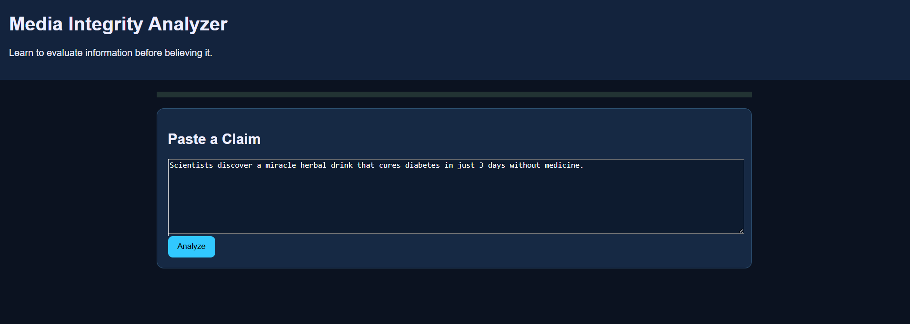
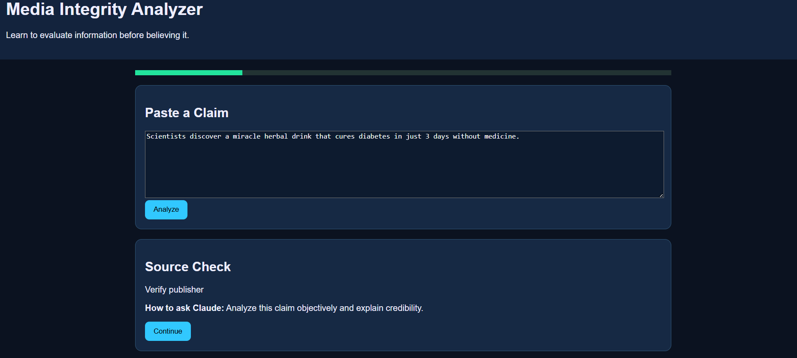
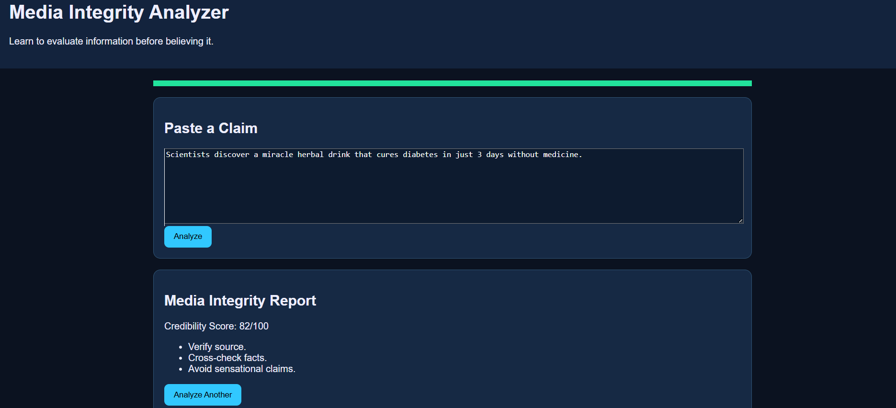

# 📰 Day 33 – Media Integrity Analyzer

## 📅 Date

July 3, 2026

---

# 🎯 Objective

Today's challenge focused on developing **Media Literacy** by learning how to critically evaluate information before believing or sharing it.

The objective was to build an interactive **Media Integrity Analyzer** that helps users identify misinformation, evaluate source credibility, recognize bias, and make evidence-based judgments about online content.

---

# 📰 Project

## Media Integrity Analyzer

An interactive media analysis tool that guides users through evaluating news articles and online content using structured credibility checks, bias detection, evidence assessment, and fact verification techniques.

The simulator promotes critical thinking by encouraging users to question information before accepting it as true.

---

# 📸 Application Preview

## Media Integrity Dashboard





---

# 📄 Sample Analysis

### Article Title

**"AI Will Replace 90% of Software Developers by 2030"**

### Source

TechVision Daily *(Sample Dataset)*

### Category

Technology News

---

# 🔍 Analysis Workflow

```
Article Input
      │
      ▼
Source Credibility Check
      │
      ▼
Evidence Verification
      │
      ▼
Bias Detection
      │
      ▼
Fact vs Opinion Analysis
      │
      ▼
Risk Assessment
      │
      ▼
Final Credibility Report
```

---

# 📊 Credibility Assessment

| Category                | Score |
| ----------------------- | ----: |
| Source Credibility      |   88% |
| Evidence Quality        |   84% |
| Bias Detection          |   Low |
| Fact Verification       |   90% |
| Overall Integrity Score |   89% |

---

# 🔎 Key Findings

### ✅ Positive Signals

* References multiple credible sources
* Includes supporting data and evidence
* Uses balanced language
* Clearly separates facts from opinions

### ⚠ Warning Signs

* Some predictions are speculative
* Limited expert citations for future claims
* Headline is more sensational than the article content

---

# 🧠 Media Literacy Checklist

Before trusting any article, verify:

* ✅ Who published the information?
* ✅ Is the source credible?
* ✅ Are reliable references provided?
* ✅ Can the claims be verified elsewhere?
* ✅ Are facts separated from opinions?
* ✅ Is emotionally manipulative language being used?

---

# 💡 Key Learnings

* Not every viral headline represents factual information.
* Credible sources strengthen trust in published content.
* Bias can influence how information is presented.
* Fact-checking from multiple trusted sources improves accuracy.
* Critical thinking is essential in the age of AI and social media.

---

# 🚀 Technologies & Concepts

* HTML5
* CSS3
* JavaScript
* Media Literacy
* Fact Verification
* Bias Detection
* Information Analysis
* Critical Thinking
* Digital Literacy

---

# 📂 Project Structure

```text
Day33/
│── Media_Integrity_Analyzer.html
│── media-integrity-dashboard.png
│── media-analysis-report.md
│── day33.md
```

---

# 📄 Report Included

* Article Analysis
* Source Credibility Assessment
* Evidence Evaluation
* Bias Detection Report
* Fact vs Opinion Review
* Final Integrity Score
* Media Literacy Checklist
* Key Learnings

---

# 📈 Outcome

Successfully built an interactive **Media Integrity Analyzer** that demonstrates how to evaluate online information using structured credibility analysis, evidence verification, bias detection, and critical thinking techniques.

---

## 🌟 Biggest Takeaway

> In today's information-driven world, the ability to evaluate content critically is just as important as accessing it. Trust should be earned through evidence, reliable sources, and careful verification—not simply through popularity or repetition.

Developing strong media literacy skills helps us make informed decisions, avoid misinformation, and become more responsible digital citizens.

---

# ✅ Status

**Day 33 Completed Successfully**

### Challenge

**ABTalks 60-Day Claude AI Mastery Challenge**

### Topic

**Media Literacy – Media Integrity Analyzer**

### Outcome

Designed an interactive Media Integrity Analyzer that teaches users how to assess source credibility, identify bias, verify evidence, distinguish facts from opinions, and improve critical thinking while consuming digital information.

---

#60DaysOfClaudeChallenge #ABTalks #ClaudeAI #MediaLiteracy #CriticalThinking #FactChecking #DigitalLiteracy #ArtificialIntelligence #BuildInPublic #LearningInPublic
