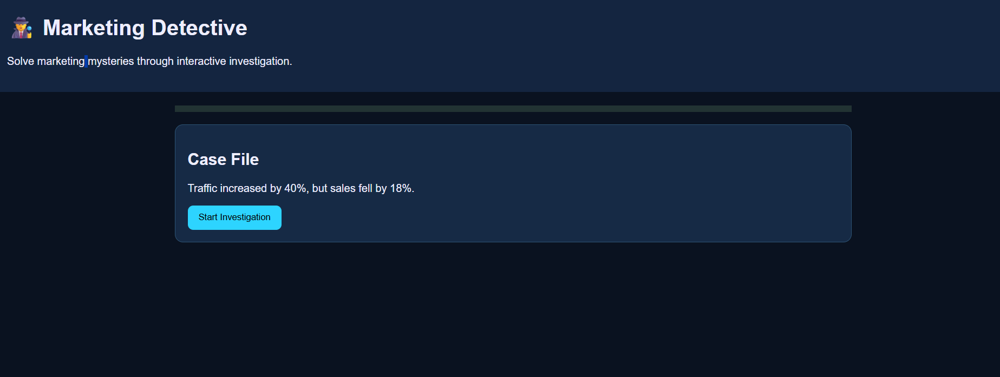
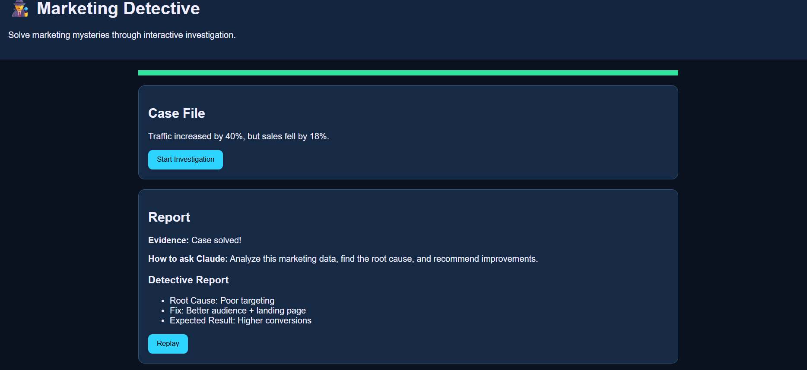

# 🕵️ Day 34 – Marketing Detective

## 📅 Date

July 4, 2026

---

# 🎯 Objective

Today's challenge focused on developing analytical thinking by solving marketing problems through data-driven investigation.

The objective was to build an interactive **Marketing Detective** application that helps users identify campaign issues, analyze customer behavior, uncover root causes, and recommend effective marketing strategies.

---

# 📊 Project

## Marketing Detective

An interactive marketing analytics simulator where users investigate marketing performance, analyze business metrics, identify campaign bottlenecks, and make strategic recommendations based on evidence rather than assumptions.

The application demonstrates how marketing professionals use analytics to improve campaign performance and customer engagement.

---

# 📸 Application Preview

## Marketing Investigation Dashboard



---

# 🗂 Investigation Case

### Company

**BrightWave Digital**

### Industry

Digital Marketing Agency

### Investigation

Declining campaign performance despite increased marketing spend.

---

# 🔍 Investigation Workflow

```
Campaign Data
      │
      ▼
Performance Analysis
      │
      ▼
Audience Behavior
      │
      ▼
Channel Performance
      │
      ▼
Root Cause Analysis
      │
      ▼
Marketing Recommendations
      │
      ▼
Final Investigation Report
```

---

# 📊 Marketing Metrics

| Metric             | Value |
| ------------------ | ----: |
| Campaign Reach     |   88% |
| Engagement Rate    |   72% |
| Conversion Rate    |   69% |
| Customer Retention |   81% |
| ROI Score          |   86% |

---

# 🕵️ Key Findings

### Root Cause

* Audience targeting was too broad.
* Engagement dropped due to repetitive content.
* Budget allocation favored underperforming channels.

### Evidence Collected

* Reduced click-through rate
* Lower engagement on social platforms
* High bounce rate on landing pages
* Increased customer acquisition cost

---

# 💡 Recommended Strategy

* Refine audience segmentation
* Improve creative messaging
* Reallocate budget to high-performing channels
* Optimize landing pages for better conversions
* Monitor campaign KPIs continuously

---

# 📈 Investigation Outcome

| Category                    | Result |
| --------------------------- | -----: |
| Problem Identification      |    94% |
| Data Analysis               |    91% |
| Strategy Recommendation     |    93% |
| Overall Investigation Score |    92% |

---

# 🎓 Key Learnings

* Marketing decisions should always be supported by data.
* Understanding customer behavior improves campaign performance.
* Root cause analysis prevents repeating the same mistakes.
* Analytics help optimize marketing investments.
* Continuous testing leads to better business outcomes.

---

# 🚀 Technologies & Concepts

* React.js
* HTML5
* CSS3
* JavaScript
* Marketing Analytics
* Customer Behavior Analysis
* Data Visualization
* Business Intelligence
* Decision Making

---

# 📂 Project Structure

```text
Day34/
│── Marketing_Detective.html
│── marketing-detective-dashboard.png
│── marketing-investigation-report.md
│── day34.md
```

---

# 📄 Report Included

* Campaign Investigation
* Audience Analysis
* Marketing Funnel Review
* Root Cause Assessment
* Performance Metrics
* Strategy Recommendations
* Final Investigation Report
* Key Learnings

---

# 📈 Outcome

Successfully built an interactive **Marketing Detective** simulator that demonstrates how analytical thinking and marketing data can be used to identify campaign issues, understand customer behavior, and recommend actionable business improvements.

---

## 🌟 Biggest Takeaway

> Great marketers don't rely on intuition alone—they investigate, analyze, and validate every decision with data. Turning marketing metrics into actionable insights is what drives sustainable business growth.

---

# ✅ Status

**Day 34 Completed Successfully**

### Challenge

**ABTalks 60-Day Claude AI Mastery Challenge**

### Topic

**Marketing Analytics – Become a Marketing Detective**

### Outcome

Designed an interactive marketing analytics simulator that teaches campaign investigation, customer behavior analysis, root cause identification, and strategic decision-making through a hands-on detective-style experience.

---

#60DaysOfClaudeChallenge #ABTalks #ClaudeAI #MarketingAnalytics #MarketingStrategy #DigitalMarketing #BusinessIntelligence #DataAnalytics #ArtificialIntelligence #BuildInPublic #LearningInPublic
