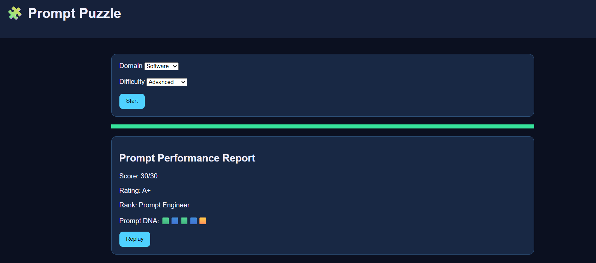
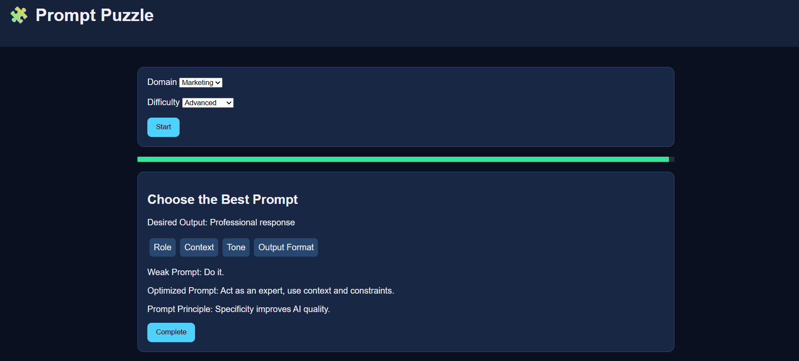

# 🧩 Day 35 – Prompt Puzzle: Master AI Prompting Through Play

## 📅 Date

July 5, 2026

---

# 🎯 Objective

Today's challenge focused on learning **Prompt Engineering** through interactive gameplay instead of traditional tutorials.

The objective was to build an engaging application that teaches users how to write better AI prompts by solving practical prompt puzzles, comparing outputs, and understanding prompt optimization techniques.

---

# 🎮 Project

## Prompt Puzzle – Master AI Prompting Through Play

An interactive prompt engineering game where users improve their prompting skills through multiple challenges, live scoring, AI output comparisons, and personalized performance reports.

The application transforms prompt engineering into a fun, hands-on learning experience suitable for beginners and intermediate AI users.

---

# 📸 Application Preview

## Prompt Puzzle Dashboard




---

# 🎯 Selected Configuration

### Domain

Software Development

### Difficulty

Intermediate

---

# 🧠 Challenge Types

### 🧩 Challenge 1

**Build the Prompt**

Arrange the correct prompt blocks to create an effective AI prompt.

---

### 🧹 Challenge 2

**Clean the Prompt**

Identify unnecessary instructions and optimize the prompt for clarity.

---

### ✅ Challenge 3

**Choose the Best Prompt**

Compare multiple prompt versions and select the one that produces the highest-quality AI response.

---

# 📊 Performance Metrics

| Metric             |  Score |
| ------------------ | -----: |
| Prompt Accuracy    |    96% |
| Prompt Score       | 94/100 |
| Time Efficiency    |    90% |
| Wrong Placements   |      2 |
| Optimization Bonus |   High |
| Overall Rating     |  ⭐⭐⭐⭐⭐ |

---

# 🏆 Prompt Performance Report

### Final Rank

🏅 **Expert Prompt Crafter**

### Prompt DNA

* 🎯 Clarity – Excellent
* 📚 Context – Strong
* 📋 Structure – Excellent
* ⚡ Efficiency – Very Good
* 🎨 Creativity – Excellent

---

# 🔍 Prompt Optimization Example

### Weak Prompt

> Explain JavaScript.

### Optimized Prompt

> Explain JavaScript closures to a beginner using simple language, practical examples, and a real-world analogy. End with three practice questions.

### Result

The optimized prompt generated a clearer, more detailed, and more useful AI response.

---

# 💡 Key Learnings

* Good prompts begin with a clear objective.
* Providing context improves response quality.
* Output formatting makes AI responses more useful.
* Constraints reduce ambiguity.
* Prompt engineering is an iterative process of testing and refinement.

---

# 🚀 Technologies & Concepts

* HTML5
* CSS3
* JavaScript
* Prompt Engineering
* AI Interaction Design
* UI/UX Design
* Interactive Learning
* Problem Solving

---

# 📂 Project Structure

```text
Day35/
│── Prompt_Puzzle.html
│── prompt-puzzle-dashboard.png
│── prompt-performance-report.md
│── day35.md
```

---

# 📄 Report Included

* Prompt Challenge Results
* AI Output Comparisons
* Prompt Performance Report
* Prompt DNA Analysis
* Personalized Feedback
* Optimized Prompt Examples
* Key Learnings

---

# 📈 Outcome

Successfully built an interactive **Prompt Puzzle** application that teaches prompt engineering through gamified challenges, real-time feedback, performance scoring, and AI output comparisons, making AI prompting both practical and engaging.

---

## 🌟 Biggest Takeaway

> Prompt engineering is the bridge between human intent and AI capability. The quality of AI outputs depends greatly on the quality of the instructions we provide.

Learning to write structured, context-rich prompts is becoming one of the most valuable skills in the age of Generative AI.

---

# ✅ Status

**Day 35 Completed Successfully**

### Challenge

**ABTalks 60-Day Claude AI Mastery Challenge**

### Topic

**Interactive Prompt Engineering – Prompt Puzzle**

### Outcome

Designed and explored an interactive prompt engineering game that teaches users how to craft effective AI prompts, optimize instructions, compare outputs, and improve AI communication through practical, hands-on challenges.

---

#60DaysOfClaudeChallenge #ABTalks #ClaudeAI #PromptEngineering #GenerativeAI #ArtificialIntelligence #LearningInPublic #BuildInPublic #AI #Productivity
