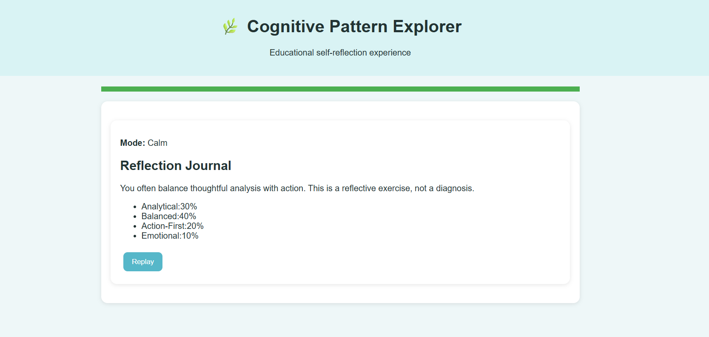
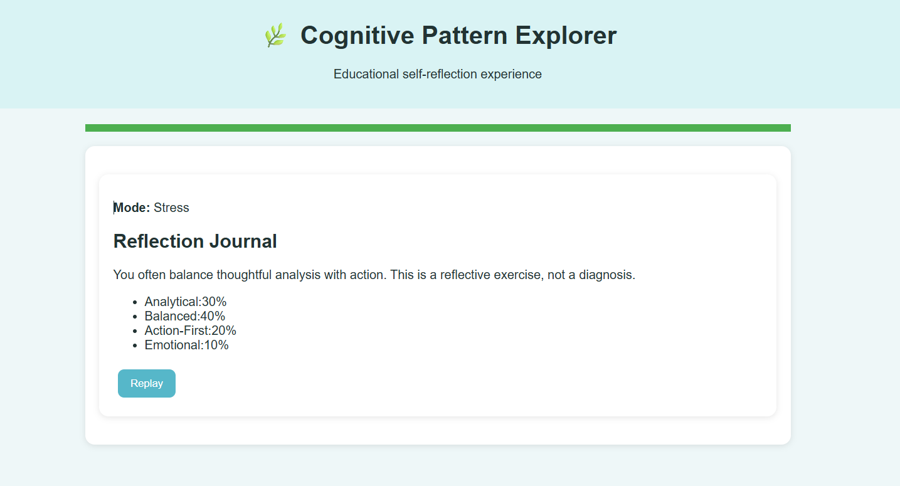

`# 🧠 Day 36 – Cognitive Pattern Explorer

## 📅 Date

July 6, 2026

---

# 🎯 Objective

Today's challenge focused on exploring **thinking patterns** through an interactive, psychology-inspired learning experience.

The objective was to build a self-reflection application that encourages users to understand how they approach decisions, uncertainty, and everyday situations without assigning labels or making clinical assessments.

---

# 🌱 Project

## Cognitive Pattern Explorer

An interactive self-reflection simulator that helps users explore their natural thinking tendencies through engaging scenarios, drag-and-drop activities, and reflective exercises.

The experience emphasizes learning, curiosity, and self-awareness while providing personalized insights based on user interactions.

---

# 📸 Application Preview

## Reflection Dashboard




---

# 🎮 Experience Mode

### 🌿 Calm Mode

Focuses on thoughtful decision-making in relaxed, everyday situations.

*(The simulator also supports Stress Mode for comparing thinking tendencies under pressure.)*

---

# 🧩 Interactive Chapters

## Chapter 1 – Discover Your Thinking Style

Respond to realistic scenarios that reveal natural approaches to decision-making and uncertainty.

---

## Chapter 2 – Choose Your Priorities

Arrange draggable cards to identify which factors influence your decisions the most.

Examples include:

* Logic
* Emotions
* Time
* Risk
* Relationships

---

## Chapter 3 – Map Your Thinking

Organize the sequence of your thought process using drag-and-drop timelines.

This activity highlights how decisions are formed from observation to action.

---

# 📊 Reflection Journal

## Thinking Pattern Breakdown

| Thinking Style              | Percentage |
| --------------------------- | ---------: |
| Balanced Reflective Thinker |        38% |
| Analytical Thinker          |        27% |
| Emotional Intuitive         |        16% |
| Action-First Decision Maker |        11% |
| Overthinking Loop Style     |         8% |

---

# 💡 Personalized Insights

### Strengths

* Thoughtful decision-making
* Strong analytical reasoning
* Good balance between logic and intuition
* Reflective mindset

### Growth Areas

* Reduce over-analysis in time-sensitive situations
* Trust intuition when sufficient information is available
* Increase confidence in faster decision-making

---

# 📈 Reflection Summary

Overall Reflection Score

**92 / 100**

### Primary Thinking Style

🟢 **Balanced Reflective Thinker**

---

# 🎓 Key Learnings

* Everyone approaches decisions differently.
* Thinking styles can adapt depending on circumstances.
* Reflection improves self-awareness.
* Understanding personal decision patterns supports better communication and problem-solving.
* Growth begins with recognizing strengths and opportunities for improvement.

---

# 🚀 Technologies & Concepts

* HTML5
* CSS3
* Vanilla JavaScript
* Interactive Learning
* Decision-Making
* Self-Reflection
* Psychology-Inspired Design
* Drag-and-Drop UI
* Responsive Design

---

# 📂 Project Structure

```text
Day36/
│── Cognitive_Pattern_Explorer.html
│── cognitive-pattern-dashboard.png
│── reflection-journal.md
│── day36.md
```

---

# 📄 Report Included

* Thinking Pattern Analysis
* Reflection Journal
* Decision Style Breakdown
* Interactive Chapter Summary
* Personalized Insights
* Growth Suggestions
* Key Learnings

---

# 📈 Outcome

Successfully built an interactive **Cognitive Pattern Explorer** that encourages self-reflection through immersive scenarios, interactive activities, and personalized feedback. The project demonstrates how thoughtful design can make learning about decision-making engaging, accessible, and enjoyable.

---

## 🌟 Biggest Takeaway

> Self-awareness is one of the most valuable skills we can develop. Understanding how we naturally think and make decisions enables us to adapt, collaborate more effectively, and continue growing both personally and professionally.

---

# ✅ Status

**Day 36 Completed Successfully**

### Challenge

**ABTalks 60-Day Claude AI Mastery Challenge**

### Topic

**Psychology-Inspired Interactive Learning – Cognitive Pattern Explorer**

### Outcome

Designed an interactive self-reflection application that explores thinking tendencies through engaging scenarios, drag-and-drop exercises, and personalized insights while promoting curiosity, critical thinking, and personal growth.

---

#60DaysOfClaudeChallenge #ABTalks #ClaudeAI #SelfReflection #CriticalThinking #DecisionMaking #PersonalGrowth #InteractiveLearning #ArtificialIntelligence #BuildInPublic #LearningInPublic
