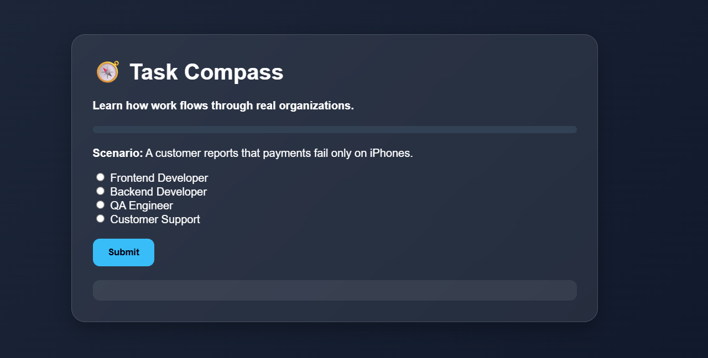
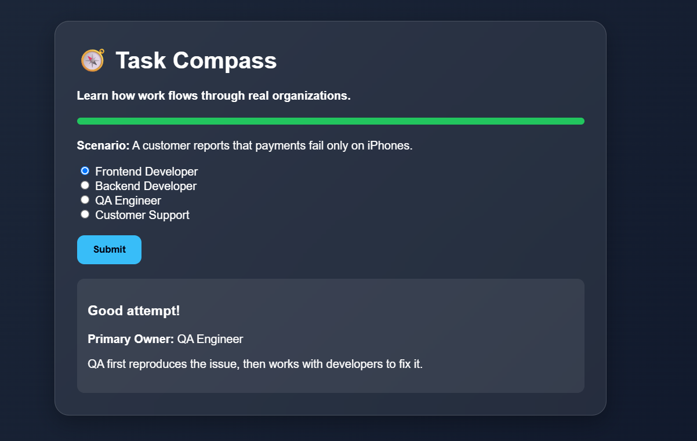

# 🧭 Day 37 – Task Compass

## 📅 Date

July 7, 2026

---

# 🎯 Objective

Today's challenge focused on understanding **how work flows through real organizations**.

The objective was to build an interactive learning application that teaches task ownership, delegation, workflow management, and cross-functional collaboration through realistic workplace scenarios.

---

# 🏢 Project

## Task Compass

A management simulation that helps users understand how organizations function by assigning ownership, routing work between teams, and solving collaborative business challenges.

Rather than testing job titles, the application encourages strategic thinking about **who should own a task, who should support it, and how work moves across departments.**

---

# 📸 Application Preview

## Organizational Thinking Dashboard




---

# 🏢 Selected Workplace

**Tech Company**

### Departments Included

* 💻 Frontend Development
* ⚙ Backend Development
* 🧪 QA Engineering
* 🎨 UX/UI Design
* 📦 Product Management
* 🎧 Customer Support
* 👨‍💼 Engineering Manager

---

# 🎮 Learning Stages

## Stage 1 – Who Owns This?

Analyze workplace scenarios and identify the most appropriate primary owner.

### Example Scenario

> Customer reports that payments fail only on iPhones.

**Primary Owner:** Frontend Developer

**Supporting Teams:**

* QA Engineer
* Backend Developer
* Product Manager

---

## Stage 2 – Task Routing

Build the correct workflow by arranging departments in the appropriate sequence.

### Example Workflow

```text
Customer Support
        │
        ▼
QA Engineer
        │
        ▼
Frontend Developer
        │
        ▼
Backend Developer
        │
        ▼
Product Manager
        │
        ▼
Customer
```

The simulator explains why each role participates in the process and how efficient task routing improves organizational productivity.

---

## Stage 3 – Collaboration Challenge

Handle larger workplace situations that require multiple teams working together.

### Example Scenario

**Major Product Release Delayed**

### Primary Owner

📦 Product Manager

### Supporting Teams

* Frontend Development
* Backend Development
* QA Engineering
* Customer Support

---

# 📊 Organizational Thinking Dashboard

| Category               | Result |
| ---------------------- | -----: |
| Ownership Thinking     |    93% |
| Delegation             |    90% |
| Collaboration          |    95% |
| Workflow Understanding |    92% |

---

# 💡 Reflection Journal

### Strengths

* Strong understanding of task ownership
* Effective cross-functional thinking
* Logical workflow sequencing
* Collaborative decision-making

### Growth Opportunities

* Avoid assigning too many responsibilities to one role.
* Consider communication between departments earlier in the workflow.
* Recognize when multiple teams should contribute to complex problems.

---

# 🎓 Key Learnings

* Clear ownership improves accountability.
* Delegation distributes work efficiently.
* Collaboration is essential for solving complex business problems.
* Well-defined workflows reduce delays and confusion.
* Most organizational challenges require teamwork rather than individual effort.

---

# 🚀 Technologies & Concepts

* HTML5
* CSS3
* Vanilla JavaScript
* Drag-and-Drop UI
* Organizational Design
* Workflow Management
* Team Collaboration
* Interactive Learning
* Project Coordination

---

# 📂 Project Structure

```text
Day37/
│── Task_Compass.html
│── task-compass-dashboard.png
│── organizational-reflection-report.md
│── day37.md
```

---

# 📄 Report Included

* Organizational Thinking Dashboard
* Task Ownership Analysis
* Workflow Routing Summary
* Collaboration Challenge Results
* Reflection Journal
* Key Learnings

---

# 📈 Outcome

Successfully built **Task Compass**, an interactive organizational learning simulator that teaches users how work flows through teams by exploring ownership, delegation, workflow design, and cross-functional collaboration using realistic workplace scenarios.

---

## 🌟 Biggest Takeaway

> Organizations succeed when responsibilities are clear, communication is effective, and teams collaborate toward shared goals. Great work is rarely the result of one person—it is the outcome of coordinated effort across multiple roles and departments.

---

# ✅ Status

**Day 37 Completed Successfully**

### Challenge

**ABTalks 60-Day Claude AI Mastery Challenge**

### Topic

**Interactive Organizational Learning – Task Compass**

### Outcome

Designed an interactive organizational learning experience that helps users understand task ownership, workflow management, delegation, and team collaboration through engaging workplace simulations and real-world scenarios.

---

#60DaysOfClaudeChallenge #ABTalks #ClaudeAI #OrganizationalLearning #Leadership #ProjectManagement #Teamwork #WorkflowManagement #BuildInPublic #LearningInPublic #ArtificialIntelligence
