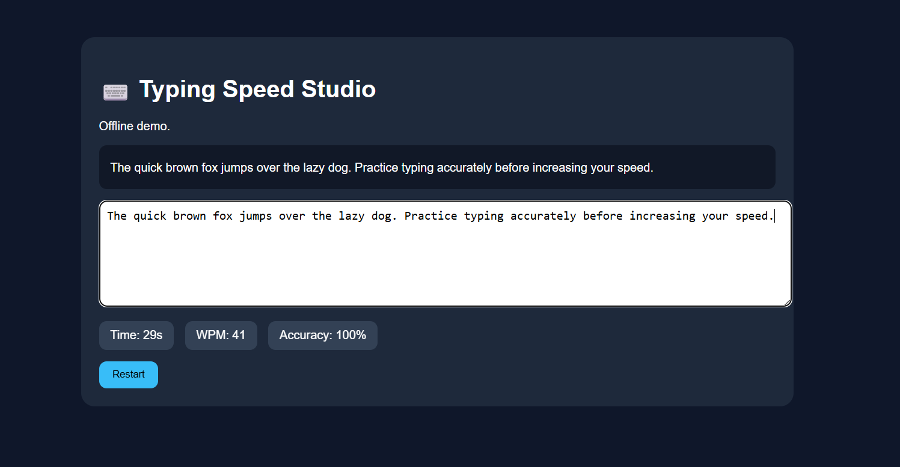

# ⌨️ Day 38 – Typing Speed Studio

## 📅 Date

July 8, 2026

---

# 🎯 Objective

Today's challenge focused on building a premium **Typing Speed Studio** that offers an engaging and feature-rich typing experience.

The objective was to create a commercial-quality typing platform where users can improve their typing speed, accuracy, and consistency through multiple practice modes, detailed analytics, and long-term performance tracking.

---

# 🚀 Project

## Typing Speed Studio

An interactive typing practice platform inspired by modern typing applications like Monkeytype.

The application provides multiple typing modes, live performance metrics, personalized analytics, and local session history to help users continuously improve their typing skills.

---

# 📸 Application Preview

## Typing Speed Studio Dashboard



---

# 🎮 Typing Modes

### ⏱ Time Mode

* 15 Seconds
* 30 Seconds
* 60 Seconds
* 120 Seconds

---

### 📝 Word Count Mode

* 25 Words
* 50 Words
* 100 Words
* 250 Words

---

### 💻 Programming Mode

Practice using realistic code snippets from:

* HTML
* CSS
* JavaScript
* Python
* Java
* C++
* SQL

---

### 📖 Quote Mode

Practice typing inspirational quotes and educational passages.

---

### 🎯 Focus Mode

Only the current typing line remains visible for distraction-free practice.

---

### 🌿 Zen Mode

Unlimited untimed typing practice focused on rhythm and accuracy.

---

# 📊 Live Typing Statistics

| Metric                | Result |
| --------------------- | -----: |
| Words Per Minute      |     82 |
| Raw WPM               |     86 |
| Accuracy              |    97% |
| Characters Per Minute |    412 |
| Mistakes              |      5 |
| Typing Streak         |     54 |
| Completion            |   100% |

---

# 📈 Performance Dashboard

## Session Summary

🏆 **Performance Rating:** Excellent

### Analytics Included

* WPM Progress
* Accuracy Graph
* Typing Consistency
* Error Heatmap
* Character Analysis
* Mistyped Keys
* Session Duration
* Achievement Badges
* Personal Bests

---

# 🎯 Personalized Insights

### Strengths

* High typing accuracy
* Consistent typing rhythm
* Strong performance on programming text
* Low error rate

### Areas for Improvement

* Improve typing speed during longer sessions
* Reduce hesitation on symbols and punctuation
* Increase consistency across different typing modes

---

# 💡 Key Learnings

* Accuracy is more important than raw speed.
* Consistent practice leads to measurable improvement.
* Performance analytics help identify weak areas.
* Different typing modes improve different skills.
* Long-term progress tracking motivates continuous learning.

---

# 🚀 Technologies & Concepts

* HTML5
* CSS3
* Vanilla JavaScript
* Typing Speed Algorithms
* Performance Analytics
* Local Storage
* Responsive UI Design
* Interactive Learning
* Accessibility Features

---

# 📂 Project Structure

```text
Day38/
│── Typing_Speed_Studio.html
│── typing-speed-dashboard.png
│── typing-performance-report.md
│── day38.md
```

---

# 📄 Report Included

* Typing Session Summary
* WPM Analysis
* Accuracy Report
* Typing Rhythm Evaluation
* Error Heatmap
* Personal Best Records
* Performance Suggestions
* Key Learnings

---

# 📈 Outcome

Successfully built a premium **Typing Speed Studio** that delivers an engaging typing experience through multiple practice modes, real-time performance tracking, comprehensive analytics, and personalized feedback to help users improve their typing skills over time.

---

## 🌟 Biggest Takeaway

> Great typing isn't defined by speed alone—it's the balance of speed, accuracy, rhythm, and consistency. By analyzing performance after every session, users can focus on meaningful improvement rather than simply chasing higher WPM.

---

# ✅ Status

**Day 38 Completed Successfully**

### Challenge

**ABTalks 60-Day Claude AI Mastery Challenge**

### Topic

**Interactive Productivity Applications – Typing Speed Studio**

### Outcome

Designed and developed a premium typing practice platform featuring multiple typing modes, live performance metrics, interactive analytics, local session history, and personalized insights to enhance typing efficiency and productivity.

---

#60DaysOfClaudeChallenge #ABTalks #ClaudeAI #TypingSpeed #Productivity #WebDevelopment #JavaScript #InteractiveLearning #BuildInPublic #LearningInPublic #ArtificialIntelligence
