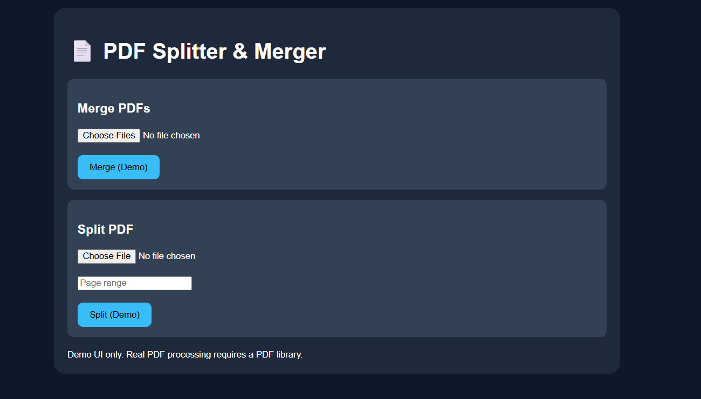

# 📄 Day 39 – PDF Splitter & Merger

## 📅 Date

July 9, 2026

---

# 🎯 Objective

Today's challenge focused on building a **browser-based PDF utility** capable of splitting, merging, previewing, and downloading PDF documents without relying on external software.

The objective was to create a premium productivity application that combines a modern user experience with secure, offline document processing.

---

# 🚀 Project

## PDF Splitter & Merger

A browser-based PDF utility that allows users to upload, split, merge, preview, and download PDF documents entirely on the client side.

The application emphasizes speed, simplicity, privacy, and an intuitive user experience.

---

# 📸 Application Preview

## PDF Utility Dashboard



---

# 📂 Core Features

### 📄 PDF Splitter

* Upload PDF documents
* Select custom page ranges
* Split into separate files
* Preview before exporting

---

### 📑 PDF Merger

* Upload multiple PDF files
* Rearrange document order
* Merge into a single PDF
* Download merged document instantly

---

### 👀 PDF Preview

* Document thumbnail preview
* Page count display
* File information
* Processing status

---

### 💾 Export

* Download processed PDFs
* Preserve document quality
* Fast browser-based processing

---

# 📊 Utility Workflow

```text
Upload PDF Files
        │
        ▼
Preview Documents
        │
        ▼
Choose Operation
(Split / Merge)
        │
        ▼
Process Files
        │
        ▼
Download Output PDF
```

---

# ⚡ Application Highlights

| Feature            | Status |
| ------------------ | :----: |
| PDF Upload         |    ✅   |
| PDF Split          |    ✅   |
| PDF Merge          |    ✅   |
| Live Preview       |    ✅   |
| Browser Processing |    ✅   |
| Download Output    |    ✅   |
| Responsive Design  |    ✅   |

---

# 🎯 User Experience Features

* Drag & Drop Upload
* Interactive File Preview
* Responsive Layout
* Dark Mode Interface
* Progress Indicators
* Smooth Animations
* Error Handling
* Offline Functionality

---

# 💡 Key Learnings

* Browser-based applications can perform powerful document processing tasks.
* Client-side processing improves privacy by keeping files on the user's device.
* A clean UI significantly enhances usability for productivity tools.
* Optimizing workflow simplicity makes complex tasks accessible to all users.
* Modern web technologies enable desktop-like experiences directly in the browser.

---

# 🚀 Technologies & Concepts

* HTML5
* CSS3
* Vanilla JavaScript
* File Handling APIs
* PDF Processing Concepts
* Drag & Drop Interface
* Responsive Web Design
* Browser-Based Productivity Applications

---

# 📂 Project Structure

```text
Day39/
│── PDF_Splitter_And_Merger.html
│── pdf-utility-dashboard.png
│── processed-sample.pdf
│── merged-sample.pdf
│── pdf-utility-report.md
│── day39.md
```

---

# 📄 Report Included

* PDF Processing Workflow
* Split Operation Summary
* Merge Operation Summary
* User Experience Highlights
* Feature Overview
* Key Learnings

---

# 📈 Outcome

Successfully built a premium **PDF Splitter & Merger** application that enables users to split, merge, preview, and download PDF documents directly within the browser while maintaining privacy, performance, and an intuitive user experience.

---

## 🌟 Biggest Takeaway

> Productivity applications don't need to be complex to be powerful. By combining intuitive design with efficient client-side processing, everyday document management tasks become faster, more secure, and more accessible for everyone.

---

# ✅ Status

**Day 39 Completed Successfully**

### Challenge

**ABTalks 60-Day Claude AI Mastery Challenge**

### Topic

**Interactive Productivity Applications – PDF Splitter & Merger**

### Outcome

Designed and developed a browser-based PDF utility that supports document splitting, merging, previewing, and exporting while delivering a responsive, privacy-focused, and user-friendly productivity experience.

---

#60DaysOfClaudeChallenge #ABTalks #ClaudeAI #PDFTools #Productivity #WebDevelopment #JavaScript #FrontendDevelopment #BuildInPublic #LearningInPublic #ArtificialIntelligence
