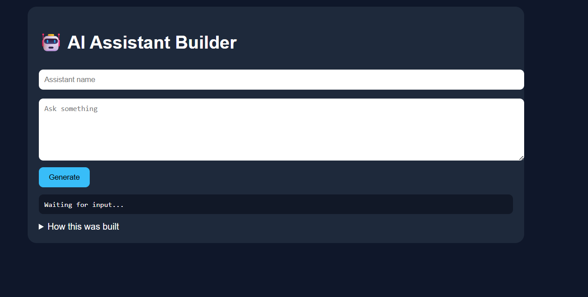
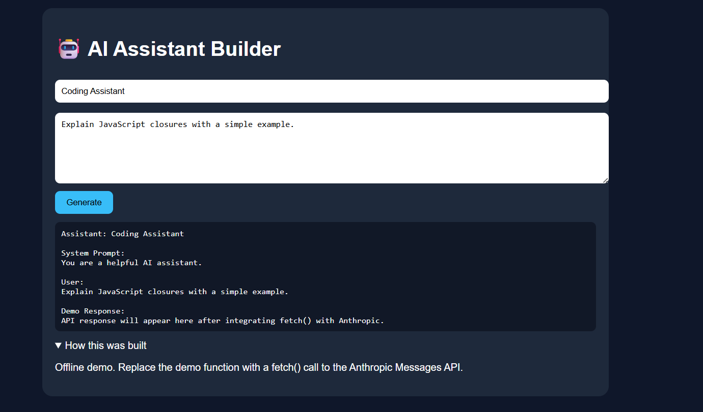

# 🤖 Day 40 – AI Assistant Builder

## 📅 Date

July 10, 2026

---

# 🎯 Objective

Today's challenge focused on designing and building a **production-ready AI Assistant** from scratch.

The objective was to understand the complete AI product development lifecycle—from identifying a user problem and defining assistant behavior to creating a production-quality system prompt and integrating the Claude API into a polished web application.

---

# 🚀 Project

## AI Assistant Builder

A responsive AI assistant application designed with a purpose-built user experience, structured prompt engineering, and seamless Claude API integration.

The application demonstrates how product thinking, conversation design, and frontend development come together to create useful AI-powered experiences.

---

# 📸 Application Preview

## AI Assistant Dashboard




---

# 🧩 Product Design Process

The assistant was developed through a structured discovery process:

* Identify the assistant's domain and niche
* Define the target users
* Understand user inputs
* Design expected outputs
* Choose an appropriate conversation tone

This approach ensures the assistant is optimized for solving a specific user problem instead of acting as a generic chatbot.

---

# 🧠 Assistant Architecture

### Core Components

* Production-Quality System Prompt
* Claude API Integration
* Purpose-Built User Interface
* Error & Loading State Management
* Responsive Design
* Documentation Panel

---

# ⚙️ Features

### 💬 Smart Conversation Interface

* Multi-turn conversations
* Structured responses
* Context-aware interactions

---

### 📝 Prompt Engineering

The application generates a production-ready system prompt including:

* Role Definition
* Scope & Responsibilities
* Constraints
* Output Format
* Edge Case Handling

---

### 🌐 Claude API Integration

* Secure API requests using `fetch()`
* Loading indicators
* Error handling
* Empty state management

---

### 📚 Documentation Panel

Includes:

* System Prompt Design
* UI/UX Decisions
* Future Enhancements
* Memory & Tool Integration Ideas

---

# 📊 Application Highlights

| Feature                  | Status |
| ------------------------ | :----: |
| Claude API Integration   |    ✅   |
| Production System Prompt |    ✅   |
| Responsive UI            |    ✅   |
| Error Handling           |    ✅   |
| Loading States           |    ✅   |
| Conversation Interface   |    ✅   |
| Documentation Panel      |    ✅   |

---

# 💡 Key Learnings

* AI product development begins with understanding user needs.
* A well-designed system prompt significantly improves AI responses.
* User experience is just as important as model capability.
* Robust error handling creates more reliable AI applications.
* Combining prompt engineering with thoughtful UI design leads to more effective assistants.

---

# 🚀 Technologies & Concepts

* HTML5
* CSS3
* Vanilla JavaScript
* Claude API
* Fetch API
* Prompt Engineering
* Product Management
* UX/UI Design
* AI Product Development

---

# 📂 Project Structure

```text
Day40/
│── AI_Assistant_Builder.html
│── ai-assistant-dashboard.png
│── ai-system-prompt.md
│── assistant-documentation.md
│── day40.md
```

---

# 📄 Report Included

* AI Assistant Overview
* Product Design Decisions
* System Prompt Architecture
* API Integration Workflow
* User Experience Design
* Future Improvements
* Key Learnings

---

# 📈 Outcome

Successfully designed and developed a **production-ready AI Assistant** by combining product strategy, prompt engineering, frontend development, and Claude API integration into a polished, user-friendly application.

---

## 🌟 Biggest Takeaway

> Building an AI assistant is not just about using an LLM—it requires thoughtful product design, clear system instructions, intuitive interfaces, and a deep understanding of user needs. Great AI products are created by combining technology with strong product thinking.

---

# ✅ Status

**Day 40 Completed Successfully**

### Challenge

**ABTalks 60-Day Claude AI Mastery Challenge**

### Topic

**AI Product Design – AI Assistant Builder**

### Outcome

Designed and built a production-ready AI assistant featuring structured prompt engineering, Claude API integration, responsive UI, and product-focused conversation design to deliver a practical AI-powered user experience.

---

#60DaysOfClaudeChallenge #ABTalks #ClaudeAI #AIAssistant #PromptEngineering #ProductDesign #FrontendDevelopment #ArtificialIntelligence #BuildInPublic #LearningInPublic
