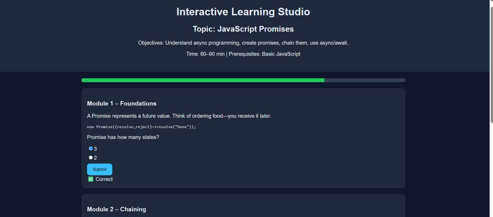
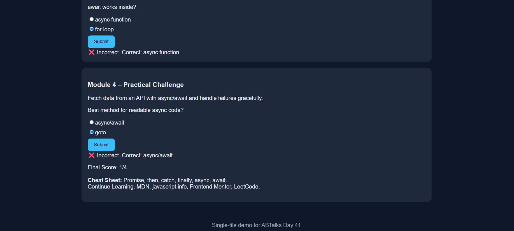

# 🤖 Day 41 – Interactive Learning Studio

## 📅 Date

July 11, 2026

---

# 🎯 Objective

Today's challenge focused on designing and building a **production-ready Interactive Learning Studio** using AI.

The objective was to understand how AI can transform a single topic into a complete interactive learning experience rather than a traditional tutorial. The generated application combines instructional design, frontend development, and AI-generated educational content into a polished, self-contained learning platform.

---

# 🚀 Project

## Interactive Learning Studio

A responsive single-page web application that teaches **JavaScript Promises** through interactive lessons, quizzes, practical exercises, and a final challenge.

Instead of creating a roadmap or notes, the application delivers a complete interactive course that learners can complete from start to finish.

---

# 📸 Application Preview

## Interactive Learning Studio Dashboard



---

## Interactive Learning Experience



---

# 🧩 Course Design Process

The learning experience was designed using a structured instructional approach:

* Selecting a focused learning topic
* Defining clear learning objectives
* Breaking the topic into progressive modules
* Creating interactive quizzes
* Adding practical coding exercises
* Reinforcing concepts with examples and analogies
* Providing summary notes and a cheat sheet

This approach helps learners gradually build their understanding while actively participating throughout the course.

---

# 🧠 Course Architecture

### Core Components

* AI-Generated Interactive Course
* Four Progressive Learning Modules
* Interactive Quiz System
* Progress Tracking
* Practical Exercises
* Final Challenge
* Cheat Sheet
* Summary Notes
* Continue Learning Resources
* Responsive User Interface

---

# ⚙️ Features

### 📚 Interactive Learning

* Four structured learning modules
* Beginner to advanced progression
* Topic-specific explanations
* Real-world examples
* Practical exercises
* Common misconceptions
* Key takeaways

---

### 🧠 Interactive Assessment

The application includes:

* Module-wise quizzes
* Instant feedback
* Automatic scoring
* Performance summary
* Progressive module unlocking

---

### 🎯 Practical Learning

* Hands-on coding exercises
* Final implementation challenge
* Real-world scenarios
* Concept reinforcement

---

### 🎨 User Experience

* Responsive layout
* Modern dark interface
* Smooth navigation
* Progress tracking
* Single-page application
* Clean educational design

---

# 📊 Application Highlights

| Feature                      | Status |
| ---------------------------- | :----: |
| Interactive Learning Modules |    ✅   |
| Four Progressive Lessons     |    ✅   |
| Interactive Quizzes          |    ✅   |
| Automatic Quiz Feedback      |    ✅   |
| Progress Tracking            |    ✅   |
| Responsive UI                |    ✅   |
| Practical Exercises          |    ✅   |
| Final Challenge              |    ✅   |
| Cheat Sheet                  |    ✅   |
| Summary Notes                |    ✅   |

---

# 💡 Key Learnings

* Learned how AI can generate complete educational experiences.
* Improved understanding of instructional design.
* Built an interactive learning application using HTML, CSS, and JavaScript.
* Learned to structure educational content into progressive modules.
* Understood the importance of quizzes and practical exercises in improving learner engagement.
* Explored how AI can accelerate educational content creation while maintaining quality.

---

# 🚀 Technologies & Concepts

* HTML5
* CSS3
* Vanilla JavaScript
* Prompt Engineering
* Instructional Design
* Interactive Learning
* Responsive Web Design
* Educational UI/UX
* AI-Assisted Course Generation

---

# 📂 Project Structure

```text
Day41/
│── Interactive_Learning_Studio.html
│── day41.md
│── 1.png
└── 2.png
```

---

# 📄 Report Included

* Interactive Learning Studio Overview
* Course Design Process
* Module Structure
* Interactive Quiz System
* Practical Learning Activities
* User Interface Design
* Key Learnings

---

# 📈 Outcome

Successfully designed and developed a **production-ready Interactive Learning Studio** that transforms **JavaScript Promises** into a complete interactive course featuring structured lessons, quizzes, practical exercises, progress tracking, and a polished responsive interface.

---

## 🌟 Biggest Takeaway

> Effective educational platforms are more than collections of information—they guide learners through structured lessons, interactive assessments, practical challenges, and continuous feedback. AI makes it possible to create these learning experiences much faster while maintaining high quality.

---

# ✅ Status

**Day 41 Completed Successfully**

### Challenge

**ABTalks 60-Day Claude AI Mastery Challenge**

### Topic

**Interactive Learning Studio – JavaScript Promises**

### Outcome

Designed and built a complete AI-generated Interactive Learning Studio that teaches **JavaScript Promises** through four progressive modules, interactive quizzes, practical exercises, progress tracking, and a responsive user interface.

---

#60DayClaudeChallenge #ABTalks #ClaudeAI #InteractiveLearning #JavaScript #HTML #CSS #FrontendDevelopment #PromptEngineering #BuildInPublic #LearningInPublic #ArtificialIntelligence
