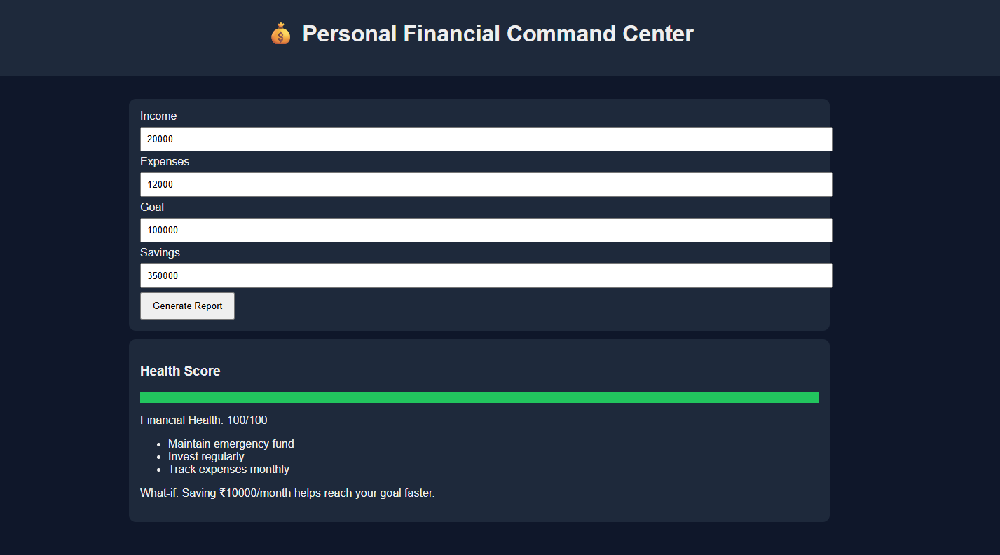

# 🤖 Day 42 – Personal Financial Command Center

## 📅 Date

July 12, 2026

---

# 🎯 Objective

Today's challenge focused on designing and building a **Personal Financial Command Center** using AI.

The objective was to create an intelligent financial dashboard that helps users monitor, understand, and improve their financial health through interactive insights, planning tools, and visual summaries.

---

# 🚀 Project

## Personal Financial Command Center

A responsive single-page financial dashboard that provides a clear overview of income, expenses, savings, financial health, and AI-generated recommendations.

Rather than acting as a basic expense tracker, the application delivers meaningful insights and planning tools to support better financial decisions.

---

# 📸 Application Preview

## Financial Dashboard



---

# 🧩 Dashboard Design Process

The application was designed with a user-focused financial planning approach:

* Understanding the user's financial profile
* Organizing key financial metrics
* Calculating a Financial Health Score
* Providing AI-inspired recommendations
* Simulating savings scenarios
* Presenting insights in a clean dashboard

---

# 🧠 Dashboard Architecture

### Core Components

* Financial Overview Dashboard
* Income & Expense Tracking
* Savings Goal Monitoring
* Financial Health Score
* AI Recommendations
* What-if Simulation
* Planning Checklist
* Responsive User Interface

---

# ⚙️ Features

### 💰 Financial Overview

* Income tracking
* Expense monitoring
* Savings goal management
* Financial health calculation

### 📊 Smart Insights

* AI-generated financial recommendations
* Savings suggestions
* Financial planning tips
* What-if simulations

### 🎨 User Experience

* Responsive design
* Modern dashboard interface
* Interactive calculations
* Clean single-page layout

---

# 📊 Application Highlights

| Feature                | Status |
| ---------------------- | :----: |
| Financial Dashboard    |    ✅   |
| Financial Health Score |    ✅   |
| Income Tracking        |    ✅   |
| Expense Tracking       |    ✅   |
| Savings Goals          |    ✅   |
| AI Recommendations     |    ✅   |
| What-if Simulation     |    ✅   |
| Responsive UI          |    ✅   |

---

# 💡 Key Learnings

* Learned how AI can improve financial planning experiences.
* Built an interactive financial dashboard using HTML, CSS, and JavaScript.
* Explored financial health scoring concepts.
* Designed a responsive productivity application.
* Improved frontend development and dashboard design skills.

---

# 🚀 Technologies & Concepts

* HTML5
* CSS3
* Vanilla JavaScript
* Financial Dashboard Design
* Responsive UI
* AI-Assisted Productivity
* Financial Planning Concepts

---

# 📂 Project Structure

```text
Day42/
│── Personal_Financial_Command_Center.html
│── day42.md
│── 1.png
└── 2.png
```

---

# 📈 Outcome

Successfully designed and developed a **Personal Financial Command Center** that provides an interactive overview of financial health, savings progress, AI-inspired recommendations, and financial planning tools within a responsive single-page application.

---

## 🌟 Biggest Takeaway

> Effective financial dashboards do more than record numbers—they provide insights, encourage better habits, and help users make informed decisions. Combining AI concepts with intuitive dashboard design creates practical tools for everyday financial management.

---

# ✅ Status

**Day 42 Completed Successfully**

### Challenge

**ABTalks 60-Day Claude AI Mastery Challenge**

### Topic

**Personal Financial Command Center**

### Outcome

Designed and built an AI-powered financial dashboard featuring financial health tracking, income and expense monitoring, savings planning, AI-generated recommendations, and an interactive responsive interface.

---

#60DayClaudeChallenge #ABTalks #ClaudeAI #PersonalFinance #FinancialDashboard #HTML #CSS #JavaScript #FrontendDevelopment #ArtificialIntelligence #BuildInPublic #LearningInPublic
