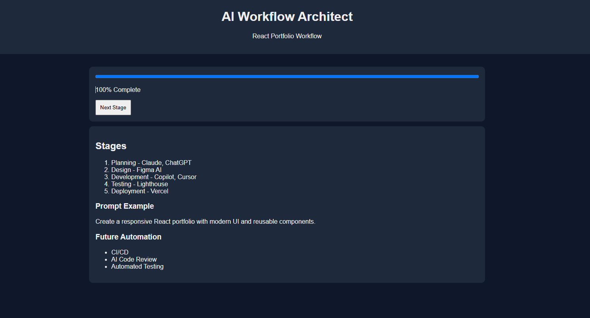

# 🤖 Day 43 – AI Workflow Architect

## 📅 Date

July 13, 2026

---

# 🎯 Objective

Today's challenge focused on designing and building a **production-ready AI Workflow Architect**.

The objective was to understand how AI can help design complete business and development workflows by transforming a goal into a structured end-to-end process instead of a simple checklist.

---

# 🚀 Project

## AI Workflow Architect

A responsive single-page web application that generates a complete workflow for:

**Software Development → Frontend Development → React Portfolio Website**

The application organizes every stage from planning to deployment while recommending AI tools, prompt examples, best practices, and future automation opportunities.

---

# 📸 Application Preview

## AI Workflow Dashboard


---

# 🧩 Workflow Design Process

The workflow was created using a structured approach:

- Identify the workflow objective
- Break the process into logical stages
- Define objectives for each stage
- Recommend AI tools
- Generate prompt examples
- Highlight best practices
- Identify common mistakes
- Suggest future automation opportunities

---

# 🧠 Workflow Architecture

### Core Components

- Workflow Overview
- Stage-wise Planning
- AI Tool Recommendations
- Prompt Examples
- Best Practices
- Progress Tracking
- Workflow Summary
- Recommended AI Stack
- Future Automation Opportunities
- Responsive User Interface

---

# ⚙️ Features

### 🚀 Workflow Management

- End-to-end workflow generation
- Stage-wise objectives
- Task breakdown
- Time estimation

---

### 🤖 AI Assistance

- Best AI tools for each stage
- Alternative tools
- Prompt examples
- Workflow recommendations

---

### 🎨 User Experience

- Responsive layout
- Modern dashboard
- Progress tracking
- Interactive single-page application

---

# 📊 Application Highlights

| Feature | Status |
| ----------------------------- | :----: |
| End-to-End Workflow | ✅ |
| AI Tool Recommendations | ✅ |
| Prompt Examples | ✅ |
| Progress Tracking | ✅ |
| Workflow Summary | ✅ |
| AI Stack Recommendations | ✅ |
| Responsive UI | ✅ |

---

# 💡 Key Learnings

- Learned how AI can structure complete workflows.
- Improved understanding of workflow automation.
- Explored AI tool selection for different stages.
- Designed a responsive productivity application.
- Strengthened frontend development and prompt engineering skills.

---

# 🚀 Technologies & Concepts

- HTML5
- CSS3
- Vanilla JavaScript
- Workflow Automation
- Prompt Engineering
- AI Productivity
- Responsive Web Design
- Business Process Design

---

# 📂 Project Structure

```text
Day43/
│── AI_Workflow_Architect.html
│── day43.md
│── 1.png
└── 2.png
```

---

# 📄 Report Included

- Workflow Overview
- Workflow Architecture
- AI Tool Recommendations
- Prompt Examples
- Best Practices
- Future Automation Opportunities
- Key Learnings

---

# 📈 Outcome

Successfully designed and developed an **AI Workflow Architect** that generates structured end-to-end workflows with AI tool recommendations, prompt examples, progress tracking, and workflow planning inside a responsive single-page application.

---

## 🌟 Biggest Takeaway

> AI is not only useful for generating code—it can also design structured workflows that improve planning, execution, collaboration, and productivity. Combining AI with workflow thinking enables smarter and more efficient project execution.

---

# ✅ Status

**Day 43 Completed Successfully**

### Challenge

**ABTalks 60-Day Claude AI Mastery Challenge**

### Topic

**AI Workflow Architect – React Portfolio Website Workflow**

### Outcome

Designed and built an AI-powered Workflow Architect that generates structured workflows with planning stages, AI tool recommendations, prompt examples, progress tracking, and future automation opportunities.

---

#60DayClaudeChallenge #ABTalks #ClaudeAI #WorkflowAutomation #AIWorkflow #PromptEngineering #HTML #CSS #JavaScript #FrontendDevelopment #ArtificialIntelligence #BuildInPublic #LearningInPublic
