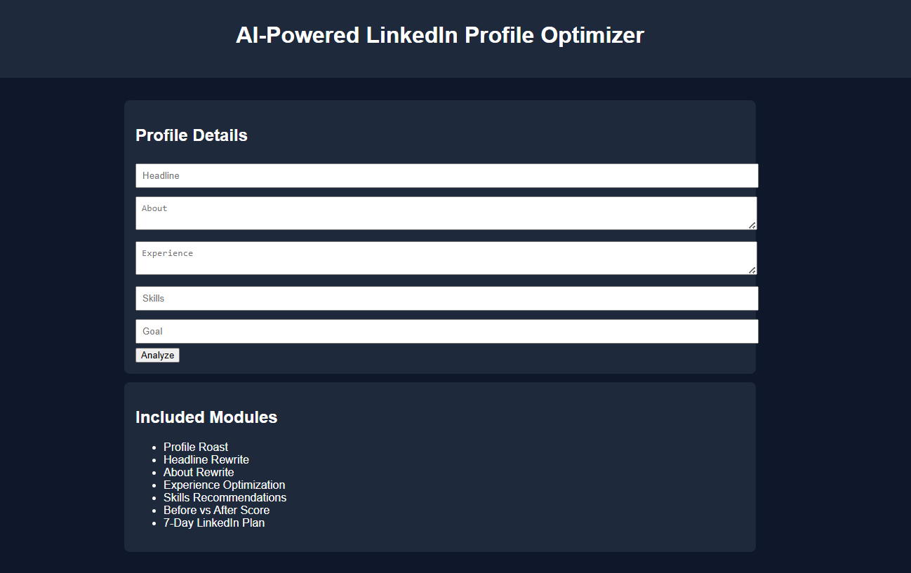

# 🤖 Day 44 – AI-Powered LinkedIn Profile Optimizer

## 📅 Date

July 14, 2026

---

# 🎯 Objective

Today's challenge focused on designing and building an **AI-Powered LinkedIn Profile Optimizer**.

The objective was to create an intelligent application that analyzes LinkedIn profiles, identifies improvement areas, and provides actionable recommendations to help users attract recruiters, clients, and professional opportunities.

---

# 🚀 Project

## AI-Powered LinkedIn Profile Optimizer

A responsive single-page web application that helps users optimize their LinkedIn profiles using AI-inspired analysis and structured recommendations.

The application focuses on improving profile quality through profile scoring, headline optimization, experience enhancement, skills recommendations, and a practical activation strategy.

---

# 📸 Application Preview

## LinkedIn Optimizer Dashboard



---

# 🧩 Optimization Process

The application follows a structured profile improvement workflow:

- Collect profile information
- Analyze current profile strength
- Generate a profile report card
- Rewrite important sections
- Recommend relevant skills
- Compare before vs. after profile quality
- Create a 7-day LinkedIn activation plan

---

# 🧠 Application Architecture

### Core Components

- LinkedIn Profile Input
- Profile Report Card
- Headline Optimizer
- About Section Rewriter
- Experience Enhancer
- Skills Recommendations
- Before vs After Comparison
- 7-Day LinkedIn Action Plan
- Responsive User Interface

---

# ⚙️ Features

### 💼 LinkedIn Profile Analysis

- Profile scoring
- Recruiter-style feedback
- Profile strengths and weaknesses
- Actionable improvement suggestions

### 🚀 Profile Optimization

- Multiple headline options
- About section rewrite
- Experience improvements
- Skills optimization
- Keyword recommendations

### 📅 Career Growth

- 7-Day LinkedIn activation plan
- Networking suggestions
- Content strategy ideas
- Profile improvement checklist

### 🎨 User Experience

- Responsive design
- Clean dashboard interface
- Interactive workflow
- Single-page application

---

# 📊 Application Highlights

| Feature | Status |
| ------------------------------- | :----: |
| Profile Analysis | ✅ |
| Report Card | ✅ |
| Headline Optimization | ✅ |
| About Rewrite | ✅ |
| Experience Enhancement | ✅ |
| Skills Recommendations | ✅ |
| 7-Day Action Plan | ✅ |
| Responsive UI | ✅ |

---

# 💡 Key Learnings

- Learned how recruiters evaluate LinkedIn profiles.
- Explored AI-assisted personal branding strategies.
- Designed a career-focused productivity application.
- Improved prompt engineering for profile optimization.
- Strengthened frontend development skills by creating an interactive dashboard.

---

# 🚀 Technologies & Concepts

- HTML5
- CSS3
- Vanilla JavaScript
- Prompt Engineering
- Personal Branding
- LinkedIn SEO
- Career Development
- Responsive Web Design

---

# 📂 Project Structure

```text
Day44/
│── AI_LinkedIn_Profile_Optimizer.html
│── day44.md
│── 1.png
└── 2.png
```

---

# 📄 Report Included

- LinkedIn Profile Analysis
- Profile Report Card
- Headline Optimization
- About Section Rewrite
- Experience Improvements
- Skills Recommendations
- 7-Day LinkedIn Plan
- Key Learnings

---

# 📈 Outcome

Successfully designed and developed an **AI-Powered LinkedIn Profile Optimizer** that analyzes LinkedIn profiles, generates personalized recommendations, improves profile visibility, and provides a structured action plan for professional growth.

---

## 🌟 Biggest Takeaway

> A strong LinkedIn profile is more than an online résumé—it is a personal brand. Combining AI with recruiter insights and structured optimization helps professionals present their experience more effectively and increase their visibility to the right opportunities.

---

# ✅ Status

**Day 44 Completed Successfully**

### Challenge

**ABTalks 60-Day Claude AI Mastery Challenge**

### Topic

**AI-Powered LinkedIn Profile Optimizer**

### Outcome

Designed and built an AI-powered LinkedIn optimization tool featuring profile analysis, recruiter-style feedback, content rewrites, skills recommendations, and a structured action plan within a responsive single-page application.

---

#60DayClaudeChallenge #ABTalks #ClaudeAI #LinkedIn #PersonalBranding #CareerGrowth #PromptEngineering #HTML #CSS #JavaScript #FrontendDevelopment #ArtificialIntelligence #BuildInPublic #LearningInPublic
