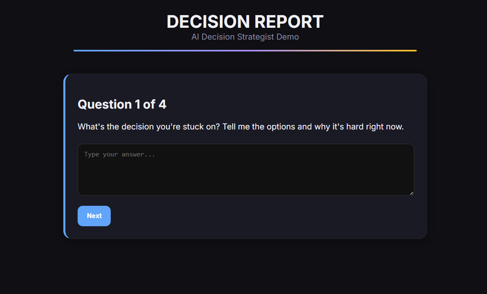
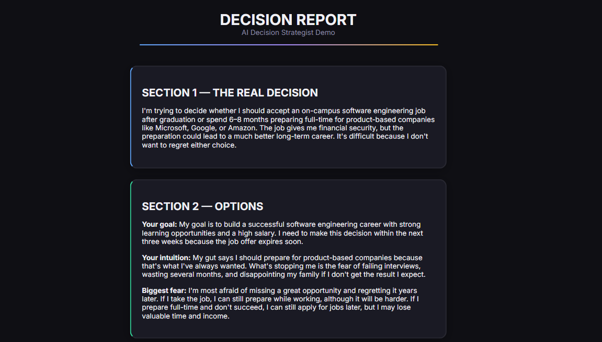
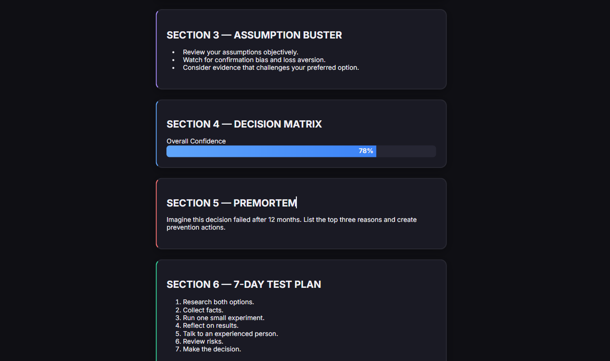
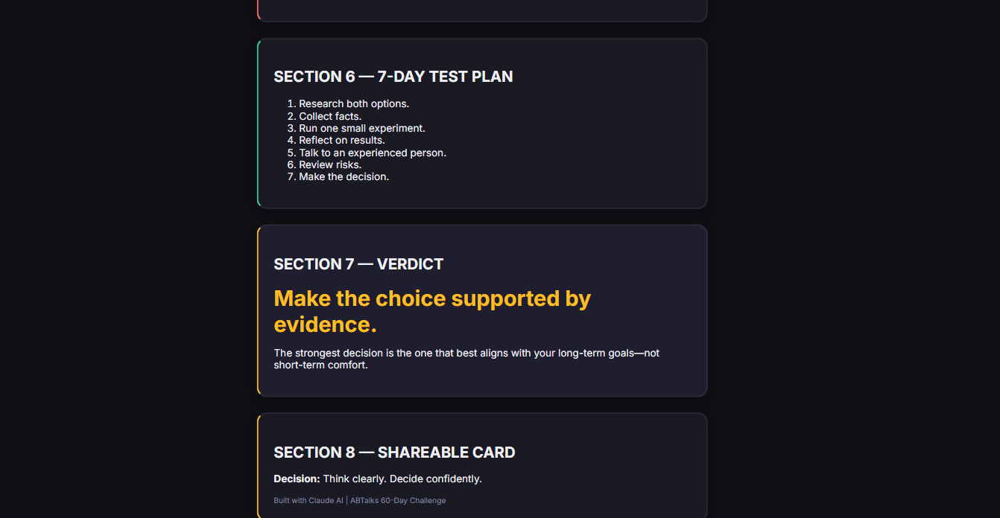

# 🧠 Day 45 – AI Decision Strategist

## 📅 Date

July 15, 2026

---

# 🎯 Objective

Today's challenge focused on designing and building an **AI Decision Strategist**.

The objective was to create an intelligent application that helps users make difficult personal, academic, and professional decisions through structured questioning, objective analysis, and AI-assisted reasoning rather than simply suggesting an answer.

---

# 🚀 Project

## AI Decision Strategist

A responsive single-page web application that guides users through an interactive decision-making process and generates a comprehensive Decision Report based on their responses.

The application combines strategic questioning, decision matrices, cognitive bias detection, risk assessment, and practical action plans to support informed decision-making.

---

# 📸 Application Preview

## AI Decision Strategist Dashboard






---

# 🧩 Decision Workflow

The application follows a structured decision-making framework:

* Understand the user's dilemma
* Clarify goals and timelines
* Identify emotional influences
* Explore fears and uncertainties
* Analyze every available option
* Generate an evidence-based decision report
* Recommend a practical 7-day validation plan

---

# 🧠 Application Architecture

### Core Components

* Interactive Decision Interview
* Decision Summary
* Option Comparison Cards
* Assumption Buster
* Cognitive Bias Detection
* Animated Decision Matrix
* Premortem Analysis
* 7-Day Test Plan
* AI Verdict
* Shareable Summary Cards
* Responsive User Interface

---

# ⚙️ Features

### 🎯 Guided Decision Analysis

* Four-step interactive interview
* Goal clarification
* Emotional trade-off analysis
* Decision framing

### 📊 Strategic Evaluation

* Option comparison dashboard
* Animated scoring matrix
* Strengths and weaknesses
* Long-term alignment analysis
* Risk assessment

### 🧠 Critical Thinking

* Assumption validation
* Cognitive bias identification
* Premortem failure analysis
* Reversibility assessment

### 🚀 Action Planning

* AI-generated recommendation
* Practical 7-day experiment plan
* Decision confidence framework
* Shareable insight cards

### 🎨 User Experience

* Premium dashboard interface
* Responsive design
* Smooth animations
* Interactive visualizations
* Single-page application

---

# 📊 Application Highlights

| Feature               | Status |
| --------------------- | :----: |
| Interactive Interview |    ✅   |
| Decision Summary      |    ✅   |
| Option Comparison     |    ✅   |
| Assumption Buster     |    ✅   |
| Bias Detection        |    ✅   |
| Decision Matrix       |    ✅   |
| Premortem Analysis    |    ✅   |
| 7-Day Test Plan       |    ✅   |
| AI Verdict            |    ✅   |
| Shareable Cards       |    ✅   |
| Responsive UI         |    ✅   |

---

# 💡 Key Learnings

* Learned how structured thinking improves complex decision-making.
* Explored common cognitive biases that influence everyday choices.
* Designed an AI-assisted strategic analysis workflow.
* Improved prompt engineering for reasoning-focused applications.
* Strengthened frontend development skills by building an interactive analytical dashboard.

---

# 🚀 Technologies & Concepts

* HTML5
* CSS3
* Vanilla JavaScript
* Prompt Engineering
* Decision Intelligence
* Critical Thinking
* Cognitive Bias Analysis
* Responsive Web Design

---

# 📂 Project Structure

```text
Day45/
│── AI_Decision_Strategist.html
│── day45.md
│── 1.png
└── 2.png
```

---

# 📄 Report Included

* Decision Summary
* Option Analysis
* Decision Matrix
* Assumption Buster
* Cognitive Bias Analysis
* Premortem Report
* 7-Day Decision Plan
* Final AI Verdict
* Key Learnings

---

# 📈 Outcome

Successfully designed and developed an **AI Decision Strategist** that guides users through a structured decision-making process, evaluates multiple options objectively, identifies cognitive biases, and provides actionable recommendations through an interactive dashboard.

---

## 🌟 Biggest Takeaway

> Better decisions rarely come from finding perfect answers—they come from asking better questions. A structured framework combined with AI-driven analysis transforms uncertainty into clarity and helps users make more confident, rational decisions.

---

# ✅ Status

**Day 45 Completed Successfully**

### Challenge

**ABTalks 60-Day Claude AI Mastery Challenge**

### Topic

**AI Decision Strategist**

### Outcome

Designed and built an AI-powered decision support application featuring an interactive interview, decision matrix, bias analysis, premortem evaluation, strategic action planning, and a premium responsive dashboard to help users make informed decisions.

---

#60DayClaudeChallenge #ABTalks #ClaudeAI #DecisionIntelligence #CriticalThinking #PromptEngineering #HTML #CSS #JavaScript #FrontendDevelopment #ArtificialIntelligence #BuildInPublic #LearningInPublic
