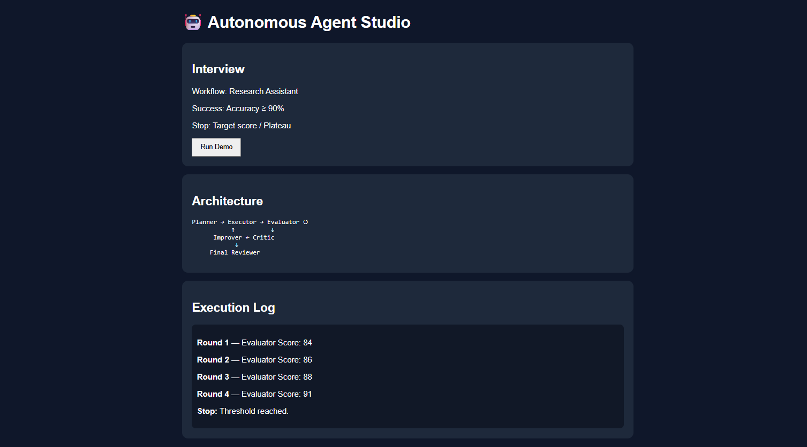

# 🤖 Day 46 – Autonomous Agent Studio

## 📅 Date

July 16, 2026

---

# 🎯 Objective

Today's challenge focused on designing and building an **Autonomous Agent Studio**.

The objective was to create an intelligent multi-agent AI system capable of autonomously planning, executing, evaluating, improving, and reviewing complex workflows through iterative reasoning instead of relying on a single AI response.

---

# 🚀 Project

## Autonomous Agent Studio

A responsive single-page web application that simulates a production-style autonomous AI system using multiple specialized agents working together in an orchestration loop.

The application demonstrates how autonomous AI agents collaborate, share memory, evaluate outputs, improve results, and terminate execution only when predefined stopping conditions are satisfied.

---

# 📸 Application Preview

## Autonomous Agent Studio Dashboard



---

# 🧩 Autonomous Workflow

The application follows a complete multi-agent orchestration pipeline:

* Receive workflow objective
* Generate execution plan
* Execute assigned task
* Evaluate output quality
* Critique weaknesses
* Improve generated results
* Update shared memory
* Repeat until stopping condition is met
* Produce final reviewed output

---

# 🧠 Multi-Agent Architecture

### Core Agents

* Planner Agent
* Executor Agent
* Evaluator Agent
* Critic Agent
* Improver Agent
* Memory Manager
* Safety Monitor
* Final Reviewer

---

# ⚙️ Features

### 🤖 Autonomous Execution

* Multi-agent orchestration
* Iterative reasoning loop
* Dynamic workflow execution
* Live execution monitoring

### 🧠 Intelligent Evaluation

* Quality scoring
* Critique generation
* Performance tracking
* Continuous refinement

### 💾 Memory & State Management

* Shared memory updates
* Context preservation
* Iteration history
* Agent communication

### 📊 Monitoring Dashboard

* Active agent indicator
* Workflow visualization
* Execution logs
* Round-by-round improvements
* Stop condition tracking
* Final execution summary

### 🎨 User Experience

* Premium responsive dashboard
* Dark mode interface
* Smooth animations
* Interactive workflow visualization
* Single-page application

---

# 📊 Application Highlights

| Feature                  | Status |
| ------------------------ | :----: |
| Multi-Agent Workflow     |    ✅   |
| Planner Agent            |    ✅   |
| Executor Agent           |    ✅   |
| Evaluator Agent          |    ✅   |
| Critic Agent             |    ✅   |
| Improver Agent           |    ✅   |
| Memory Manager           |    ✅   |
| Safety Monitor           |    ✅   |
| Final Reviewer           |    ✅   |
| Iteration History        |    ✅   |
| Stop Condition Detection |    ✅   |
| Responsive UI            |    ✅   |

---

# 💡 Key Learnings

* Learned how autonomous AI systems coordinate multiple specialized agents.
* Explored iterative reasoning instead of one-shot AI generation.
* Understood how memory sharing improves multi-agent collaboration.
* Learned how stopping conditions control autonomous execution.
* Strengthened frontend development skills by building an interactive AI orchestration dashboard.

---

# 🚀 Technologies & Concepts

* HTML5
* CSS3
* Vanilla JavaScript
* Prompt Engineering
* Multi-Agent Systems
* Autonomous AI
* Agent Orchestration
* Workflow Automation
* Context Management
* Responsive Web Design

---

# 📂 Project Structure

```text
Day46/
│── Autonomous_Agent_Studio.html
│── day46.md
│── 1.png
└── 2.png
```

---

# 📄 Report Included

* Autonomous Workflow
* Multi-Agent Architecture
* Execution Pipeline
* Agent Responsibilities
* Memory Management
* Evaluation Reports
* Iteration History
* Stop Conditions
* Final Summary
* Key Learnings

---

# 📈 Outcome

Successfully designed and developed an **Autonomous Agent Studio** that demonstrates how multiple AI agents collaborate through planning, execution, evaluation, critique, improvement, and memory management to autonomously solve complex tasks while providing complete execution transparency.

---

## 🌟 Biggest Takeaway

> Powerful AI systems are no longer just single prompts—they are intelligent teams of specialized agents working together. Autonomous orchestration enables AI to plan, improve, and reason through complex problems with far greater reliability than one-shot generation.

---

# ✅ Status

**Day 46 Completed Successfully**

### Challenge

**ABTalks 60-Day Claude AI Mastery Challenge**

### Topic

**Autonomous Agent Studio**

### Outcome

Designed and built an AI-powered multi-agent orchestration platform featuring autonomous planning, execution, evaluation, iterative improvement, shared memory management, workflow visualization, execution tracking, and a premium responsive dashboard.

---

#60DayClaudeChallenge #ABTalks #ClaudeAI #AutonomousAI #MultiAgentSystems #AIAgents #AgenticAI #WorkflowAutomation #PromptEngineering #HTML #CSS #JavaScript #FrontendDevelopment #ArtificialIntelligence #BuildInPublic #LearningInPublic
