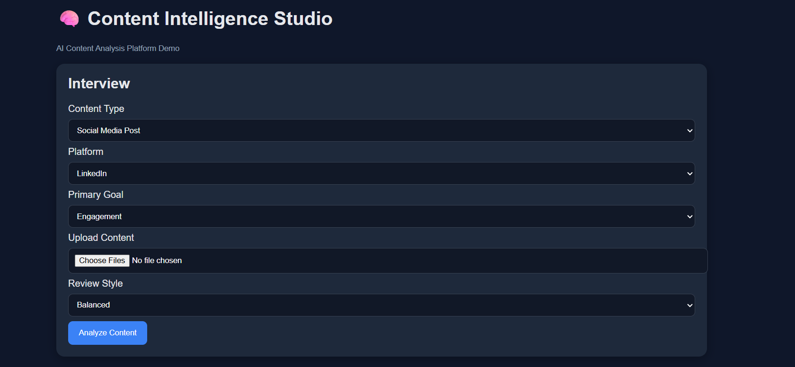
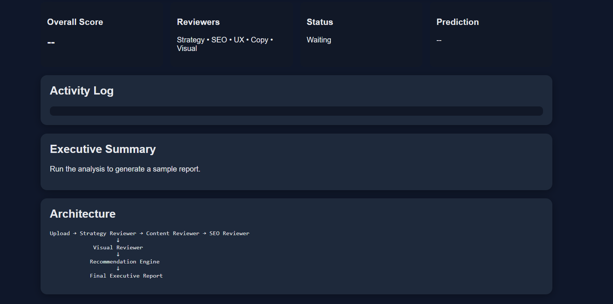

# 🧠 Day 47 – Content Intelligence Studio

## 📅 Date

July 17, 2026

---

# 🎯 Objective

Today's challenge focused on designing and building a **Content Intelligence Studio**.

The objective was to create an AI-powered platform capable of analyzing content across multiple formats and platforms, identifying improvement opportunities, and providing actionable recommendations to maximize engagement, reach, and overall content quality.

---

# 🚀 Project

## Content Intelligence Studio

A responsive single-page web application that acts as an AI-powered content consultant for creators, marketers, and businesses.

The application intelligently reviews text and visual content, evaluates quality across multiple dimensions, generates platform-specific insights, rewrites content for improved performance, and produces a comprehensive optimization report.

---

# 📸 Application Preview

## Content Intelligence Studio Dashboard




---

# 🧩 Content Analysis Workflow

The application follows a structured AI-powered review pipeline:

* Upload content
* Detect content type
* Analyze structure and quality
* Review engagement potential
* Evaluate platform optimization
* Identify strengths and weaknesses
* Generate rewritten content
* Produce actionable recommendations
* Build comprehensive optimization report

---

# 🧠 AI Review Architecture

### Specialized AI Reviewers

* Content Quality Reviewer
* Engagement Analyzer
* Platform Optimization Expert
* SEO & Discoverability Reviewer
* Visual Content Reviewer
* Copywriting Specialist
* Content Strategy Advisor
* Final Intelligence Reporter

---

# ⚙️ Features

### ✍️ Intelligent Content Analysis

* AI-powered content scoring
* Structural analysis
* Readability evaluation
* Clarity assessment
* Engagement prediction

### 📈 Optimization Engine

* Headline improvements
* Alternative hooks
* Content rewrites
* Platform-specific recommendations
* Publishing checklist

### 🖼️ Visual Intelligence

* Image analysis
* Thumbnail review
* Screenshot evaluation
* Design feedback
* Visual improvement suggestions

### 📊 Analytics Dashboard

* Overall content score
* Category-wise breakdown
* Strengths & weaknesses
* AI reasoning
* Performance estimation
* Before vs After comparison
* Executive summary

### 🎨 User Experience

* Responsive SaaS-style interface
* Premium dark theme
* Interactive dashboard
* Smooth animations
* Single-page application

---

# 📊 Application Highlights

| Feature                  | Status |
| ------------------------ | :----: |
| Text Analysis            |    ✅   |
| Image Analysis           |    ✅   |
| Content Scoring          |    ✅   |
| AI Reviewers             |    ✅   |
| Engagement Analysis      |    ✅   |
| Platform Recommendations |    ✅   |
| Content Rewriting        |    ✅   |
| Executive Summary        |    ✅   |
| Before vs After Report   |    ✅   |
| Responsive UI            |    ✅   |

---

# 💡 Key Learnings

* Learned how AI can evaluate content quality beyond basic grammar checking.
* Explored platform-specific optimization strategies for better reach.
* Understood how multiple AI reviewers collaborate to generate comprehensive insights.
* Improved prompt engineering for content intelligence systems.
* Strengthened frontend development skills by building a modern AI-powered dashboard.

---

# 🚀 Technologies & Concepts

* HTML5
* CSS3
* Vanilla JavaScript
* Prompt Engineering
* Content Intelligence
* AI Content Analysis
* Generative AI
* UX Design
* Responsive Web Design

---

# 📂 Project Structure

```text
Day47/
│── Content_Intelligence_Studio.html
│── day47.md
│── 1.png
└── 2.png
```

---

# 📄 Report Included

* Content Analysis
* AI Review Summary
* Engagement Insights
* Platform Recommendations
* Content Rewrites
* Performance Prediction
* Executive Summary
* Before vs After Comparison
* Key Learnings

---

# 📈 Outcome

Successfully designed and developed a **Content Intelligence Studio** that analyzes text and visual content using AI, provides detailed quality assessments, generates optimization recommendations, and delivers an interactive intelligence dashboard for creators and marketers.

---

## 🌟 Biggest Takeaway

> Great content isn't created by chance—it's refined through analysis, iteration, and optimization. AI-powered content intelligence enables creators to transform good ideas into high-performing content with data-driven recommendations.

---

# ✅ Status

**Day 47 Completed Successfully**

### Challenge

**ABTalks 60-Day Claude AI Mastery Challenge**

### Topic

**Content Intelligence Studio**

### Outcome

Designed and built an AI-powered content analysis platform featuring intelligent content review, platform-specific optimization, engagement analysis, content rewriting, executive reporting, and a premium responsive dashboard.

---

#60DayClaudeChallenge #ABTalks #ClaudeAI #ContentIntelligence #AIContent #ContentStrategy #PromptEngineering #HTML #CSS #JavaScript #FrontendDevelopment #ArtificialIntelligence #BuildInPublic #LearningInPublic
