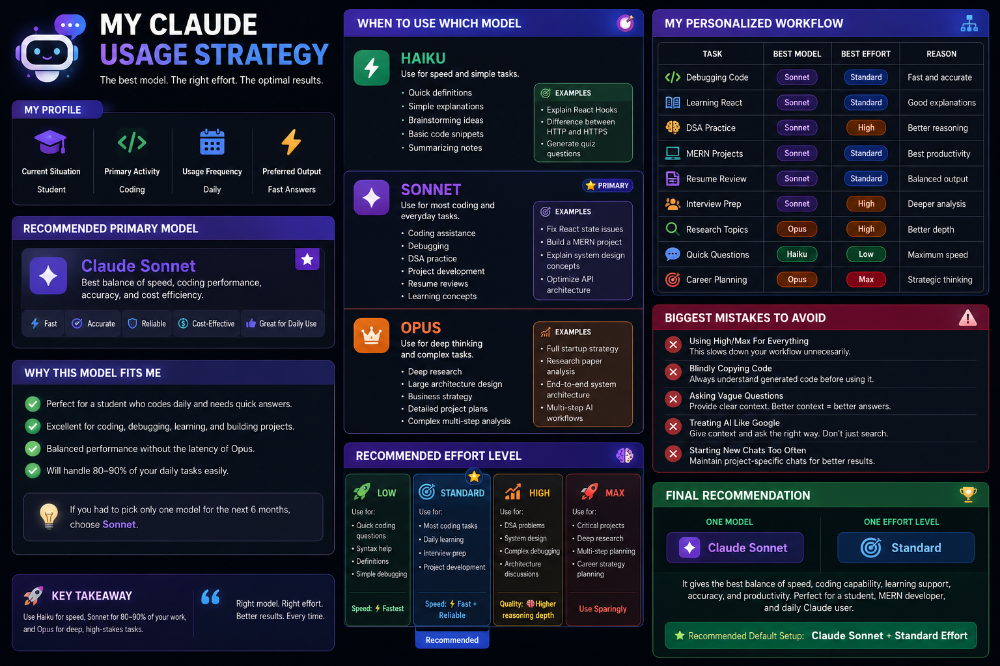

# Day 7 - Claude Model & Effort Strategy

## 📅 Date

June 7, 2026

---

# 🎯 Objective

Today's goal was to understand how to choose the right Claude model and effort level based on individual needs, workflows, and productivity requirements.

---

# 🤖 What I Explored

I analyzed my profile and daily AI usage patterns to determine:

- Which Claude model suits me best
- When to use Haiku, Sonnet, and Opus
- Which effort level should be my default
- How to optimize my AI workflow

---

# 👨‍🎓 My Profile

| Category | Details |
|-----------|---------|
| Current Situation | Student |
| Primary Activity | Coding |
| Usage Frequency | Daily |
| Preferred Output | Fast Answers |

---

# 🚀 Recommended Primary Model

## Claude Sonnet

### Why It Fits Me

- Excellent coding assistance
- Fast response time
- Strong debugging capabilities
- Great for learning and projects
- Best balance between speed and intelligence

For a student and MERN developer, Sonnet can handle most daily tasks efficiently.

---

# ⚡ Recommended Effort Level

## Standard Effort

### Why?

- Fast enough for daily work
- Reliable coding assistance
- Good balance of speed and reasoning
- Suitable for learning and project development

This is the effort level I would use most of the time.

---

# 🔍 Model Usage Breakdown

| Model | Best Use Cases |
|---------|--------------|
| Haiku | Quick answers, definitions, simple tasks |
| Sonnet | Coding, debugging, learning, projects |
| Opus | Deep research, complex planning, strategic decisions |

---

# 📋 Personalized Workflow

| Task | Model | Effort |
|---------|---------|---------|
| Debugging Code | Sonnet | Standard |
| Learning New Concepts | Sonnet | Standard |
| DSA Practice | Sonnet | High |
| MERN Projects | Sonnet | Standard |
| Quick Questions | Haiku | Low |
| Research Topics | Opus | High |
| Career Planning | Opus | Max |

---

# 💡 Biggest Insight

> The best AI model is not always the smartest model. It is the right model for the task.

Choosing the correct model and effort level can significantly improve productivity and reduce unnecessary complexity.

---

# 📸 Generated Claude Usage Strategy

---

# 📚 Key Learnings

- Different models serve different purposes.
- Sonnet is the best everyday model for my workflow.
- Higher effort should be reserved for complex tasks.
- AI productivity depends on choosing the right tool for the job.
- Context and model selection both impact output quality.

---

# 🚀 Takeaway

Understanding when to use Haiku, Sonnet, and Opus allows me to work more efficiently and get better results from AI.

Instead of using the same model for everything, I now have a structured strategy for maximizing productivity.

---

# ✅ Status

Day 7 Completed Successfully

### Challenge

ABTalks 60-Day Claude AI Mastery Challenge

### Topic

Claude Model & Effort Strategy

### Outcome

Created a personalized AI workflow and identified the optimal Claude model and effort settings for my daily tasks.

#60DaysOfClaudeChallenge #ClaudeAI #PromptEngineering #ABTalks
