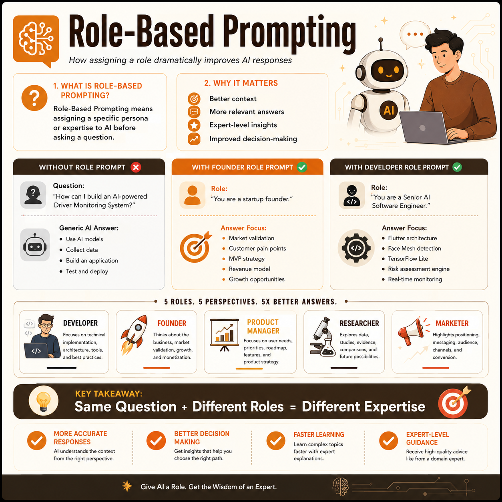

# Day 3 - Role-Based Prompting

## 📅 Date

June 3, 2026

---

## 🎯 Objective

Today's goal was to understand **Role-Based Prompting** and how assigning a specific role to AI can dramatically improve the quality and relevance of responses.

---

## 🤖 What is Role-Based Prompting?

Role-Based Prompting is a prompt engineering technique where you assign a specific persona or expertise to the AI before asking a question.

Examples:

- Software Engineer
- Startup Founder
- Product Manager
- Researcher
- Marketer

This allows AI to respond from a specialized perspective rather than giving a generic answer.

---

## 📝 Activity Performed

I explored how the same question can produce different answers when different roles are assigned.

### Example Question

> How can I build an AI-powered Driver Monitoring System?

### Roles Tested

- No Role (General Response)
- Founder Persona
- Developer Persona

### Observation

The responses changed significantly depending on the assigned role.

- Founder → Business strategy, customers, MVP, revenue
- Developer → Architecture, AI models, implementation
- No Role → General overview

---

## 📚 Key Learnings

- AI performs better with context.
- Different roles generate different perspectives.
- Role-Based Prompting produces more relevant responses.
- Assigning expertise helps obtain expert-level insights.
- Better prompts lead to better outcomes.

---

## 🖼️ Role-Based Prompting Infographic

---

## 🚀 Takeaway

> Same Question + Different Roles = Different Expertise

Role-Based Prompting transforms AI from a general assistant into a specialized expert, making responses more useful and actionable.

---

## ✅ Status

Day 3 Completed Successfully

#60DaysOfClaudeChallenge #RoleBasedPrompting #ClaudeAI #ABTalks
