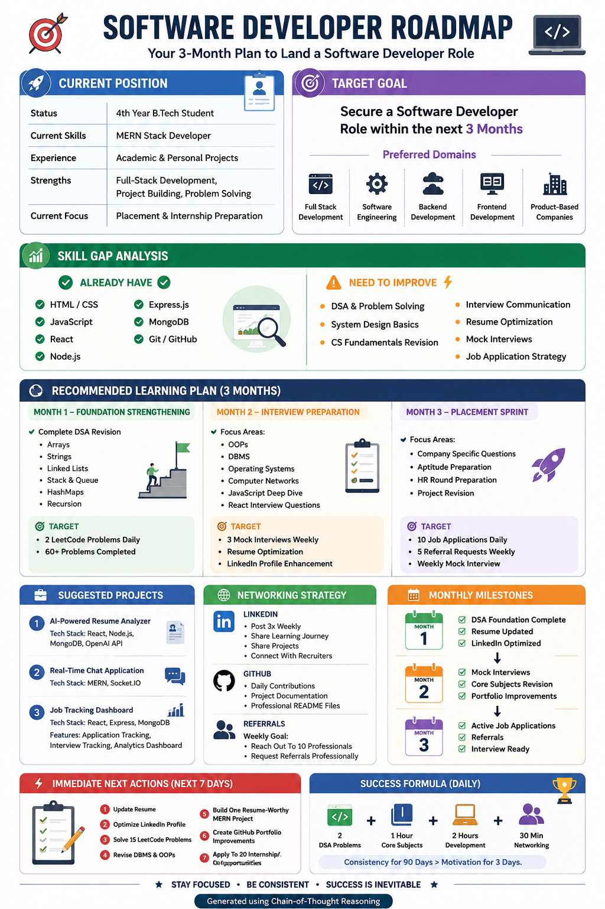

# Day 4 - Chain-of-Thought Prompting

## 📅 Date
June 4, 2026

## 🎯 Objective

Learn how Chain-of-Thought Prompting helps AI analyze a problem step-by-step before generating recommendations.

---

## 🤖 What is Chain-of-Thought Prompting?

Chain-of-Thought Prompting is a technique where AI breaks down a problem into smaller logical steps before producing a final answer.

Instead of directly generating a response, the AI:

- Analyzes the current situation
- Identifies strengths
- Finds skill gaps
- Recommends priorities
- Creates a structured roadmap

This leads to more accurate and personalized results.

---

## 📝 Information Provided

### Current Situation
4th Year B.Tech Student

### Current Skills
- MERN Stack Development
- JavaScript
- React.js
- Node.js
- Express.js
- MongoDB
- Git & GitHub

### Target Goal
Software Developer

### Timeline
3 Months

---

## 🚀 Personalized Career Roadmap

The AI generated a customized roadmap focused on helping me become a Software Developer within the next 90 days.

### Strengths

✅ MERN Stack Development  
✅ Full-Stack Project Building  
✅ JavaScript Ecosystem  
✅ Git & GitHub

### Skill Gaps

⚡ Data Structures & Algorithms  
⚡ Problem Solving  
⚡ DBMS  
⚡ Operating Systems  
⚡ Computer Networks  
⚡ Interview Preparation

### Recommended Focus Areas

- Daily LeetCode Practice
- Core CS Subject Revision
- Resume Optimization
- GitHub Portfolio Improvement
- LinkedIn Optimization
- Mock Interviews
- Networking & Referrals

---

## 💡 Biggest Insight

> I don't have a MERN Stack problem. I have a placement preparation problem.

The roadmap helped me realize that my biggest opportunity lies in strengthening DSA, CS Fundamentals, and interview preparation rather than learning additional frameworks.

---

## 📚 Key Learnings

- Better context leads to better AI outputs.
- Chain-of-Thought Prompting creates structured recommendations.
- A roadmap helps prioritize high-impact activities.
- Consistency is more important than learning everything at once.

---

## 🖼️ Generated Roadmap

---

## ⚡ Immediate Action Plan

- [ ] Update Resume
- [ ] Solve 15 LeetCode Problems
- [ ] Revise DBMS & OOPs
- [ ] Improve GitHub Portfolio
- [ ] Optimize LinkedIn Profile
- [ ] Apply to Internship & Job Opportunities
- [ ] Start Mock Interview Preparation

---

## ✅ Status

Day 4 Completed Successfully

---

### Challenge
ABTalks 60-Day Claude AI Mastery Challenge

### Topic
Chain-of-Thought Prompting

### Outcome
Generated a personalized 3-month roadmap to become a Software Developer.

#60DaysOfClaudeChallenge #ABTalks #ChainOfThoughtPrompting #SoftwareDevelopment #MERNStack #CareerRoadmap
