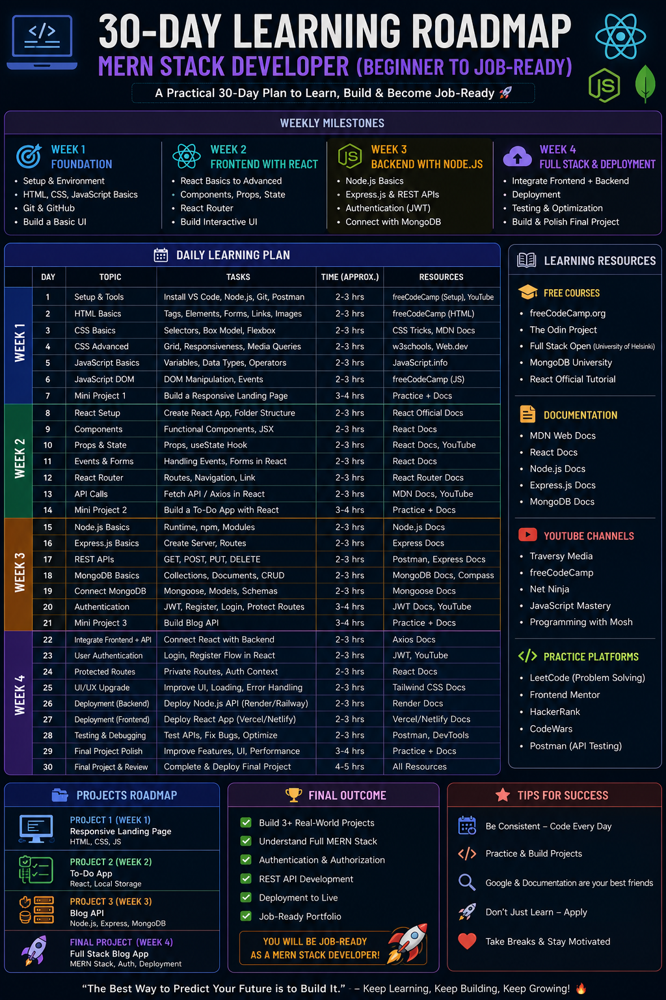
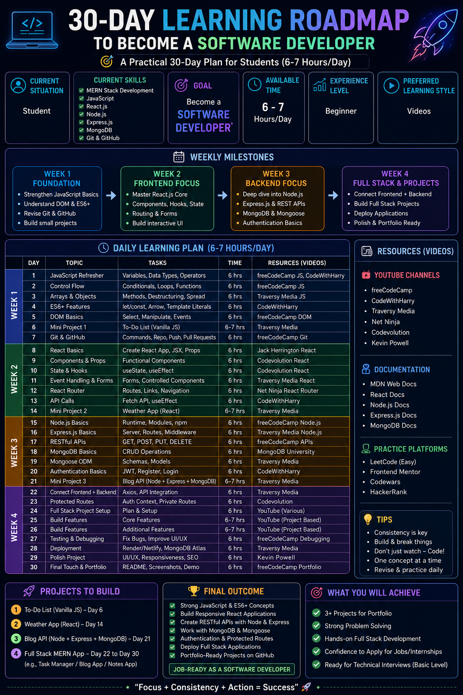

# Day 5 - Context Engineering

## 📅 Date
June 5, 2026

## 🎯 Objective

Today's goal was to understand the importance of **Context Engineering** and how providing relevant context can significantly improve AI-generated outputs.

---

## 🤖 What is Context Engineering?

Context Engineering is the practice of providing AI with relevant background information, goals, constraints, and personal details before asking it to perform a task.

The more useful context the AI has, the more personalized and accurate the response becomes.

---

## 📝 Activity Performed

I compared two different prompts.

### Prompt A - Generic Request

A basic prompt with little or no context.

### Observation

The output was:

- Generic
- Broad
- One-size-fits-all
- Less personalized

---

### Prompt B - Personalized Request

The same task was performed, but with additional context including:

- Current Situation: Student
- Skills: MERN Stack Development
- Goal: Software Developer
- Available Time: 6–7 Hours Daily
- Learning Style: Videos

### Observation

The output was:

- More personalized
- More actionable
- Better structured
- Aligned with my goals
- Easier to follow

---

## 🔍 Comparison

| Generic Output | Personalized Output |
|---------------|---------------------|
| General Advice | Tailored Roadmap |
| Broad Recommendations | Goal-Oriented Recommendations |
| Less Relevant | Highly Relevant |
| Generic Learning Path | Personalized Learning Path |
| Limited Context | Context-Aware Suggestions |

---

## 💡 Biggest Insight

> Better Context = Better Outputs

The biggest difference I observed was that AI became significantly more useful when it understood my background, goals, skills, and constraints.

Instead of generating generic advice, it created recommendations specifically designed for my situation.

---

## 📚 Key Learnings

- Context directly impacts output quality.
- Personalized prompts generate personalized results.
- AI performs better when given clear goals.
- Good context reduces irrelevant recommendations.
- Context Engineering is a powerful prompt engineering technique.

---

## 📸 Screenshots

### Generic Output

### Personalized Output

---

## 🚀 Takeaway

Context Engineering transforms AI from a general assistant into a personalized advisor.

Providing relevant information helps AI deliver more accurate, actionable, and useful responses.

---

## ✅ Status

Day 5 Completed Successfully

### Challenge
ABTalks 60-Day Claude AI Mastery Challenge

### Topic
Context Engineering

### Outcome
Compared generic vs personalized prompts and observed how context dramatically improves AI outputs.

#60DaysOfClaudeChallenge #ContextEngineering #PromptEngineering #ClaudeAI #ABTalks
